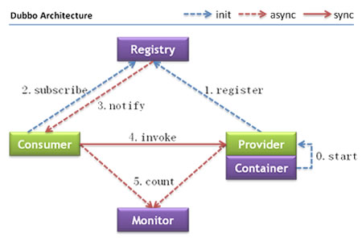

最近面试工作颇多，Dubbo作为的微服务主流技术架构，也是分布式系统中面试的高频考题之一。但从面试的过程中得到的反馈，大家对于Dubbo的关注以及掌握程度基本都处于会基本使用的程度，基本没遇到有对Dubbo框架做学习研究的求职者。
  
求职者一般只会聊下面两个话题：

1. Dubbo 是什么东西？
    - 答：RPC框架/微服务框架，在实际工作中用Dubbo做业务功能服务化。
1. Dubbo的工作原理是什么样的？
    - 答：Provider端将服务注册到Zookeeper中，Consumer端从Zookeeper获取Provider，然后就可以调用API了。

<!-- more -->

一般情况下关于Dubbo的基本都聊到此结束了，虽然说没回答错，但也忒简洁了吧，连Dubbo架构图中（下图）的内容都没说完整，而这并不是面试官想得到的讯息。

---

Dubbo作为主流的微服务技术框架，必然有其优秀的一面，也是学习RPC框架思想很好的素材

Dubbo 应该掌握哪些内容？（个人思路）

1. 阅读Dubbo的用户手册以及开发手册。[Dubbo.io](http://dubbo.apache.org)
    - 知晓Dubbo支持的功能
    - 知晓Dubbo的各种扩展点
    - 知晓Dubbo的设计思想（这里不得不说Dubbo.io的文档说明写的非常详细、到位，甚至一度让我觉得没有写Blog的必要）
1. Dubbo 核心流程源码实现
    1. Dubbo Bean的集成
    1. Provider 注册、暴露服务
    1. Consumer 注册、订阅服务
    1. Consumer 调用实现
    1. Provider 处理请求
    1. Dubbo SPI机制
    1. Dubbo Filter机制
1. 思考些高级的
    1. Dubbo各可配机制主流选择的优缺点
        - register
        - remoting
        - rpc
    1. Dubbo Cluster
    1. Dubbo 怎么做服务治理
        - 策略路由
        - 降级
        - 熔断
    1. Dubbo 性能基线&性能调优
    1. 框架扩展
        - 服务监控
        - 流量分析

那么，逐步的去落实吧！如果开始、请务必坚持！

