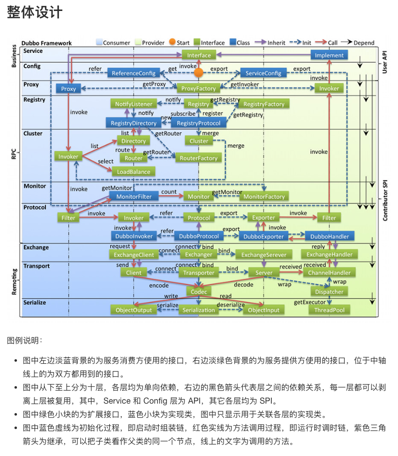
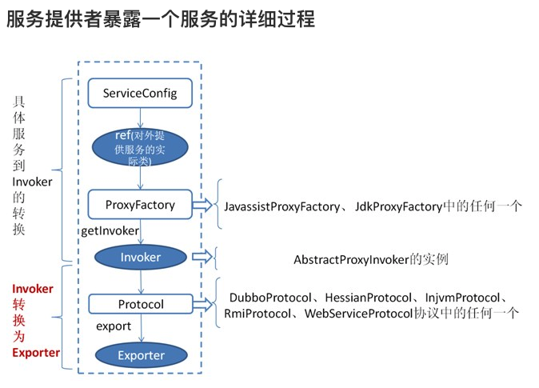

## 前言

Dubbo Provider暴露服务的流程中，需要掌握几个核心抽象对象

+ 过程中的重要类
    - ServiceConfig：记录了Dubbo Service所有相关的配置信息。[ServiceConfig作用](#ServiceConfig)
    - DubboProtocol：以Dubbo协议的方式暴露服务，并以此为中心维护所有相关的动态服务数据。
    - RegisterProtocol: 内部会加载具体的注册中心Register,例如：ZookeeperRegister。完成服务向注册中心注册的动作。
    - ServiceConfig#loadRegistries：解析获得注册中心地址列表


+ 过程中的重要对象
    - com.alibaba.dubbo.common.URL: 服务发布的地址
    - Invoker: 对原Service Interface进行了代理封装，屏蔽了具体Service Interface的差异，方便统一管理和调用。
    - Exporter： 一个ServiceBean每向一个注册中心Register注册一次，就会生成已各Exporter。Exporter用于连接暴露服务的Url与本地Invoker的对应关系。
    - ExporterMap: 记录着服务地址和Exporter的对应关系


<!--more-->

+ 来自Dubbo官方的几个架构设计图，先感觉下





## ServiceBean核心流程

1. Spring容器启动，带动Dubbo Bean配置解析以及Bean实例化。
    - [Dubbo启动](#Dubbo 启动)
    - 关键类：
        - DubboNamespaceHandler
        - ServiceBean
        - [ServiceConfig作用](#ServiceConfig)
1. ServiceBean 继承了ServiceConfig，所有的Provider服务的Dubbo配置都在ServiceConfig中。
    - Dubbo Service基本信息
    - Dubbo Service参数配置
    - 注册中心地址信息。对应ServiceConfig中的loadRegistries().
1. ServiceBean 实现了InitializingBean, 实现了afterPropertiesSet()方法，在每个Dubbo Service Bean实例化后，在afterPropertiesSet()方法中进行所有Dubbo服务注册需要的操作。
1. afterPropertiesSet()中前置代码都是在做一些配置校验和默认值设置，最后会执行export()方法注册暴露服务。
1. afterPropertiesSet()
    - export()
        - doExport()
            - doExportUrls()
                - doExportUrlsFor1Protocol(DubboProtocol, regitsryURLs)
                    - DubboProtocol.export(wrapperInvoker)
1. doExportUrlsFor1Protocol(ProtocolConfig protocolConfig, List<URL> registryURLs) 是真正执行export暴露服务的代码区
    - 

## DubboProtocol#Export核心流程

```java
public <T> Exporter<T> export(Invoker<T> invoker) throws RpcException {
    URL url = invoker.getUrl();

    // export service.
    String key = serviceKey(url);
    DubboExporter<T> exporter = new DubboExporter<T>(invoker, key, exporterMap);
    exporterMap.put(key, exporter);

    //export an stub service for dispatching event
    Boolean isStubSupportEvent = url.getParameter(Constants.STUB_EVENT_KEY, Constants.DEFAULT_STUB_EVENT);
    Boolean isCallbackservice = url.getParameter(Constants.IS_CALLBACK_SERVICE, false);
    if (isStubSupportEvent && !isCallbackservice) {
        String stubServiceMethods = url.getParameter(Constants.STUB_EVENT_METHODS_KEY);
        if (stubServiceMethods == null || stubServiceMethods.length() == 0) {
            if (logger.isWarnEnabled()) {
                logger.warn(new IllegalStateException("consumer [" + url.getParameter(Constants.INTERFACE_KEY) +
                        "], has set stubproxy support event ,but no stub methods founded."));
            }
        } else {
            stubServiceMethodsMap.put(url.getServiceKey(), stubServiceMethods);
        }
    }

    //获取一个服务端口，使用NettyServer绑定并监听，并设置Server监听事件处理回调为：DubboProtocol#requestHandler
    //Exchanger.bind的实际对象可配置，对应dubbo-remoting-api包
    openServer(url);   
    optimizeSerialization(url);
    return exporter;
}
```

### DubboProtocol核心数据
```java
public class DubboProtocol extends AbstractProtocol {

    ...

    //单例
    private static DubboProtocol INSTANCE;
    
    //本地启动Server监听服务的Map
    private final Map<String, ExchangeServer> serverMap = new ConcurrentHashMap<String, ExchangeServer>(); // <host:port,Exchanger>
    
    //记录消费端的Exchanger
    private final Map<String, ReferenceCountExchangeClient> referenceClientMap = new ConcurrentHashMap<String, ReferenceCountExchangeClient>(); // <host:port,Exchanger>
    
    //
    private final ConcurrentMap<String, LazyConnectExchangeClient> ghostClientMap = new ConcurrentHashMap<String, LazyConnectExchangeClient>();
    
    //
    private final Set<String> optimizers = new ConcurrentHashSet<String>();
    
    //consumer side export a stub service for dispatching event
    //servicekey-stubmethods
    private final ConcurrentMap<String, String> stubServiceMethodsMap = new ConcurrentHashMap<String, String>();
    private ExchangeHandler requestHandler = {...};

    ...

}
```

```java

public abstract class AbstractProtocol implements Protocol {
    // ExporterMap
    protected final Map<String, Exporter<?>> exporterMap = new ConcurrentHashMap<String, Exporter<?>>();
}
```

### Dubbo Service是哪个时机注册到注册中心的？

> 有关注到这个章节内容的小伙伴，说明你此时可能也还没想通吧，请听我道来。

这里会涉及到Dubbo的SPI机制，Dubbo 有好几个利用SPI+动态代理+Filter的处理责任链模式，ProtocolFilterWrapper.java算一个。  
    - Protocol protocol = ExtensionLoader.getExtensionLoader(Protocol.class).getAdaptiveExtension();

在Dubbo源码中，Dubbo有自行注册几个protocol SPI （这里只列举Dubbo服务注册相关的） 

+ [SPI机制用法详见](http://dubbo.apache.org/books/dubbo-dev-book/SPI.html)
+ [Dubbo Protocol SPI扩展详见](http://dubbo.apache.org/books/dubbo-dev-book/impls/protocol.html)
+ RegistryProtocol SPI: 
    - 注册位置：dubbo-registry-api包,resources下的com.alibaba.dubbo.rpc.Protocol
    - 注册位置：dubbo-registry-zookeeper包,resources下的com.alibaba.dubbo.register.RegistryFactory

其实，在ServiceConfig中拿到的全局protocol并不直接是DubboProtocol，而是一串Protocol，DubboProtocol只是其中之一，这些Protocol会以责任链的方式逐一被调用

所以，在doExportUrlsFor1Protocol中protocol.export(...)时，会先执行DubboProtocol#export,再执行RegisterProtocol#export,各司其职。


RegisterProtocol中会根据Dubbo Service配置的register地址类型来决定加载哪个具体的RegisterFactory
  
```java
public void register(URL registryUrl, URL registedProviderUrl) {
        //RegisterFactory根据注册中心类型，获取到注册实例，例如ZookeeperRegistry
        Registry registry = registryFactory.getRegistry(registryUrl);
        
        //执行注册，实际对应ZookeeperRegistry#register
        registry.register(registedProviderUrl);
    }

    public <T> Exporter<T> export(final Invoker<T> originInvoker) throws RpcException {
        ...

        if (register) {
            register(registryUrl, registedProviderUrl);
            ProviderConsumerRegTable.getProviderWrapper(originInvoker).setReg(true);
        }

        ...
    }
```

### Netty Server

当DubboProtocol.export.openServer()时，就是在本地启动Dubbo Service的Server服务并启动监听。

实现上是通过Exchanger拿到被配置的信息交换层的实现套件（一般是Netty）。  
    - 获取一个服务端口，使用NettyServer绑定并监听，并设置Server监听事件处理回调为：DubboProtocol#requestHandler
    - Exchanger.bind的实际对象可配置，对应dubbo-remoting-api包
    
```java
public class NettyServer extends AbstractServer implements Server {

    private static final Logger logger = LoggerFactory.getLogger(NettyServer.class);

    private Map<String, Channel> channels; // <ip:port, channel>

    private ServerBootstrap bootstrap;

    private org.jboss.netty.channel.Channel channel;

    public NettyServer(URL url, ChannelHandler handler);

    @Override
    protected void doOpen() throws Throwable {
        NettyHelper.setNettyLoggerFactory();
        ExecutorService boss = Executors.newCachedThreadPool(new NamedThreadFactory("NettyServerBoss", true));
        ExecutorService worker = Executors.newCachedThreadPool(new NamedThreadFactory("NettyServerWorker", true));
        ChannelFactory channelFactory = new NioServerSocketChannelFactory(boss, worker, getUrl().getPositiveParameter(Constants.IO_THREADS_KEY, Constants.DEFAULT_IO_THREADS));
        bootstrap = new ServerBootstrap(channelFactory);

        final NettyHandler nettyHandler = new NettyHandler(getUrl(), this);
        channels = nettyHandler.getChannels();
        // https://issues.jboss.org/browse/NETTY-365
        // https://issues.jboss.org/browse/NETTY-379
        // final Timer timer = new HashedWheelTimer(new NamedThreadFactory("NettyIdleTimer", true));
        bootstrap.setPipelineFactory(new ChannelPipelineFactory() {
            public ChannelPipeline getPipeline() {
                NettyCodecAdapter adapter = new NettyCodecAdapter(getCodec(), getUrl(), NettyServer.this);
                ChannelPipeline pipeline = Channels.pipeline();
                /*int idleTimeout = getIdleTimeout();
                if (idleTimeout > 10000) {
                    pipeline.addLast("timer", new IdleStateHandler(timer, idleTimeout / 1000, 0, 0));
                }*/
                pipeline.addLast("decoder", adapter.getDecoder());
                pipeline.addLast("encoder", adapter.getEncoder());
                pipeline.addLast("handler", nettyHandler);
                return pipeline;
            }
        });
        // bind
        channel = bootstrap.bind(getBindAddress());
    }

    @Override
    protected void doClose();

    public Collection<Channel> getChannels();

    public Channel getChannel(InetSocketAddress remoteAddress);

    public boolean isBound();

}
```


---

### <span id="ServiceConfig">ServiceConfig作用(见代码注释)</span>

```java
public class ServiceConfig<T> extends AbstractServiceConfig {

    ...

    // 采用的protocol远程调用层实现，用于封装RPC调用，默认是DubboProtocol，其余可选还有HttpProtocol,HessianProtocol,InjvmProtocol,RedisProtocol等
    private static final Protocol protocol = ExtensionLoader.getExtensionLoader(Protocol.class).getAdaptiveExtension();

    //对ServiceBean进行代理，包装成Dubbo内部通用的Invoker
    private static final ProxyFactory proxyFactory = ExtensionLoader.getExtensionLoader(ProxyFactory.class).getAdaptiveExtension();

    //ServiceBean作为Dubbo Provider启动时，会在本地起server服务，每个server服务都会绑定并监听端口。
    private static final Map<String, Integer> RANDOM_PORT_MAP = new HashMap<String, Integer>();

    //记录已暴露服务的服务地址
    private final List<URL> urls = new ArrayList<URL>();
    
    //一个ServiceBean每向一个注册中心Register注册一次，就会生成已各Exporter。Exporter用于连接暴露服务的Url与本地Invoker的对应关系。
    private final List<Exporter<?>> exporters = new ArrayList<Exporter<?>>();
    
    //关于本ServiceBean的Java Class信息
    private String interfaceName;
    private Class<?> interfaceClass;
    // reference to interface impl
    private T ref;
    // service name
    private String path;
    // method configuration
    private List<MethodConfig> methods;
    private ProviderConfig provider;
    private transient volatile boolean exported;

    private transient volatile boolean unexported;

    private volatile String generic;

```

### <span id="Dubbo 启动">Dubbo 启动</span>

Spring容器启动，带动Dubbo Bean配置实例化。Dubbo Bean配置来自于Dubbo Provider XML 文件。

```java
public class DubboNamespaceHandler extends NamespaceHandlerSupport {

    static {
        Version.checkDuplicate(DubboNamespaceHandler.class);
    }

    public void init() {
        registerBeanDefinitionParser("application", new DubboBeanDefinitionParser(ApplicationConfig.class, true));
        registerBeanDefinitionParser("module", new DubboBeanDefinitionParser(ModuleConfig.class, true));
        registerBeanDefinitionParser("registry", new DubboBeanDefinitionParser(RegistryConfig.class, true));
        registerBeanDefinitionParser("monitor", new DubboBeanDefinitionParser(MonitorConfig.class, true));
        registerBeanDefinitionParser("provider", new DubboBeanDefinitionParser(ProviderConfig.class, true));
        registerBeanDefinitionParser("consumer", new DubboBeanDefinitionParser(ConsumerConfig.class, true));
        registerBeanDefinitionParser("protocol", new DubboBeanDefinitionParser(ProtocolConfig.class, true));
        registerBeanDefinitionParser("service", new DubboBeanDefinitionParser(ServiceBean.class, true));  //dubbo provider bean配置解析
        registerBeanDefinitionParser("reference", new DubboBeanDefinitionParser(ReferenceBean.class, false));
        registerBeanDefinitionParser("annotation", new AnnotationBeanDefinitionParser());
    }

}
```

+ 具体详见笔记：[Dubbo源码解析-Spring Bean注册](/2018/04/22/Dubbo源码解析-Spring-Bean注册/)

### ServiceBean实例化

```java
public class ServiceBean<T> extends ServiceConfig<T> implements InitializingBean, DisposableBean, ApplicationContextAware, ApplicationListener<ContextRefreshedEvent>, BeanNameAware {
    ......
}
```

ServiceBean 继承了ServiceConfig，所有的Provider服务的Dubbo配置都在ServiceConfig中。

ServiceBean 实现了InitializingBean, 实现了afterPropertiesSet()方法，在每个Dubbo Service Bean实例化后，进行暴露服务的相关操作。


afterPropertiesSet()中前置代码都是在做一些配置校验和默认值设置，最后会执行export()方法注册暴露服务。


```java
public void afterPropertiesSet() throws Exception {  
        //如果没有配置provider  
        if (getProvider() == null) {  
            //获取IOC容器里的所有provider  
            Map<String, ProviderConfig> providerConfigMap = applicationContext == null ? null  : BeanFactoryUtils.beansOfTypeIncludingAncestors(applicationContext, ProviderConfig.class, false, false);  
            if (providerConfigMap != null && providerConfigMap.size() > 0) {  
                Map<String, ProtocolConfig> protocolConfigMap = applicationContext == null ? null  : BeanFactoryUtils.beansOfTypeIncludingAncestors(applicationContext, ProtocolConfig.class, false, false);  
                if ((protocolConfigMap == null || protocolConfigMap.size() == 0)  
                        && providerConfigMap.size() > 1) { // 兼容旧版本  
                    List<ProviderConfig> providerConfigs = new ArrayList<ProviderConfig>();  
                    for (ProviderConfig config : providerConfigMap.values()) {  
                        if (config.isDefault() != null && config.isDefault().booleanValue()) {  
                            providerConfigs.add(config);  
                        }  
                    }  
                    //关联所有providers  
                    if (providerConfigs.size() > 0) {  
                        setProviders(providerConfigs);  
                    }  
                } else {  
                    ProviderConfig providerConfig = null;  
                    for (ProviderConfig config : providerConfigMap.values()) {  
                        if (config.isDefault() == null || config.isDefault().booleanValue()) {  
                            if (providerConfig != null) {  
                                throw new IllegalStateException("Duplicate provider configs: " + providerConfig + " and " + config);  
                            }  
                            providerConfig = config;  
                        }  
                    }  
                    if (providerConfig != null) {  
                        setProvider(providerConfig);  
                    }  
                }  
            }  
        }  
        //如果没有配置application，且没有配置provider  
        if (getApplication() == null  
                && (getProvider() == null || getProvider().getApplication() == null)) {  
            //获取所有applications  
            Map<String, ApplicationConfig> applicationConfigMap = applicationContext == null ? null : BeanFactoryUtils.beansOfTypeIncludingAncestors(applicationContext, ApplicationConfig.class, false, false);  
            if (applicationConfigMap != null && applicationConfigMap.size() > 0) {  
                ApplicationConfig applicationConfig = null;  
                for (ApplicationConfig config : applicationConfigMap.values()) {  
                    if (config.isDefault() == null || config.isDefault().booleanValue()) {  
                        if (applicationConfig != null) {  
                            throw new IllegalStateException("Duplicate application configs: " + applicationConfig + " and " + config);  
                        }  
                        applicationConfig = config;  
                    }  
                }  
                //关联application  
                if (applicationConfig != null) {  
                    setApplication(applicationConfig);  
                }  
            }  
        }  
        //如果没有配置module，且没有配置provider  
        if (getModule() == null  
                && (getProvider() == null || getProvider().getModule() == null)) {  
            Map<String, ModuleConfig> moduleConfigMap = applicationContext == null ? null : BeanFactoryUtils.beansOfTypeIncludingAncestors(applicationContext, ModuleConfig.class, false, false);  
            if (moduleConfigMap != null && moduleConfigMap.size() > 0) {  
                ModuleConfig moduleConfig = null;  
                for (ModuleConfig config : moduleConfigMap.values()) {  
                    if (config.isDefault() == null || config.isDefault().booleanValue()) {  
                        if (moduleConfig != null) {  
                            throw new IllegalStateException("Duplicate module configs: " + moduleConfig + " and " + config);  
                        }  
                        moduleConfig = config;  
                    }  
                }  
                //关联module  
                if (moduleConfig != null) {  
                    setModule(moduleConfig);  
                }  
            }  
        }  
        //如果没有配置registries，且没有配置provider  
        if ((getRegistries() == null || getRegistries().size() == 0)  
                && (getProvider() == null || getProvider().getRegistries() == null || getProvider().getRegistries().size() == 0)  
                && (getApplication() == null || getApplication().getRegistries() == null || getApplication().getRegistries().size() == 0)) {  
            Map<String, RegistryConfig> registryConfigMap = applicationContext == null ? null : BeanFactoryUtils.beansOfTypeIncludingAncestors(applicationContext, RegistryConfig.class, false, false);  
            if (registryConfigMap != null && registryConfigMap.size() > 0) {  
                List<RegistryConfig> registryConfigs = new ArrayList<RegistryConfig>();  
                for (RegistryConfig config : registryConfigMap.values()) {  
                    if (config.isDefault() == null || config.isDefault().booleanValue()) {  
                        registryConfigs.add(config);  
                    }  
                }  
                //关联registries  
                if (registryConfigs != null && registryConfigs.size() > 0) {  
                    super.setRegistries(registryConfigs);  
                }  
            }  
        }  
        //如果没有配置monitor，且没有配置provider  
        if (getMonitor() == null  
                && (getProvider() == null || getProvider().getMonitor() == null)  
                && (getApplication() == null || getApplication().getMonitor() == null)) {  
            Map<String, MonitorConfig> monitorConfigMap = applicationContext == null ? null : BeanFactoryUtils.beansOfTypeIncludingAncestors(applicationContext, MonitorConfig.class, false, false);  
            if (monitorConfigMap != null && monitorConfigMap.size() > 0) {  
                MonitorConfig monitorConfig = null;  
                for (MonitorConfig config : monitorConfigMap.values()) {  
                    if (config.isDefault() == null || config.isDefault().booleanValue()) {  
                        if (monitorConfig != null) {  
                            throw new IllegalStateException("Duplicate monitor configs: " + monitorConfig + " and " + config);  
                        }  
                        monitorConfig = config;  
                    }  
                }  
                //关联monitor  
                if (monitorConfig != null) {  
                    setMonitor(monitorConfig);  
                }  
            }  
        }  
        //如果没有配置protocol，且没有配置provider  
        if ((getProtocols() == null || getProtocols().size() == 0)  
                && (getProvider() == null || getProvider().getProtocols() == null || getProvider().getProtocols().size() == 0)) {  
            Map<String, ProtocolConfig> protocolConfigMap = applicationContext == null ? null  : BeanFactoryUtils.beansOfTypeIncludingAncestors(applicationContext, ProtocolConfig.class, false, false);  
            if (protocolConfigMap != null && protocolConfigMap.size() > 0) {  
                List<ProtocolConfig> protocolConfigs = new ArrayList<ProtocolConfig>();  
                for (ProtocolConfig config : protocolConfigMap.values()) {  
                    if (config.isDefault() == null || config.isDefault().booleanValue()) {  
                        protocolConfigs.add(config);  
                    }  
                }  
                //关联protocol  
                if (protocolConfigs != null && protocolConfigs.size() > 0) {  
                    super.setProtocols(protocolConfigs);  
                }  
            }  
        }  
        //如果没有配置path  
        if (getPath() == null || getPath().length() == 0) {  
            if (beanName != null && beanName.length() > 0   
                    && getInterface() != null && getInterface().length() > 0  
                    && beanName.startsWith(getInterface())) {  
                setPath(beanName);  
            }  
        }  
        //暴露provider,重点！！！
        if (! isDelay()) {  
            export();  
        }  
    }  
```

### Export暴露服务

+ export()方法会完成后续服务注册的所有流程


```java
public synchronized void export() {  
        //如果provider没有配置  
        if (provider != null) {  
            //如果exporter没有配置使用provider所关联的exporter  
            if (export == null) {  
                export = provider.getExport();  
            }  
            //如果delay（延迟暴露）没有配置，获取provider的delay  
            if (delay == null) {  
                delay = provider.getDelay();  
            }  
        }  
        //如果不需要暴露接口则直接返回  
        if (export != null && ! export.booleanValue()) {  
            return;  
        }  
        //如果延迟暴露的时间（毫秒级）是存在的，开启线程并等待delay毫秒后开始暴露接口，否则直接执行暴露接口过程  
        if (delay != null && delay > 0) {  
            Thread thread = new Thread(new Runnable() {  
                public void run() {  
                    try {  
                        Thread.sleep(delay);  
                    } catch (Throwable e) {  
                    }  
                    doExport();  
                }  
            });  
            thread.setDaemon(true);  
            thread.setName("DelayExportServiceThread");  
            thread.start();  
        } else {  
            doExport();  
        }  
    }  
```


