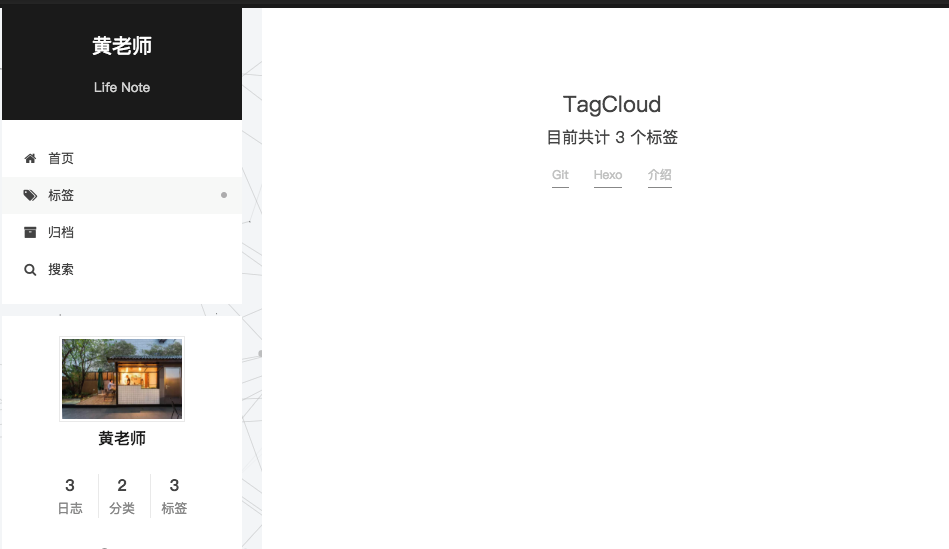

前篇《[个人博客搭建-结缘Hexo](https://veryjj.github.io/2018/03/17/%E4%B8%AA%E4%BA%BA%E5%8D%9A%E5%AE%A2%E6%90%AD%E5%BB%BA-%E7%BB%93%E7%BC%98Hexo/)》  

从时间投入上来说，搭建Hexo可谓是分分钟的事情，装修可花了我近一天的时间。

Hexo 是一个开放、扩展性强的框架，样式风格、功能都可以通过主题包、插件来实现。完全可以根据个人口味来装修你的博客。

<!-- more -->

---

# 选主题

关于Hexo的主题，你可以问度娘"Hexo Themes"网友好评度高的主题，也可以去官网自行挑选[https://hexo.io/themes/](https://hexo.io/themes/)

+ 需要提前说明的是：不是选上对应主题，所有功能就有了，这也是我为什么会单独写这篇备忘的原因。

经过各种试用和对比，我最终选择了：NexT这个主题 [Go Github](https://github.com/iissnan/hexo-theme-next)，理由如下：

1. （Most Important）界面符合我口味。NexT 中的Pisces主题，样例：[IIssNan's Notes](http://notes.iissnan.com/)
1.  NexT主题集成的插件多，极大的方便了初级的小白用户，详见：NexT主题的_config.xml配置项
    - 博客评论
    - Baidu Analytics / Google Analytics
    - 文章阅读数量
    - baidu push
    - algolia_search / local_search
    - 背景画布特效
    - highlight_theme
    - 等等
1. 支持手机端

### 安装主题

Hexo theme 统一放在Hexo根目录的themes目录下，每个主题一个子目录。

  
如果主题是Github上的，推荐使用如下命令下载

```git
git clone https://github.com/iissnan/hexo-theme-next.git themes/next
```

然后修改hexo根目录下的_config.xml，切换主题


OK, hexo g -> hexo s 看下效果吧


# 主题配置
找到 hexo/themes/next/_config.xml，一项项阅读熟悉吧，注释写的很详细。


## 基础配置

基础配置项：

1. 菜单配置：主页、关于、标签、分类、归档等
1. 头像
1. 打赏
1. 社交主页
1. 侧边栏

主题的_config.xml会引用hexo的_config.xml中基础配置，所以请同时配置hexo的_config.xml，例如：博客抬头、语种、相关数据目录等

## 背景特效
效果图示  


配置next主题的_config.xml


## 支持搜索
  


## 文章阅读计数
NexT提供两种插件方式：1、leancloud_visitors（国内的）   和  2、firestore(谷歌的)  
我选用的是leancloud_visitors，配置相对简单一些

+ 配置LeanCloud

注册：[https://leancloud.cn](https://leancloud.cn)  
打开LeanCloud官网，进入注册页面注册。完成邮箱激活后，点击头像，进入控制台页面创建新应用，如下：

  
创建名称为Counter的Class  
  

  

修改NexT的_config.xml配置文件
  


```xml
# Show number of visitors to each article.
# You can visit https://leancloud.cn get AppID and AppKey.
leancloud_visitors:
  enable: true
  app_id: "你的App Id"
  app_key: "你的App Key"
```

## PV/UV

  

## Google Analytics

```xml
# Google Analytics
google_analytics: '你的Google Analytics Code'
```


---

# 问题解决

## 标签和分类页面不显示问题

当时切换NexT主题后，侧边栏的标签、分类点击时，是无法正常显示标签和分类的，属：Cannot Get /tags/

若出现此问题，请按下方式解决  
在hexo 目录下执行
  
+ 步骤一：

```shell
hexo new page 'tags'
```

+ 步骤二：

编辑刚新建的页面，将页面的类型设置为tags，主题会自动为这个页面显示标签云。

```shell
---
title: TagCloud
date: 2018-03-17 15:31:21
type: "tags"
comments: false   #注意：如果有启动多说或Disqus评论，需要关闭评论，添加comments字段并设置为false
---
```



**"分类"同理~**


---

# 其他推荐
+ [hexo的next主题个性化配置教程](https://segmentfault.com/a/1190000009544924)

