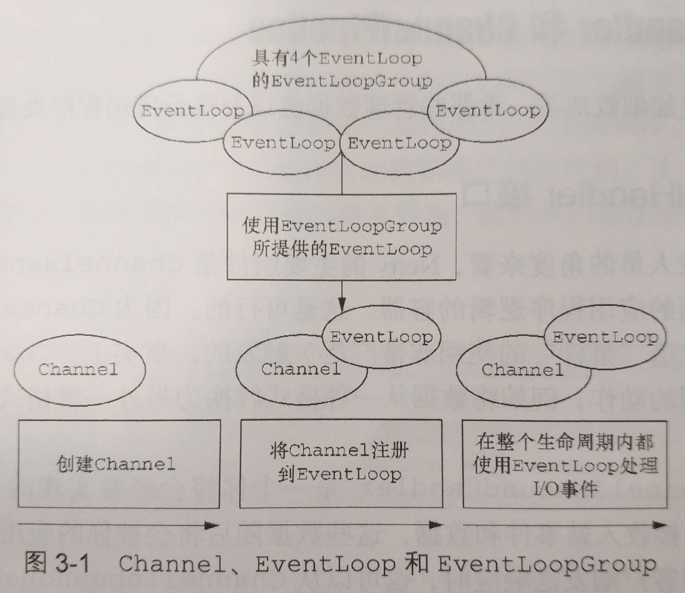
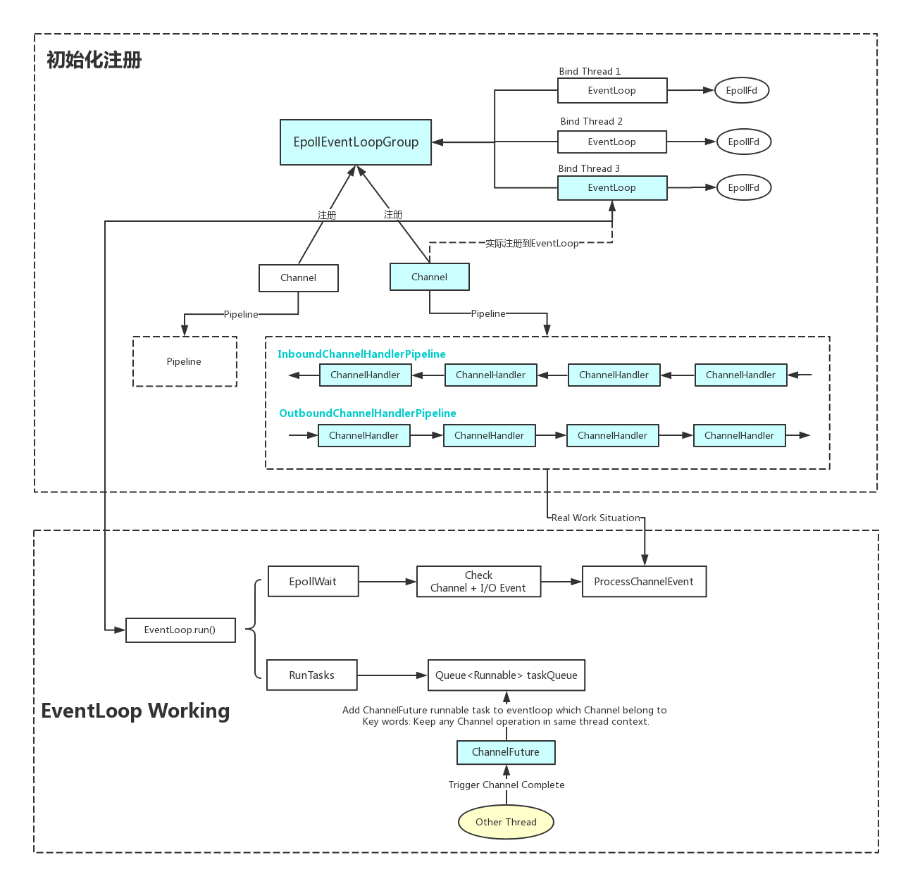

《Netty In Action》阅读笔记摘要


<!-- more -->

  
## What is Netty

Netty是一款用于快速`开发高性能的网络应用程序的Java框架` 

+ 它封装了网络编程的复杂性

**Key words:**  

1. 是一款Java语言的开发框架
2. 封装、提供程序快速网络编程的能力
3. 高性能

##### Netty是完全异步和事件驱动的

---

## Netty 核心组件

### Channel

Channel 是Java NIO的一个基本构造  
  
可以将Channel 看作是连接的载体。因此，它可以被打开、被关闭、连接、断开连接。
  
### 事件

Channel连接上发生的事件。可以等价的理解为 epoll 中关于每个Socket事件，例如：EPOLLIN, EPOLLOUT, EPOLLHUP的回调    

### 回调

类似于常见的回调，Netty内部用回调来处理事件；  
  
可理解为 epoll 中关于每个Socket事件的回调，例如：EPOLLIN, EPOLLOUT, EPOLLHUP的回调。
    
应用程序可以自定义回调，感知Netty网络通信的事件。

### ChannelFuture
    
Future提供了另一种在操作完成时通知应用程序的方式。
  
JDK中的java.util.concurrent.Future 在使用上是阻塞调用的，不优雅。Netty 提供了另一种实现：ChannelFuture，用于在执行异步操作的时候使用。  
  
Netty的每个出站I/O都将返回一个ChannelFuture。  
  
  
使用ChannelFuture时，可以配合使用ChannelFutureListener。只要实现operationComplete() 回调即可，非常方便。且支持多ChannelFuture。  


```java
Channel channel = ...;
//Does not block 
ChannelFuture future = channel.connect(new InetSocketAddress("192.168.0.1", 25));
​
future.addListener(new ChannelFuturelistener(){
    @Override
    public void operationComplete(ChannelFuture future){
        if (future.isSuccess()){
            ByteBuf buffer = Unpooled.copiedBuffer("Hello", Charset.defaultCharset());
            ChannelFuture wf = future.channel().writeAndFlush(buffer);
            ...
        } else {
            Throwable cause = future.cause();
            cause.printStackTrace();
        }
    }
})
```

### ChannelHandler
    可以初步理解为每个ChannelHandler实例都类似于一种为了响应特定事件而被执行的回调。


### `PS`

Netty 的内部实现细节跟Linux epoll的用法很相似，熟悉Linux Epoll以及编程模型的朋友来说可以对比着来学习，寻找类同点、差异点以及差异的原因。  

Netty 同时支持OIO, NIO, EPOLL等多路复用模式，我是以熟悉的epoll作为切入熟悉的内部流程原理。

---

## Netty的组件和设计
+ Channel  ———— Socket；
+ EventLoop ———— 控制流、多线程处理、并发；
+ ChannelFuture ———— 异步通知；


### Channel 接口

Netty的Channel接口所提供的API，大大地降低了使用Socket类的复杂性。


### EventLoopGroup 接口

主要作用

1. 用于注册Channel
1. 执行部分Runnable任务

这里重点讲下“注册Channel”，在实际编程或应用时，每个Channel都是向EventLoopGroup注册的，由EventLoopGroup按照指定的策略方法，将Channel注册到EventLoopGroup下某个具体的EventLoop当中去。

```java
public interface EventLoopGroup extends EventExecutorGroup {
    ...

    /**
     * Register a {@link Channel} with this {@link EventLoop}. The returned {@link ChannelFuture}
     * will get notified once the registration was complete.
     */
    ChannelFuture register(Channel channel);

    ...
}

public abstract class MultithreadEventLoopGroup extends MultithreadEventExecutorGroup implements EventLoopGroup {

    ...
    
    @Override
    public ChannelFuture register(Channel channel) {
        return next().register(channel);
    }

    ...
}

public abstract class MultithreadEventExecutorGroup extends AbstractEventExecutorGroup {

   ...
   
    @Override
    public EventExecutor next() {
        return chooser.next();
    }

    ...
    
```

### EventLoop 接口

EventLoop定义了Netty的核心抽象，用于处理连接的生命周期中所发生的事件。



+ 一个EventLoopGroup包含一个或者多个EventLoop；
+ 一个EventLoop在它的生命周期内只和一个Thread绑定；
+ 所有由EventLoop处理的I/O事件都将在它专有的Thread上被处理；
+ 一个Channel在它的生命周期内只注册于一个EventLoop；
+ 一个EventLoop可能会被分配给一个或多个Channel；


在这种设计中，一个给定的Channel的I/O操作都是由相同的Thread执行的，实际上消除了对于同步的需要。

### ChannelFuture 接口
Netty中所有的I/O操作都是异步的。所有我们需要一种用于在之后的某个时间点确定其结果的方法。


为此，Netty提供了ChannelFuture接口，其addListener()方法注册了一个ChannelFutureListener，以便在某个操作完成时得到通知。


### ChannelHandler 接口

顾名思义，Channel的Handler，它充当了所有处理入站和出站数据的应用程序逻辑的容器。ChannelHandler的方法是由网络事件触发的。


### ChannelPipeline 接口

ChannelPipeline为ChannelHandler链提供了容器，并定义了用于在该链上传播入站和出站事件流的API。当Channel被创建时，它会被自动的分配到它专属的ChannelPipeline。


+ ChannelPipleline中的ChannelHandler的执行顺序是由它们被添加的顺序所决定的。

### 编码器和解码器

Netty用于网络通信，天然需要编码和解码。也是用ChannelPipeline + ChannelHandler的机制实现的。  


+ 所有由Netty提供的编码器/解码器适配器类都实现了ChannelOutboundHandler或者ChannelInboundHandler接口。

### 引导（Bootstrap）

Netty的引导类为应用程序的网络层配置提供了容器。


类别 |    Bootstrap    | ServerBootstrap
---|---|---
网络编程中的作用 | 连接到远程主机和端口   | 绑定到一个本地端口
EventLoopGroup的数目   | 1|    2


+ 使用Netty的ChannelOption和属性

    在每个Channel创建时都手动配置它可能会变得相当乏味。幸运的是，你不必这样做。相反，你可以使用option()方法来将ChannelOption应用到Bootstrap上。你所提供的值将会被自动应用到Bootstrap所创建的所有Channel。

**引导DatagramChannel**


Bootstrap除了引导基于TCP协议的SocketChannel，也可以用于引导无连接的协议。Netty提供了各种DatagramChannel的实现。与面向连接的TCP相比，唯一区别是不再调用connect()方法，而是只调用bind()方法

```java

//使用Bootstrap和DatagramChannel
Bootstrap bootstrap = new Bootstrap();
bootstap.group(new OioEventLoopGroup())
    .channel(OioDatagramChannel.class)
    .handler(new SimpleChannelInboundHandler<DatagramPacket>(){
        @Override
        public void channelRead0(ChannelHandlerContext ctx, DatagramPacket msg) throws Exception {
            //Do something with the packet
        }
    });

ChannelFuture future = bootstrap.bind(new InetSocketAddress(0));
future.addListener(new ChannelFutureListener(){
    @Override
    public void operationComplete(ChannelFuture channelFuture) throws Exception{
        if (channelFuture.isSuccess()){
            System.out.println("Channel bound");
        } else {
            System.out.println("Bind attempt failed");
            channelFuture.cause().printStackTrace();
        }
    }
})

```

### `我的理解`

1. 引导的根对象是 EventLoopGroup，间接的负责监听、处理所有Channel的网络事件。

2. EventLoop是EventLoopGroup内的成员，每个EventLoop与具体的线程绑定。也可以理解一个线程，一个EventLoop。
    EventLoop直接负责处理其下所有Channel的网络事件。

3. ChannelHadler是Channel网络事件逻辑处理的容器，应用逻辑开发的重点就在此。

4. 当一个Channel上来一个网络事件时，对应的EventLoop首先进行响应，并找到Channel所属的ChannelPipeline，Channel作为输入驱动一次ChannelPipeline。

5. ChannelPipeline 遍历其下ChannelHandler，逐个处理Channel的网络事件。


+ ChannelFuture可以同步等结果，也可以异步通知结果，都支持，自己选！





---

## ByteBuf

网络数据的基本单位是字节。Java NIO提供了ByteBuffer作为它的字节容器，但是这个类使用起来过于复杂，而且也有些繁琐。  

Netty的ByteBuffer替代品是ByteBuf，一个强大的实现，既解决了JDK API的局限性，又为网络应用程序的开发者提供了更好的API。

+ ByteBuf优点：  
    1. 对于同一个数据buffer，维护readIndex, writeIndex两份索引

+ ByteBuf模式

    1. 堆缓冲区模式：
        - 将数据存储在JVM的堆空间中，应用代码可直接访问缓冲区中的数据。
    2. 直接缓冲区模式：
        - JDK 1.4引入的ByteBuffer类允许JVM实现直接使用操作系统的本地内容，这就避免了JAVA 应用在每次调用本地I/O操作前/后 需要将缓冲区的内容复制到一个与操作系统结合的中间缓冲区中。
        - 缺点：因为数据不是在堆上，所以业务代码处理时不得不经过一次复制。
    3. 复合缓冲区：
        - 为多个ByteBuf提供一个统一的聚合视图，可以根据需要向复合缓冲区中添加或者删除ByteBuf实例。

+ 字节级操作

    可以以字节的操作方式使用ByteBuf
    
1. 随机访问索引
1. 顺序访问索引
1. 可丢弃字节
1. 可读字节
1. 可写字节
1. 索引管理
1. indexOf / ByteBufProcessor
1. 派生缓冲区
1. 读/写操作

+ ByteBuf池化分配

    为了降低分配和释放内存的开销，Netty通过interface ByteBufAllocator实现了ByteBuf的池化。

+ Unpooled 缓冲区

    如果未能获取到一个ByteBufAllocator的引用，Netty提供一个简单的Unpooled工具类，它提供创建未池化的ByteBuf实例。


