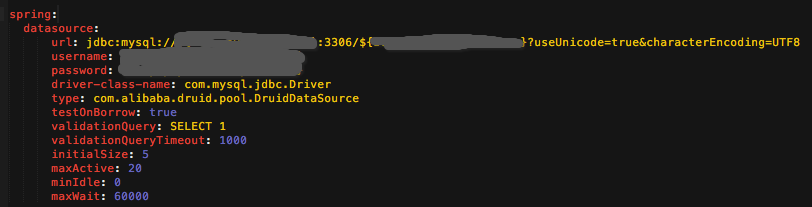
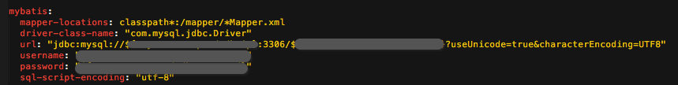
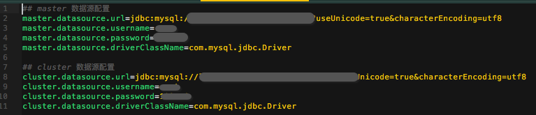
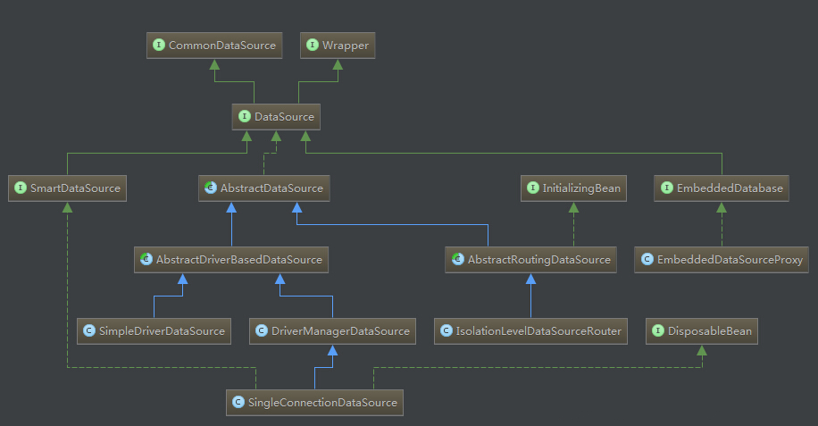

# DataSource

## 引言

用Spring进行Web应用开发时，我们经常会做datasource的配置。而且datasource的配法风格各异。那么他们到底有哪些异同点呢？








## DataSource作用

DataSource是javax.sql包中的类，是Java原生rt.jar包中的类。

```java
public interface DataSource  extends CommonDataSource, Wrapper {

  Connection getConnection() throws SQLException;

  Connection getConnection(String username, String password)
    throws SQLException;
}
```

<!-- more -->

javax.sql.DataSource定义的是抽象方法，通过Java JNDI的方式将具体实现开放给各个厂商、组织自己、个人自己实现。

在Spring框架中，通过DataSource + 配置的方式，来定义具体的数据库源。并向Spring框架提供数据源的Connection服务。

在Spring中若想实现多数据源，那么就需要在DataSource下手。

## javax.sql.DataSource源码注释说明

```javadoc
/**
 * <p>A factory for connections to the physical data source that this
 * {@code DataSource} object represents.  An alternative to the
 * {@code DriverManager} facility, a {@code DataSource} object
 * is the preferred means of getting a connection. An object that implements
 * the {@code DataSource} interface will typically be
 * registered with a naming service based on the
 * Java&trade; Naming and Directory (JNDI) API.
 * <P>
 * The {@code DataSource} interface is implemented by a driver vendor.
 * There are three types of implementations:
 * <OL>
 *   <LI>Basic implementation -- produces a standard {@code Connection}
 *       object
 *   <LI>Connection pooling implementation -- produces a {@code Connection}
 *       object that will automatically participate in connection pooling.  This
 *       implementation works with a middle-tier connection pooling manager.
 *   <LI>Distributed transaction implementation -- produces a
 *       {@code Connection} object that may be used for distributed
 *       transactions and almost always participates in connection pooling.
 *       This implementation works with a middle-tier
 *       transaction manager and almost always with a connection
 *       pooling manager.
 * </OL>
 * <P>
 * A {@code DataSource} object has properties that can be modified
 * when necessary.  For example, if the data source is moved to a different
 * server, the property for the server can be changed.  The benefit is that
 * because the data source's properties can be changed, any code accessing
 * that data source does not need to be changed.
 * <P>
 * A driver that is accessed via a {@code DataSource} object does not
 * register itself with the {@code DriverManager}.  Rather, a
 * {@code DataSource} object is retrieved though a lookup operation
 * and then used to create a {@code Connection} object.  With a basic
 * implementation, the connection obtained through a {@code DataSource}
 * object is identical to a connection obtained through the
 * {@code DriverManager} facility.
 * <p>
 * An implementation of {@code DataSource} must include a public no-arg
 * constructor.
 *
 * @since 1.4
 */
```

### 概要翻译
1. Part - 1:
    - DataSource是获取物理数据源连接的工厂类。
    - 作为DriverManager工具的替代方案，DataSource对象是获取连接的首选方法.
    - DataSource的实现类一般都通过JNDI的方式注册到框架中进行使用。
2. Part - 2:
    - DataSource一般由数据库厂商提供对应的实现类，DataSource有三种实现方式
        1. 基本实现，生成标准连接对象。
        1. 连接池实现，适用于中间层连接池管理器。
        1. 分布式事务实现。此实现适用于中间层事务管理器，并且几乎总是使用连接池管理器。
3. Part - 3:
    - DataSource向Spring框架屏蔽了具体数据源的差异，即当物理数据源切换时，只需要更新相关的DataSource配置值即可，不需要应用层修改代码。

4. Part - 4:
    - 数据库Driver都是通过DataSource对象被注册到DriverManager中，而不是由Driver直接向DriverManager注册。
    - 但是对于获取Connection，先通过检索先获得DataSource，再根据DataSource对象进行getConnection，而不是直接从DriverManager获取Connection。

## Spring-JDBC的DataSource实现案例




在 Spring-jdbc 下，DataSource 最顶级的类是 AbstractDataSource ，对 DataSource 的所有父接口方法做了实现。但保留 getConnection() 方法由子类实现。

在 AbstractDriverBasedDataSource 中，定义了大量的参数，诸如 url, username 等，这些都被用来定位并定义与数据库实例的连接。


```java
package org.springframework.jdbc.datasource;

import java.sql.Connection;
import java.sql.SQLException;
import java.util.Properties;
import org.springframework.lang.UsesJava7;
import org.springframework.util.Assert;

public abstract class AbstractDriverBasedDataSource extends AbstractDataSource {
    private String url;
    private String username;
    private String password;
    private String catalog;
    private String schema;
    private Properties connectionProperties;

    public AbstractDriverBasedDataSource() {
    }

    ......略

    public Connection getConnection() throws SQLException {
        return this.getConnectionFromDriver(this.getUsername(), this.getPassword());
    }

    public Connection getConnection(String username, String password) throws SQLException {
        return this.getConnectionFromDriver(username, password);
    }

    @UsesJava7
    protected Connection getConnectionFromDriver(String username, String password) throws SQLException {
        Properties mergedProps = new Properties();
        Properties connProps = this.getConnectionProperties();
        if(connProps != null) {
            mergedProps.putAll(connProps);
        }

        ......略

        return con;
    }

    protected abstract Connection getConnectionFromDriver(Properties var1) throws SQLException;
}
```

整合方案为将除 url 外的所有参数整合在同一个 Properties 对象中 (其中，Properties 可以被认为是一个线程安全的 Hash Map) 。最终调用 Connection getConnectionFromDriver(Properties props) 获取连接。

AbstractDriverBasedDataSource 抽象类的两个子类 DriverManagerDataSource 和 SimpleDriverDataSource 都以不同方式获得了连接(Connection)，但总结而言，获取连接(Connection) 的任务被委托给了 Driver 来实现。

```java
// ----------------------------
// SimpleDriverDataSource 的实现
// ----------------------------
@Override
protected Connection getConnectionFromDriver(Properties props) throws SQLException {
    Driver driver = getDriver();
    String url = getUrl();
    Assert.notNull(driver, "Driver must not be null");
    if (logger.isDebugEnabled()) {
        logger.debug("Creating new JDBC Driver Connection to [" + url + "]");
    }
    return driver.connect(url, props);
}

// -----------------------------
// DriverManagerDataSource 的实现
// -----------------------------
@Override
protected Connection getConnectionFromDriver(Properties props) throws SQLException {
    String url = getUrl();
    Assert.state(url != null, "'url' not set");
    if (logger.isDebugEnabled()) {
        logger.debug("Creating new JDBC DriverManager Connection to [" + url + "]");
    }
    // 调了个内部函数
    return getConnectionFromDriverManager(url, props);
}

protected Connection getConnectionFromDriverManager(String url, Properties props) throws SQLException {
    // 委托给 DriverManager 类来获取连接
    // DriverManager 的主要操作是遍历在该管理类中注册的 Driver
    // 每个 Driver 实例都去尝试一下，能不能获得一个连接
    // 第一次在某个 Driver 中拿到一个连接即返回连接 (Connection)
    return DriverManager.getConnection(url, props);
}
```
