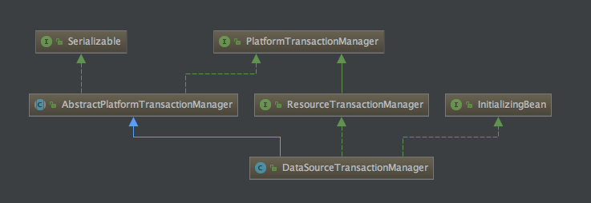
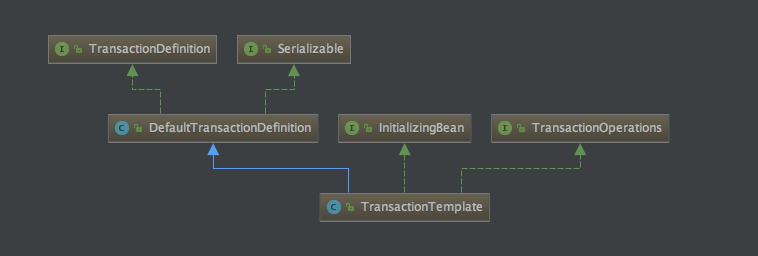
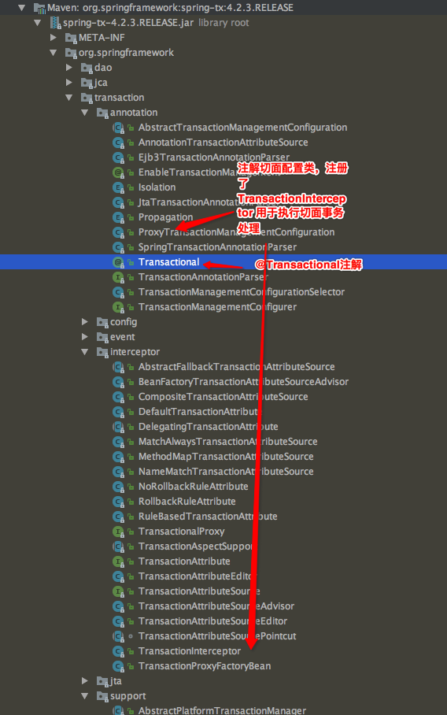
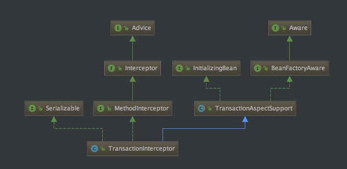

# 知识点分解
## 核心类对象

| 对象                               | 一句话介绍 |
| :--------------------------------- | :--------- |
| PlatformTransactionManager         | Spring事务的核心底层interface，定义了事务核心方法|
| AbstractPlatformTransactionManager | Spring标准事务处理流程的抽象基类，定义了Spring事务处理框架|
| TransactionDefinition              | 事务属性相关。事务隔离级别；超时；传播行为；等|
| TransactionStatus              | 事务实例状态对象，可供查询，用于回滚、SavePoint等场景|
| DataSourceTransactionManager       | Spring框架TransactionManager的典型实现|
| TransactionTemplate                | 将编程式上下文多个步骤合并成一个核心的execute方法，方便事务编程 |







<!-- more -->


## PlatformTransactionManager

+ jar包

```xml
<dependency>
    <groupId>org.springframework</groupId>
    <artifactId>spring-tx</artifactId>
</dependency>
```

Spring事务的核心底层interface，定义了事务核心方法：getTransaction, commit, rollback。

## AbstractPlatformTransactionManager

+ jar包

```xml
<dependency>
    <groupId>org.springframework</groupId>
    <artifactId>spring-tx</artifactId>
</dependency>
```


 Spring标准事务处理流程的抽象基类，定义了Spring事务处理框架。

- AbstractPlatformTransactionManager 利用模板方式定义了Spring标准事务的处理流程，并提供了必须的默认实现，且将doBengin, doSuspend, doResume, doCommit, doRollback等方法开放给继承类实现。

AbstractPlatformTransactionManager 提供了如下事务流程功能

1. 确定是否已存在事务
2. 处理事务传播行为
3. 控制事务的暂停和恢复
4. 检查commit上的rollback-only标记
5. 在回滚时进行必要的处理
6. 触发已注册的事务同步回调。trigger[Before/After][Begin/Commit/Rollback/...]系列，参见：TransactionSynchronizationUtils。


## DataSourceTransactionManager

+ jar包

```xml
<dependency>
    <groupId>org.springframework</groupId>
    <artifactId>spring-jdbc</artifactId>
</dependency>
```

Spring TransactionManager的典型实现类。

继承了AbstractPlatformTransactionManager类，并做了完整的实现。可供编程式事务开发。也可作为TransactionManager的具体实现注入到如TransactionTemplate， Mybatis SqlSessionFactory中去。

## TransactionTemplate

+ jar包

```xml
<dependency>
    <groupId>org.springframework</groupId>
    <artifactId>spring-tx</artifactId>
</dependency>
```

TransactionTemplate 提供的是便捷的编程式事务的方法，将编程式上下文多个步骤合并成一个核心的execute方法。

其本身不具备事务管理的机制，需要通过注入PlatformTransactionManager的Bean实现。

```java
public class TransactionTemplate extends DefaultTransactionDefinition
		implements TransactionOperations, InitializingBean {

	public TransactionTemplate(PlatformTransactionManager transactionManager) {
		this.transactionManager = transactionManager;
	}

    // 核心方法
	@Override
	public <T> T execute(TransactionCallback<T> action) throws TransactionException {
		if (this.transactionManager instanceof CallbackPreferringPlatformTransactionManager) {
			return ((CallbackPreferringPlatformTransactionManager) this.transactionManager).execute(this, action);
		}
		else {
			TransactionStatus status = this.transactionManager.getTransaction(this);
			T result;
			try {
				result = action.doInTransaction(status);
			}
			catch (RuntimeException ex) {
				// Transactional code threw application exception -> rollback
				rollbackOnException(status, ex);
				throw ex;
			}
			catch (Error err) {
				// Transactional code threw error -> rollback
				rollbackOnException(status, err);
				throw err;
			}
			catch (Exception ex) {
				// Transactional code threw unexpected exception -> rollback
				rollbackOnException(status, ex);
				throw new UndeclaredThrowableException(ex, "TransactionCallback threw undeclared checked exception");
			}
			this.transactionManager.commit(status);
			return result;
		}
	}

	private void rollbackOnException(TransactionStatus status, Throwable ex) throws TransactionException {
		logger.debug("Initiating transaction rollback on application exception", ex);
		try {
			this.transactionManager.rollback(status);
		}
		catch (TransactionSystemException ex2) {
			logger.error("Application exception overridden by rollback exception", ex);
			ex2.initApplicationException(ex);
			throw ex2;
		}
		catch (RuntimeException ex2) {
			logger.error("Application exception overridden by rollback exception", ex);
			throw ex2;
		}
		catch (Error err) {
			logger.error("Application exception overridden by rollback error", ex);
			throw err;
		}
	}

}
```

# @Transactional 声明式事务

理解Spring事务的核心对象和配合关系后，再来看Spring框架的声明式事务机制@Transactional就很简单了。








1. sprint-tx包中的ProxyTransactionManagementConfiguration会去配置关于@Transactional注解的处理机制。其中核心的是注册了TransactionInterceptor作为切面事务处理类
1. 当执行声明式事务的代码块之前，会优先被TransactionInterceptor拦截，先执行TransactionInterceptor#invoke进行事务包围。
    - TransactionAspectSupport#invokeWithinTransaction

```java
public class TransactionInterceptor extends TransactionAspectSupport implements MethodInterceptor, Serializable {

	@Override
	public Object invoke(final MethodInvocation invocation) throws Throwable {
		// Work out the target class: may be {@code null}.
		// The TransactionAttributeSource should be passed the target class
		// as well as the method, which may be from an interface.
		Class<?> targetClass = (invocation.getThis() != null ? AopUtils.getTargetClass(invocation.getThis()) : null);

		// Adapt to TransactionAspectSupport's invokeWithinTransaction...
		return invokeWithinTransaction(invocation.getMethod(), targetClass, new InvocationCallback() {
			@Override
			public Object proceedWithInvocation() throws Throwable {
				return invocation.proceed();
			}
		});
	}

}
```

```java
public abstract class TransactionAspectSupport implements BeanFactoryAware, InitializingBean {

    //内部其他方法详见TransactionAspectSupport源码
	protected Object invokeWithinTransaction(Method method, Class<?> targetClass, final InvocationCallback invocation)
			throws Throwable {

		// If the transaction attribute is null, the method is non-transactional.
		final TransactionAttribute txAttr = getTransactionAttributeSource().getTransactionAttribute(method, targetClass);
		final PlatformTransactionManager tm = determineTransactionManager(txAttr);
		final String joinpointIdentification = methodIdentification(method, targetClass);

		if (txAttr == null || !(tm instanceof CallbackPreferringPlatformTransactionManager)) {
			// Standard transaction demarcation with getTransaction and commit/rollback calls.
			TransactionInfo txInfo = createTransactionIfNecessary(tm, txAttr, joinpointIdentification);
			Object retVal = null;
			try {
				// This is an around advice: Invoke the next interceptor in the chain.
				// This will normally result in a target object being invoked.
				retVal = invocation.proceedWithInvocation();
			}
			catch (Throwable ex) {
				// target invocation exception
				completeTransactionAfterThrowing(txInfo, ex);
				throw ex;
			}
			finally {
				cleanupTransactionInfo(txInfo);
			}
			commitTransactionAfterReturning(txInfo);
			return retVal;
		}

		else {
			// It's a CallbackPreferringPlatformTransactionManager: pass a TransactionCallback in.
			try {
				Object result = ((CallbackPreferringPlatformTransactionManager) tm).execute(txAttr,
						new TransactionCallback<Object>() {
							@Override
							public Object doInTransaction(TransactionStatus status) {
								TransactionInfo txInfo = prepareTransactionInfo(tm, txAttr, joinpointIdentification, status);
								try {
									return invocation.proceedWithInvocation();
								}
								catch (Throwable ex) {
									if (txAttr.rollbackOn(ex)) {
										// A RuntimeException: will lead to a rollback.
										if (ex instanceof RuntimeException) {
											throw (RuntimeException) ex;
										}
										else {
											throw new ThrowableHolderException(ex);
										}
									}
									else {
										// A normal return value: will lead to a commit.
										return new ThrowableHolder(ex);
									}
								}
								finally {
									cleanupTransactionInfo(txInfo);
								}
							}
						});

				// Check result: It might indicate a Throwable to rethrow.
				if (result instanceof ThrowableHolder) {
					throw ((ThrowableHolder) result).getThrowable();
				}
				else {
					return result;
				}
			}
			catch (ThrowableHolderException ex) {
				throw ex.getCause();
			}
		}
	}

}
```


