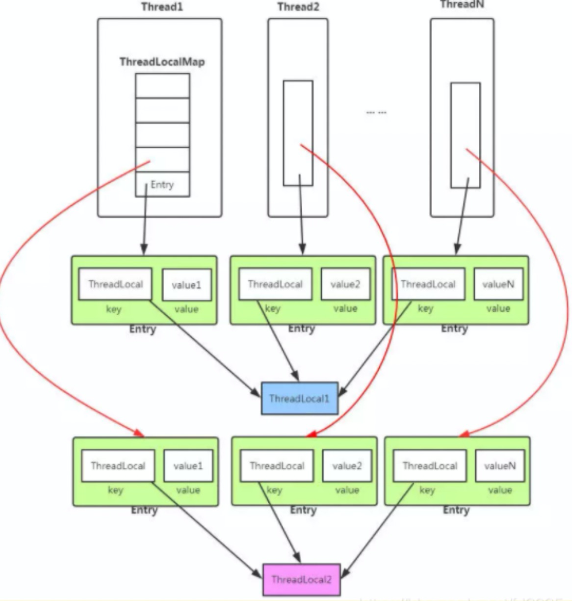
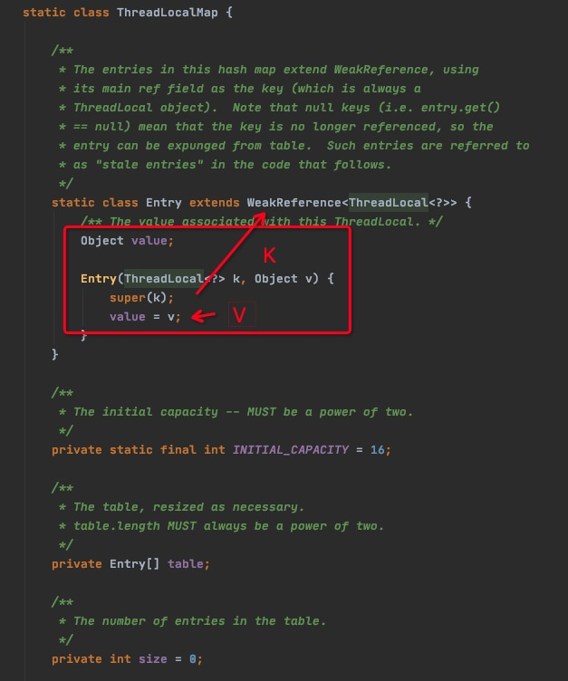
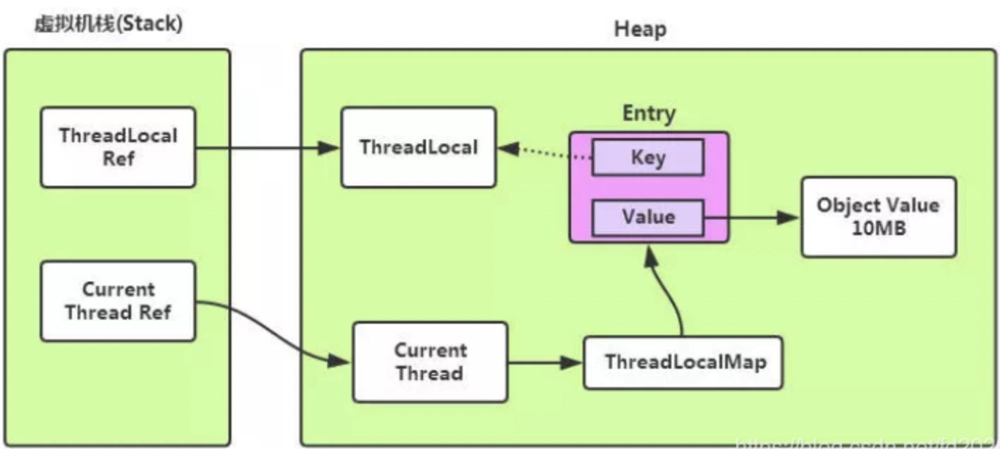
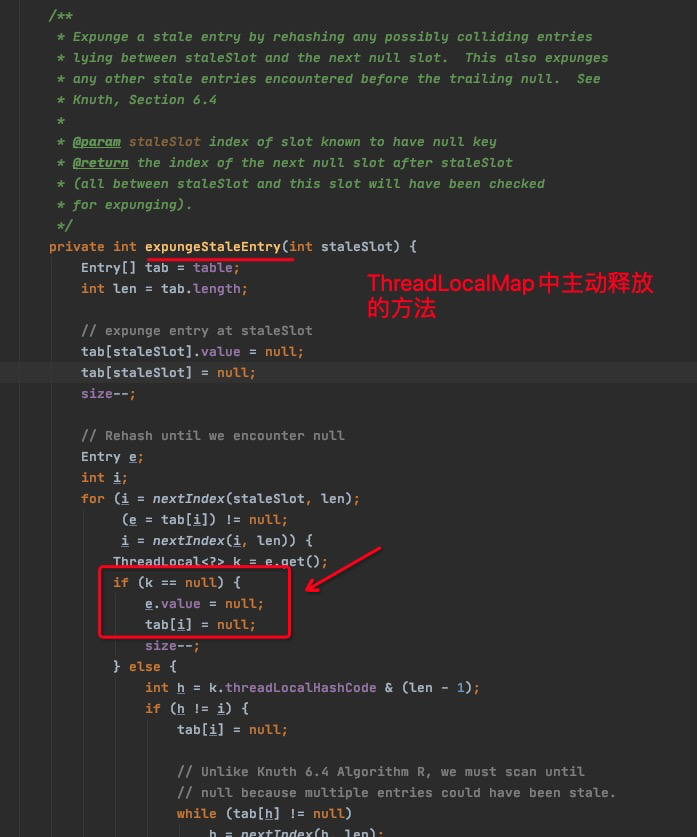
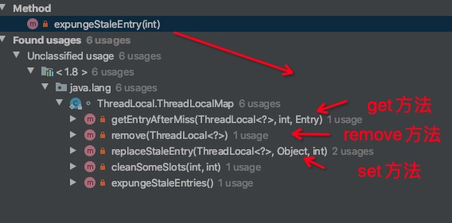

## ThreadLocal内存泄露知识点详解

### 1、ThreadLocal常规用法

```java
public class ThreadLocal<T> {
    
    public static <S> ThreadLocal<S> withInitial(Supplier<? extends S> supplier);

    public void set(T value);
  
    public T get();

    public void remove();
}
```

java.lang.ThreadLocal中只有4个public方法，非常清晰。

- withInitial：是更灵活的set能力，支持传入一个方法，以方法的返回值作为ThreadLocal的初始值。
- set：设置Value到当前线程的ThreadLocal中去。
- get：获取当前线程存储在ThreadLocal中的Value。
- remove：移除当前线程ThreadLocal存储的Value。

注：ThreadLocal是一个变量对象，一个ThreadLocal是一个存储位置。如果线程需要多个存储位置，则创建多个ThreadLocal。

<!--more-->

<br>

**常见用法：**

```java
public class ThreadLocalDemo {
    //2个ThreadLocal
    static ThreadLocal<Integer> countLocal1 = ThreadLocal.withInitial(() -> 0);
    static ThreadLocal<Integer> countLocal2 = ThreadLocal.withInitial(() -> 0);

    public static void main( String[] args ) {
        Thread[] threads = new Thread[3];

        //3个线程，共用2个ThreadLocal。互相不影响。
        for(int i = 0; i < threads.length; i++){
            threads[i] = new Thread(()->{
                int count1 = countLocal1.get();
                countLocal1.set(count1 + 5);

                int count2 = countLocal2.get();
                countLocal2.set(count2 + 10);

                System.out.println(Thread.currentThread().getName() +":"+countLocal1.get()+"->"+countLocal2.get());
            },"thread-"+i);
        }

        for(Thread thread : threads){
            thread.start();
        }
    }
}
```

```shell
运行结果：
thread-0:5->10
thread-2:5->10
thread-1:5->10
```

<br>

### 2、ThreadLocal源码分析

#### 2.1、每个线程的ThreadLocal的Value存在哪？

答：

- 具体是存储在当前线程Thread下的一个HashMap结构中。
- 此线程的所有ThreadLocal共享此HashMap。每个ThreadLocal是Map的Key，set的值就是Value。

```java
public class Thread implements Runnable {
    ...

    ThreadLocal.ThreadLocalMap threadLocals = null;   《《《 存储位置

    ThreadLocal.ThreadLocalMap inheritableThreadLocals = null;
  
    ...
}
```



<center>ThreadLocal存储示意图</center>

<br>

注：ThreadLocal本身不存储Value，而是以自身为标记索引，把Value存储到对应Thread的Map中去。

<br>

#### 2.2、ThreadLocalMap

ThreadLocalMap是实现线程隔离机制的关键。

每个Thread内部都有 一个ThreadLocal.ThreadLocalMap类型的成员变量，该成员变量用来存储实际的ThreadLocal变量副本。

```java
public class Thread implements Runnable {
    ...

    ThreadLocal.ThreadLocalMap threadLocals = null;   <<<<<<<<  这里

    ThreadLocal.ThreadLocalMap inheritableThreadLocals = null;

    ...
}
```

<br>

ThreadLocalMap提供了一种用K-V健值对方式存储每个线程的变量副本的方法，key为ThreadLocal对象，value则是对应线程的变量副本。



- 可以看到ThreadLocalMap有个Entry内部静态类，并继承了WeakReference。由Entry记录两个信息：一个是ThreadLocal类型，一个是Object类型的值。
- getEntry方法则是以ThreadLocal为Key，在线程的ThreadLocalMap中取对应的value值。set方法就是同理，更新或赋值相应ThreadLocal对应的值。
- `Entry继承自WeakReference（弱引用，在无强引用时，生命周期只能存活到下次GC前）`，但只有Key是弱引用类型的，Value并非弱引用。

<br>

`特别说明：`

- 一般网上资料介绍WeakReference特点时，表示弱引用对象的生命周期只能存活到下次GC前。这个描述不准确。
- 关于**弱引用的GC回收**，我推荐的准确描述：当一个对象**仅仅被WeakReference指向，而没有任何其他StrongReference指向的时候**，如果GC运行，那么这个对象就会被回收。（[不错的举例](https://www.xz577.com/j/23022.html)）

- 所以，大家在代码上下文用ThreadLocal时，不用焦虑是否某个时刻被GC回收了而造成代码异常。因为当还在你代码调用上下文时，虚拟机栈上的栈帧里仍记录着对ThreadLocal的StrongReference，此时即使发生GC，ThreadLocal也是不会被回收的。

<br>

#### 2.3、set方法

```java
public void set(T value) {
    Thread t = Thread.currentThread();
    ThreadLocalMap map = getMap(t);
    if (map != null)
        map.set(this, value);
    else
        createMap(t, value);
}


ThreadLocalMap getMap(Thread t) {
    return t.threadLocals;
}


void createMap(Thread t, T firstValue) {
    t.threadLocals = new ThreadLocalMap(this, firstValue);
}
```

- 获取当前线程的ThreadLocalMap
- map非空，则将ThreadLocal和新的value副本放入到map中。
- map空，则创建ThreadLocalMap，赋值到线程Thread中，并将ThreadLocal和value副本放入map中。

<br>

#### 2.4、get方法

```java
public T get() {
    Thread t = Thread.currentThread();
    ThreadLocalMap map = getMap(t);
    if (map != null) {
        ThreadLocalMap.Entry e = map.getEntry(this);
        if (e != null) {
            @SuppressWarnings("unchecked")
            T result = (T)e.value;
            return result;
        }
    }
    return setInitialValue();
}
```

- 获取当前线程的 ThreadLocalMap
- 以ThreadLocal为Key，从此线程的 map 中获取存储的K-V Entry节点。
- 从Entry节点获取存储的Value副本值返回。

<br>

#### 2.5、remove方法

```java
public void remove() {
    ThreadLocalMap m = getMap(Thread.currentThread());
    if (m != null)
        m.remove(this);
}


private void remove(ThreadLocal<?> key) {
    Entry[] tab = table;
    int len = tab.length;
    int i = key.threadLocalHashCode & (len-1);
    for (Entry e = tab[i];
         e != null;
         e = tab[i = nextIndex(i, len)]) {
        if (e.get() == key) {
            e.clear();
            expungeStaleEntry(i);
            return;
        }
    }
}
```

- 移除当前线程的ThreadLocalMap中，ThreadLocal对应觉得Entry节点。

<br>

### 3、ThreadLocal什么时候会内存泄露



1、【因素1：WeakReference】线程的ThreadLocalMap中的K-V的K（ThreadLocal）是以一个弱引用身份存在的，因此当没有外部强引用来引用ThreadLocal时，在下次GC时此ThreadLocal会被回收。这个时候就会出现Entry中Key已经被回收，出现一个null Key的情况，Value讲永远不会被读取到。

2、【因素2：线程一直未退出】如果当前线程的生命周期很长，一直存在，那么其内部的ThreadLocalMap对象也一直生存下来，这些null key就存在一条强引用链的关系一直存在：**Thread --> ThreadLocalMap–>Entry–>Value**，这条`强引用链会导致Entry不会回收`，Value也不会回收，但Entry中的Key却已经被回收的情况，造成内存泄漏。

<br>

### 4、如何避免ThreadLocal内存泄露

#### 4.1【知识点】JDK做了释放的优化

JDK代码做了改进，会在set/get/remove操作中，主动释放属于当前线程的K为null的Entry。





<br>

#### 4.2、【重点】良好的remove习惯

既然Key是弱引用，那么我们要做的事就是在调用ThreadLocal的get()、set()方法时完成后再调用remove方法，将Entry节点和Map的**引用关系移除**，这样整个Entry对象在GC Roots分析后就变成不可达了，下次GC的时候就可以被回收。

**良好的remove习惯可以加速ThreadLocal Value内存的释放**。

如果使用ThreadLocal的set方法之后，没有显示的调用remove方法，就有可能发生内存泄露/内存溢出（因为会延迟到下一次调用ThreadLocal方法，有些时候可能没有下一次了）。

<br>

### 5、为什么ThreadLocalMap的Key是弱引用类型呢？

**如果 key 使用强引用**：引用的ThreadLocal的对象Value被回收了，但是ThreadLocalMap还持有ThreadLocal的强引用，如果没有手动删除，ThreadLocal不会被回收，导致Entry内存泄漏。

<br>

**如果 key 使用弱引用**：引用的ThreadLocal的对象被回收了，由于ThreadLocalMap持有ThreadLocal的弱引用，即使没有手动删除，ThreadLocal也会被回收。value在下一次ThreadLocalMap调用set,get,remove的时候会被清除。

<br>

### 6、最后，再特别强调

关于弱引用类型：

- 一般网上资料介绍WeakReference特点时，表示弱引用对象的生命周期只能存活到下次GC前。这个描述是不准确的。
- 关于**弱引用的GC回收**，我推荐的准确描述：当一个对象**仅仅被WeakReference指向，而没有任何其他StrongReference指向的时候**，如果GC运行，那么这个对象就会被回收。（[不错的举例](https://www.xz577.com/j/23022.html)）

- 所以，大家在代码上下文用ThreadLocal时，不用焦虑是否某个时刻被GC回收了而造成代码异常。因为当还在你代码调用上下文时，虚拟机栈上的栈帧里仍记录着对ThreadLocal的StrongReference，此时即使发生GC，ThreadLocal也是不会被回收的。