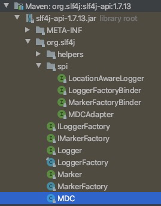

# slf4j MDC是个好东西

# 简介

MDC 全拼 Mapped Diagnostic Contexts，是SLF4J类**日志系统**中实现分布式多线程日志数据**传递**的重要工具。

同时，用户也可利用MDC将一些运行时的上下文数据打印出来。

<br>

**什么意思呢？**

常规情况下，写打日志的代码时，一般都是log.info、log.warn、log.error将想要打的日志进行拼装和格式化，打到日志输出中。MDC能干什么呢？能在不改动log.xxx打日志代码的情况下，在最终的日志输出的指定位置打印额外的信息。而这，就是靠MDC进行传递实现的。

<!--more-->

<br>

# 应用场景

在日志中自动打印框架/组件方面的信息

例如：

- 全链路日志traceId
- 用户请求的IP地址、user-agent

<br>

# 代码示例

> 一般配合AOP / Filter / Interceptor使用

```java
@Around(value = "execution(* com.xx.xx.facade.impl.*.*(..))", argNames="pjp")
public Object validator(ProceedingJoinPoint pjp) throws Throwable {
  try {
    String traceId = TraceUtils.begin();
    MDC.put("mdc_trace_id", traceId);    
    Object obj = pjp.proceed(args);
    return obj;
  } catch(Throwable e) {
    //TODO 处理错误
  } finally {
    TraceUtils.endTrace();
  }
} 
```

代码通过AOP记录了每次请求的traceId，并使用变量"mdc_trace_id"记录到MDC内。

在日志配置文件里需要设置变量才能将"mdc_trace_id"输出到日志文件中。以logback配置文件为例，看日志第10行%X{mdc_trace_id}：

```shell
<appender name="ALL" class="ch.qos.logback.core.rolling.RollingFileAppender">
      <file>${CATALINA_BASE}/logs/all.log</file>
      <rollingPolicy class="ch.qos.logback.core.rolling.TimeBasedRollingPolicy">
          <!-- daily rollover -->
          <fileNamePattern>${CATALINA_BASE}/logs/all.%d{yyyy-MM-dd}.log</fileNamePattern>
          <!-- keep 30 days' worth of history -->
          <maxHistory>30</maxHistory>
      </rollingPolicy>
      <encoder charset="UTF-8">
          <pattern>%d{yyyy-MM-dd HH:mm:ss.SSS} [%thread] %-5level %logger{36} - traceId:[%X{mdc_trace_id}] - %msg%n</pattern>
      </encoder>
  </appender>
```

<br>

# 可见的优势

1、如果你的系统早已上线，突然有一天老板说我们增加一些用户数据到日志里分析一下。如果没有MDC，你不得不在N个工程里翻天覆地的“传参数+改打日志的代码”，你肯定很崩溃，不懂技术的老板也很无奈（就多加几点信息，这么大动静吗？）。而MDC能让你很从容的完成此事。

- 笔者团队就有这样的情况，但提出在日志里加内容的是我们自已的优化想法：将pinpoint的链路标识打到应用日志里去。

2、使代码简洁、日志风格统一、变更灵活。

<br>

# 对MDC源码的窥探

## MDC所在的jar包



此处以 Logback中的实现为例。为了方便讲解，我们只分析MDC的put()方法：

```java
public class MDC {

  public static void put(String key, String val)
      throws IllegalArgumentException {
    if (key == null) {
      throw new IllegalArgumentException("key parameter cannot be null");
    }
    if (mdcAdapter == null) {
      throw new IllegalStateException("MDCAdapter cannot be null. See also "
          + NULL_MDCA_URL);
    }
    mdcAdapter.put(key, val);
  }
```

MDC的put()方法利用MDCAdapter实现。

<br>

## Logback中的具体实现

> 既然一般都是结合AOP使用MDC，那么还是要考虑内部方法实现时的支撑情况，例如：多线程

<br>

下面看一下Logback中MDCAdapter的实现**LogbackMDCAdapter**：

```java
public final class LogbackMDCAdapter implements MDCAdapter {
   final InheritableThreadLocal<Map<String, String>> copyOnInheritThreadLocal = new InheritableThreadLocal();
  
  public void put(String key, String val) throws IllegalArgumentException {
        if (key == null) {
            throw new IllegalArgumentException("key cannot be null");
        } else {
            Map<String, String> oldMap = (Map)this.copyOnInheritThreadLocal.get();
            Integer lastOp = this.getAndSetLastOperation(1);
            if (!this.wasLastOpReadOrNull(lastOp) && oldMap != null) {
                oldMap.put(key, val);
            } else {
                Map<String, String> newMap = this.duplicateAndInsertNewMap(oldMap);
                newMap.put(key, val);
            }
        }
    }
}
```

- MDC只有一种用法：`MDC.put(X,Y)`。那么，在MDC的具体实现包中，肯定会有个Map作为存储容器。如上，LogbackMDCAdapter中也有Map<String, String>。
- MDC内的key-value要能在调用链路中都能打印，那么Map肯定是存储在ThreadLocal中传递。
- Map<String, String>存储在InheritableThreadLocal中，即AOP内真正的业务方法内部若进行了子线程的创建，MDC内的key-value也能正常的打印到日志中。但，内部若是线程池的方式执行细分业务，则线程池任务内打印的日志则不会有此内容（线程池的ThreadLocal传递需要用TransmittableThreadLocal）。比较遗憾，logback没有预留这一点的SPI。

