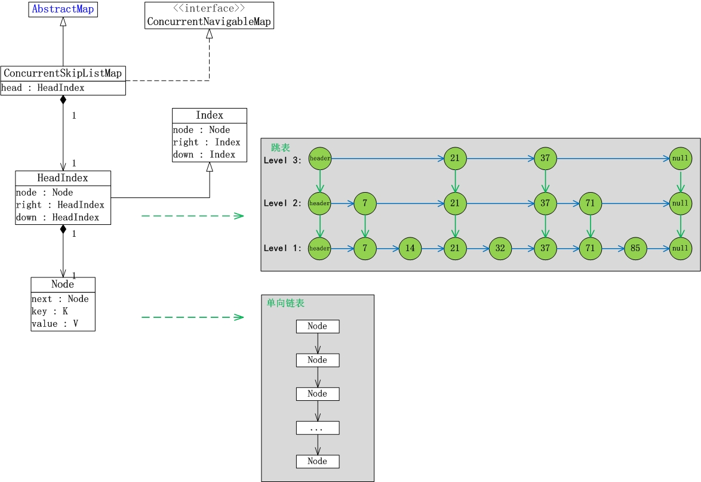
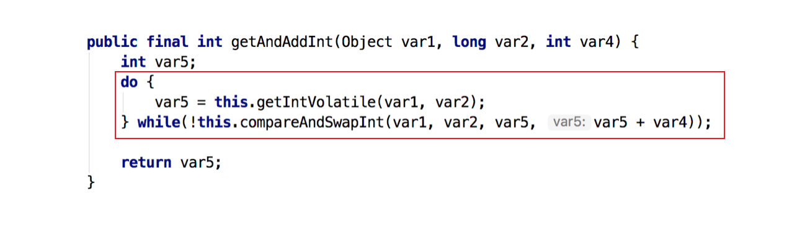
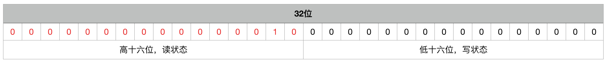

# 《一文就明白Java并发编程》

一文系列 之 并发编程。

行文3万余字，包含了多线程方方面面的知识点，相信对你会有所帮助！

<br>

<br>

<p align="right">黄老师</p>

<br>

[TOC]

<br><br>

# 1、进程&线程

虽然大家肯定知道进程、线程的概念，但在介绍整篇文章前还是需要再陈述下，保证行文信息量的连贯性。

<br>


<Center>Linux系统中线程的位置</Center>

<!--more-->

**一些基础知识：**

- Linux操作系统分内核态和用户态。
  - 内核态是操作系统自己管理和控制的，是“基石”。内核态也可以开发，利用linux内核模块化技术进行模块形式加载。
  - 用户态是开放使用的，以进程为开放使用单位。进程是在用户态资源分配的单位（以进程为单位分配内存空间），进程内的线程是用户态执行单位（进程有默认线程，以线程去执行具体的代码，作为执行单位的特点是每个线程一个调用栈）。
- 其实，内核态是清楚并管理用户态的进程和线程的。用户态的每个进程在内核有对应的PCB作为管理对象。用户态的每个线程在内核有对应的TCB作为管理和调度对象。
- 在计算机中，CPU是稀缺资源，N多待调度的线程通过操作系统的Scheduler调度器去分配CPU时间片，让各个线程能“雨露均沾”。
- 用户态线程的调度功能有2种实现方式：
  - 第一种：交由操作系统去管理调度，特点：用户态线程和内核线程是一一映射的（如图）。也是JDK 1.2之后版本的实现方式。
  - 第二种：JDK1.2之前，由开发者（对于JDK来说，是JVM自己）在进程空间实现一套进程内线程的调度算法。这种实现方式对开发者来说复杂，又难以完全控制时间片，可能部分线程会饿死，因为是否分配CPU时间片的真正权力握在操作系统内核上.

<br>

# 2、JUC并发包

## 2.1、JUC包介绍

JUC是 java.util.concurrent的简称，是JDK包下原生的lib。是Java 5.0 提供的并发编程包，包含了并发编程中很常用的实用工具类。

> 下文以JDK8为例


<br>

其实，JUC包中的内容经过归类后并不繁多、复杂。

<br>

**JUC提供的能力分类：**

1、Atomic原子类

2、Lock相关 几类基础锁机制

3、并发安全的Collection类、Map类

4、多种队列工具类

5、线程池机制

6、多线程协同工具类

<br>

## 2.2、Atomic原子类

总所周知，Atomic原子类能保证在一个对象上多个操作步骤的原子性。这是Atomic机制在多线程并发环境中存在的意义。

<br>

### 2.2.1、Atomic原子类的细分


- **基本类型的原子性操作：AtomicBoolean、AtomicInteger、AtomicLong**

  - 这些类能保证在并发环境中对基础整型数字的get、set、incr、decr、add、minus等方面操作的原子性。
  - *JDK8开始有LongAdder类*，功能与AtomicLong类似。在高并发，写多读少的场景性能比AtomicLong好。

- **数组类型的原子性操作：AtomicIntegerArray、AtomicLongArray、AtomicReferenceArray**

  - 数组级别的原子操作。提供的方法方面，只是对数组上的指定单个元素做原子操作。不具备范围型批量操作方法。

- **引用类型的原子性操作：AtomicReference**

  - “AtomicReference<V>” 是AtomicReference的Class声明，即AtomicReference是存放Java对象引用的，任何对象都可以。而AtomicReference能保证多线程环境下对这个对象引用变更的一致性。
  - 代码案例见下文

- **带版本标识的引用类型的原子性操作：AtomicStampedReference、AtomicMarkableReference**

  - *AtomicReference无法避免ABA问题*。

  - 若业务场景对AtomicReference指向的对象的变化过程不关心，**只关心当下时刻的值是多少，那么AtomicReference还是适合的**。若业务场景关心对象值的变化过程，那么AtomicReference就不适合了。

  - AtomicStampedReference 在AtomicReference基础上，增加了一个`final int stamp`字段，大家可以理解为版本号+乐观锁的概念。每当对AtomicStampedReference的对象做更新时，需同时比对对象应用和stamp值，然后同时更新对象应用和stamp值

  - ```java
    public boolean compareAndSet(V   expectedReference,
                                 V   newReference,
                                 int expectedStamp,
                                 int newStamp) {
      Pair<V> current = pair;
      return
        expectedReference == current.reference &&
        expectedStamp == current.stamp &&
        ((newReference == current.reference &&
          newStamp == current.stamp) ||
         casPair(current, Pair.of(newReference, newStamp)));
    }
    ```

  - AtomicMarkableReference与AtomicStampReference的区别：相较于，AtomicStampReference新增的int stamp字段，AtomicMarkableReference增加的是boolean类型的字段。其他操作上都一样，但不能解决ABA问题。

- **反射方式原子操作：AtomicIntegerFieldUpdater、AtomicLongFieldUpdater、AtomicReferenceFieldUpdater**

  - 以反射方式，对一个对象内的整型数字字段进行原子操作
  - 要求：
    - 此字段必须是volatile的，保证变量变更线程间立即可见
    - 此字段必须是变量，不能是final
    - 只能是实例变量，不能是类变量，也就是说不能加static关键字
    - 此字段只能是int、long基础类型（不能是包装类）
    - 段的描述类型（修饰符public/protected/default/private）是与调用者与操作对象字段的关系一致。也就是说调用者能够直接操作对象字段，那么就可以反射进行原子操作
  - 代码案例见下文

<br><br>

**代码案例说明 - AtomicReference**

以Person POJO类为背景，Person类里含有2个字段：name、age。

 构造Person对象的初始值为 `name=Tom, age = 18`。

计划

 在 线程1 中将 `name` 修改为 `Tom1`，`age + 1`。
 在 线程2 中将 `name` 修改为 `Tom2`，`age + 2`。

<br>

- 普通引用版本  《《《 会引发更新不一致性

```java
// 普通引用
private static Person person;   《《《 全局Person对象

public static void main(String[] args) throws InterruptedException {
    person = new Person("Tom", 18);

    System.out.println("Person is " + person.toString());

    Thread t1 = new Thread(new Task1());  
    Thread t2 = new Thread(new Task2());  

    t1.start();   《《《 并发修改：name、age
    t2.start();   《《《 并发修改：name、age

    t1.join();
    t2.join();

    System.out.println("Now Person is " + person.toString());
}

static class Task1 implements Runnable {
    public void run() {
        person.setAge(person.getAge() + 1);   《《《 并发场景下，对象多个字段的赋值非原子性
        person.setName("Tom1");               《《《

        System.out.println("Thread1 Values "
                + person.toString());
    }
}

static class Task2 implements Runnable {
    public void run() {
        person.setAge(person.getAge() + 2);   《《《 并发场景下，对象多个字段的赋值非原子性
        person.setName("Tom2");               《《《

        System.out.println("Thread2 Values "
                + person.toString());
    }
}
```

可能的输出：

```shell
Person is [name: Tom, age: 18]
  Thread2 Values [name: Tom1, age: 21]
  Thread1 Values [name: Tom1, age: 21]
Now Person is [name: Tom1, age: 21]
```

<br>

- 原子引用版本 

```java
// 普通引用
private static Person person;
// 原子性引用
private static AtomicReference<Person> aRperson;

public static void main(String[] args) throws InterruptedException {
    person = new Person("Tom", 18);
    aRperson = new AtomicReference<Person>(person); 《《《 对象的原子引用

    System.out.println("Atomic Person is " + aRperson.get().toString());

    Thread t1 = new Thread(new Task1());   
    Thread t2 = new Thread(new Task2());   

    t1.start();   《《《 并发修改：name、age
    t2.start();   《《《 并发修改：name、age

    t1.join();
    t2.join();

    System.out.println("Now Atomic Person is " + aRperson.get().toString());
}

static class Task1 implements Runnable {
    public void run() {
        aRperson.getAndSet(new Person("Tom1", aRperson.get().getAge() + 1));  《《《 对象多字段操作原子性

        System.out.println("Thread1 Atomic References "
                + aRperson.get().toString());
    }
}

static class Task2 implements Runnable {
    public void run() {
        aRperson.getAndSet(new Person("Tom2", aRperson.get().getAge() + 2));  《《《 对象多字段操作原子性

        System.out.println("Thread2 Atomic References "
                + aRperson.get().toString());
    }
}
```

输出之一：

```shell
Atomic Person is [name: Tom, age: 18]
  Thread1 Atomic References [name: Tom1, age: 19]
  Thread2 Atomic References [name: Tom2, age: 21]
Now Atomic Person is [name: Tom2, age: 21]
```

<br>

<br>

**代码案例说明 - AtomicIntegerFieldUpdater**

```java
package automic;
import java.util.concurrent.atomic.AtomicIntegerFieldUpdater;

public class AtomicIntegerFieldUpdaterTest {
     private static Class<Person> cls;
     /**
      * AtomicIntegerFieldUpdater class说明
      * 基于反射的实用工具，可以对指定类的指定 volatile int 字段进行原子更新。此类用于原子数据结构，
      * 该结构中同一节点的几个字段都独立受原子更新控制。
      * 注意，此类中 compareAndSet 方法的保证弱于其他原子类中该方法的保证。
      * 因为此类不能确保所有使用的字段都适合于原子访问目的，所以对于相同更新器上的 compareAndSet 和 set 的其他调用，
      * 它仅可以保证原子性和可变语义。
      * @param args
      */
     public static void main(String[] args) {
        // 新建AtomicLongFieldUpdater对象，传递参数是“class对象”和“long类型在类中对应的名称”
        AtomicIntegerFieldUpdater<Person> personFieldUpdater = AtomicIntegerFieldUpdater.newUpdater(Person.class, "id");
        Person person = new Person(12345);
        personFieldUpdater.compareAndSet(person, 12345, 1000);
        System.out.println("id=" + person.getId());
     }
}

class Person {
    volatile int id;
    public Person(int id) {
        this.id = id;
    }
    ......
}
```


<br>

### 2.2.2、Atomic原子类的实现原理

Atomic的核心操作是CAS（Compare And Set）。该操作在操作系统层面对应C语言汇编的CMPXCHG指令，该指令通过三个操作数（变量V，预期旧值O，目标新值N），能原子的完成“变量V当前值与预期旧值E的等值判断，并完成新值N的赋值”。

注，常规的Atomic存在ABA的问题。

<br>

所有Atomic类内部都会调用Unsafe类完成CAS的操作

```java
public final native boolean compareAndSwapObject(Object var1, long var2, Object var4, Object var5);

public final native boolean compareAndSwapInt(Object var1, long var2, int var4, int var5);

public final native boolean compareAndSwapLong(Object var1, long var2, long var4, long var6);
```

Unsafe内部就是C语言实现与操作系统的交互了，最终会涉及到CPU级的操作。

<br>

**CMPXCHG指令介绍**

Unsafe的CompareAndSwap方法最终在 hotspot 源码实现中都会调用统一的 cmpxchg 函数。

**cmpxchg 函数源码**：

源码地址：`hotspot/src/share/vm/runtime/Atomic.cpp`

```c++
jbyte Atomic::cmpxchg(jbyte exchange_value, volatile jbyte*dest, jbyte compare_value) {
		 assert (sizeof(jbyte) == 1,"assumption.");
		 uintptr_t dest_addr = (uintptr_t) dest;
		 uintptr_t offset = dest_addr % sizeof(jint);
		 volatile jint*dest_int = ( volatile jint*)(dest_addr - offset);
		 // 对象当前值
		 jint cur = *dest_int;
		 // 当前值cur的地址
		 jbyte * cur_as_bytes = (jbyte *) ( & cur);
		 // new_val地址
		 jint new_val = cur;
		 jbyte * new_val_as_bytes = (jbyte *) ( & new_val);
		  // new_val存exchange_value，后面修改则直接从new_val中取值
		 new_val_as_bytes[offset] = exchange_value;
		 // 比较当前值与期望值，如果相同则更新，不同则直接返回
		 while (cur_as_bytes[offset] == compare_value) {
		  // 调用汇编指令cmpxchg执行CAS操作，期望值为cur，更新值为new_val
			 jint res = cmpxchg(new_val, dest_int, cur);
			 if (res == cur) break;
			 cur = res;
			 new_val = cur;
			 new_val_as_bytes[offset] = exchange_value;
		 }
		 // 返回当前值
		 return cur_as_bytes[offset];
}
```

<br>

**多CPU如何实现原子操作**


在计算机硬件层面，CPU 处理器速度远远大于主内存，为了解决速度差异，在两者之间架设了CPU多级缓存，如 L1、L2、L3 级别的缓存，这些缓存离CPU越近就越快，将频繁操作的数据缓存到这里，加快访问速度。

现在都是多核 CPU 处理器，每个 CPU 处理器内维护各自关于内存数据的缓存，当多线程并发读写时，就会出现CPU缓存数据不一致的情况。

**对于原子操作，CPU处理器提供2种方式：**

- **总线锁定**

当一个处理器要操作共享变量时，在 BUS 总线上发出一个 Lock 信号，其他处理就无法操作这个共享变量了。

缺点很明显，总线锁定在阻塞其它处理器获取该共享变量的操作请求时，也可能会导致大量阻塞，从而增加系统的性能开销。

- **缓存锁定 **

后来的处理器都提供了缓存锁定机制，当某个处理器对缓存中的共享变量进行了操作，其他处理器会有个嗅探机制，将其他处理器的该共享变量的缓存失效，待其他线程读取时会重新从主内存中读取最新的数据，基于 MESI 缓存一致性协议来实现的。

现代的处理器基本都支持和使用的缓存锁定机制。


<br>

## 2.3、JUC包中的锁

Java中有很多种类的锁，在JUC包中也有比较多的锁类型。但不用怕难，因为归结到底层和操作系统级别，其核心原理和机制都是类似的，所以学Java的锁也只需要掌握锁背后的核心机制和扩展方向就行了，剩下的就交给举一反三吧。

<br>


<Center>JUC包中锁之间的关联</Center>

通过上图，对JUC包中的锁有个宏观认识，相信对理解和掌握JUC包中的锁会有事半功倍的效果。


### 2.3.1、顶层抽象类：AbstractQueuedSynchronizer（AQS）

**2.3.1.1、AbstractQueuedSynchronizer**，简称AQS。【核心抽象类】

我们对于锁的认知，一般会有如下几个常规的认知：

1、多个线程尝试拿锁

2、拿不到锁的线程阻塞等待

3、用完锁的线程释放锁，等待线程得到锁

<br>

其实在JUC包中锁实现的本质原理也是这么回事。

<br>

**有关于AQS：**

1、AQS中的等待队列FIFO


- head：表示当前拿到锁的线程Node
- node：表示未拿到锁被阻塞的线程Node

2、AQS有“独占锁”和“共享锁”两种模式

- 独占模式（Node.EXCLUSIVE） 应用：ReentrantLock
- 共享模式（Node.SHARE）        应用：Semaphore

3、实现了AQS的锁有：自旋锁、互斥锁、读锁写锁、条件产量、信号量、栅栏都是AQS的衍生物

<br>

**2.3.1.1.1、独占模式：**

> 为帮助阅读，已精简剔除大量代码。

```java
public abstract class AbstractQueuedSynchronizer extends AbstractOwnableSynchronizer {
    ...
/**重要变量*/
      
    // 头结点，可理解为当前持有锁的线程
    private transient volatile Node head;
    // 阻塞的尾节点，每个新的节点进来，都插入到最后，也就形成了一个链表
    private transient volatile Node tail;
    // 代表当前锁的状态，0代表没有被占用，大于0 代表有线程持有当前锁, 大于 1 代表锁重入的次数
    private volatile int state;                     
    // 当前持有独占锁的线程。继承自AbstractOwnableSynchronizer
    private transient Thread exclusiveOwnerThread; 

/**重要接口*/
  
    // 加锁接口
    public final void acquire(int arg){...}
       boolean tryAcquire(int arg) {...}    // 尝试加锁
       Node addWaiter(Node mode) {...}      // 拿不到锁就创建新等待节点，并添加到队列尾部
       boolean acquireQueued(final Node node, int arg) {...}  // 使线程阻塞在等待队列中，一直获取到资源后才返回。如果在整个等待过程中被中断过，则返回true，否则返回false
           boolean parkAndCheckInterrupt()  // 当前线程主动阻塞自己

    //解锁接口
    public final boolean release(int arg) {...}
       boolean tryRelease(int arg) {...}    // 尝试解锁，一般都会成功。若跨线程解锁会抛异常
       void unparkSuccessor(Node node)      // 唤醒等待队列里的下一个等待节点的线程

    ...
}
```

<br>

AbstractQueuedSynchronizer作为JUC包中锁的顶级抽象类，以模板方式和抽象方法方式，为JUC包中锁的实现定义了框架和提供了默认/基础实现。

**AQS类锁能力基础认知：**

1、如上代码注释所属。其实现原理借助于关键变量：head、tail、state、exclusiveOwnerThread，和关键方法：acquire和release，以及内部的子方法。

2、总体上实现：加锁、判断锁、阻塞等待队列、可重入锁、解锁等框架能力

<br>

**AQS关键代码解读：**

- **acquireQueued(Node, int)** 拿不到锁时，线程阻塞挂起

```java
final boolean acquireQueued(final Node node, int arg) {
      boolean failed = true;//标记是否成功拿到资源
      try {
          boolean interrupted = false;//标记等待过程中是否被中断过
          
          //“自旋”！
          for (;;) {
              final Node p = node.predecessor();//拿到前驱
              
              //如果前驱是head，即该结点已成老二，那么便有资格去尝试获取资源（可能是老大释放完资源唤醒自己的，当然也可能被interrupt了）。
              if (p == head && tryAcquire(arg)) {
                 setHead(node);//拿到资源后，将head指向该结点。所以head所指的标杆结点，就是当前获取到资源的那个结点或null。
                 p.next = null; // setHead中node.prev已置为null，此处再将head.next置为null，就是为了方便GC回收以前的head结点。也就意味着之前拿完资源的结点出队了！
                 failed = false; // 成功获取资源
                 return interrupted;//返回等待过程中是否被中断过
             }
             
             //如果自己可以休息了，就通过park()进入waiting状态，直到被unpark()。如果不可中断的情况下被中断了，那么会从park()中醒过来，发现拿不到资源，从而继续进入park()等待。
             if (shouldParkAfterFailedAcquire(p, node) &&
                 parkAndCheckInterrupt())
                 interrupted = true;//如果等待过程中被中断过，哪怕只有那么一次，就将interrupted标记为true
         }
     } finally {
         if (failed) // 如果等待过程中没有成功获取资源（如timeout，或者可中断的情况下被中断了），那么取消结点在队列中的等待。
             cancelAcquire(node);
     }
 }
```

<br>

- **unparkSuccessor(Node node)**  解锁时唤醒下一个等待节点线程

```java
private void unparkSuccessor(Node node) {
     //这里，node一般为当前线程所在的结点。
     int ws = node.waitStatus;
     if (ws < 0)//置零当前线程所在的结点状态，允许失败。
         compareAndSetWaitStatus(node, ws, 0);
 
     Node s = node.next;//找到下一个需要唤醒的结点s
     if (s == null || s.waitStatus > 0) {//如果为空或已取消
         s = null;
         for (Node t = tail; t != null && t != node; t = t.prev) // 从后向前找。
             if (t.waitStatus <= 0)//从这里可以看出，<=0的结点，都是还有效的结点。
                 s = t;
     }
     if (s != null)
         LockSupport.unpark(s.thread);//唤醒
 }
```


**2.3.1.1.2、共享模式：**

> 查看带 xxxShared 字眼的方法

相比独占模式，共享模式的差异如下：

1、state 初始值大于1，代表可被共享的次数

2、共享模式加锁时，对state做减法操作，只要剩余state够就能加锁成功。加锁成功时**不再记录加锁的Thread信息**。

3、加锁失败时，与共享模式一样，添加等待节点到等待队列尾部。

4、解锁时，做state做加法操作。然后**循环唤醒**等待队列中的阻塞线程。

<br>

**关键代码解读：**

- **tryAcquireShared** 

```java
final int nonfairTryAcquireShared(int acquires) {
  for (;;) {
    //获取AQS中资源个数
    int available = getState();
    int remaining = available - acquires;
    //如果remaining小于0，说明没有可用的资源了，如果大于0，执行CAS操作获取资源，最后返回剩余的资源数
    //如果返回的剩余资源数小于或者等于0，说明没有可用资源了，如果大于0，说明还有可用资源
    if (remaining < 0 ||
        compareAndSetState(available, remaining))
      return remaining;
  }
}
```

- **releaseShared**

```java
public final boolean releaseShared(int arg) {
    if (tryReleaseShared(arg)) {
        doReleaseShared();
        return true;
    }
    return false;
}

//Semaphore中的实现
protected final boolean tryReleaseShared(int releases) {
  for (;;) {
    int current = getState();
    int next = current + releases;
    if (next < current) // overflow
      throw new Error("Maximum permit count exceeded");
    if (compareAndSetState(current, next))   // 释放资源占用
      return true;
  }
}
```

- **doReleaseShared**

```java
private void doReleaseShared() {
  for (;;) {
    //获取首节点
    Node h = head;
    if (h != null && h != tail) {
    //获取首节点状态
    int ws = h.waitStatus;
    //如果首节点状态是SIGNAL，说明首节点后面还有节点，唤醒他们
    if (ws == Node.SIGNAL) {
        //先把首节点状态改成0，0可以看成首节点的中间状态，只有在唤醒第二个节点的时候才会存在，当第二个节点唤醒之后，首节点
        //就会被干掉
        if (!compareAndSetWaitStatus(h, Node.SIGNAL, 0))
          continue;            // loop to recheck cases

        //这个方法就是唤醒首节点之后第一个处于非取消状态的节点
        unparkSuccessor(h);
    }
      
      //判断ws == 0，这个是中间状态，就是说有一个线程正在唤醒第二个节点，这个时候，又有一个线程释放了资源，也要来唤醒第二个节点，但是他发现
      //有别的线程在处理，他就把这个状态改成PROPAGATE = -3,而这个状态正是上一个方法需要判断的，上一个方法判断h.waitStatus < 0，会成立就是这里设置的
      //当然，h.waitStatus < 0会成立，还有别的原因，这个只是其中一个，下面会分析
      else if (ws == 0 &&
               !compareAndSetWaitStatus(h, 0, Node.PROPAGATE))
        continue;                // loop on failed CAS
    }
    if (h == head)               // loop if head changed
      break;
  }
}
```

<br>

至此，你已经掌握了AQS抽象类的主要原理，相信在看具体锁实现时会事半功倍（AbstractQueuedSynchronizer中还有很多的具体实现，但不打紧，掌握这几个核心原理就可以了）。

<br>

### 2.3.2、顶层抽象类：AbstractOwnableSynchronizer

此类特别简单，可直接看代码。

```java
public abstract class AbstractOwnableSynchronizer implements java.io.Serializable {

    // 锁独占模式下，当前独占锁的线程
    private transient Thread exclusiveOwnerThread;

    //set操作
    protected final void setExclusiveOwnerThread(Thread thread) {
        exclusiveOwnerThread = thread;
    }

    //get操作
    protected final Thread getExclusiveOwnerThread() {
        return exclusiveOwnerThread;
    }
}
```

<br>

### 2.3.3、顶层抽象类：AbstractQueuedLongSynchronizer

一句话：64位版本的AQS


<br>

### 2.3.4、锁分类

Java中有哪些常见的锁？

- 见本文后面章节《Java中的锁》。进行了分类和详细的介绍。

<br>

### 2.3.5、ReentrantLock

> 假设你已经先读了：
>
> - AQS
> - 本文的锁分类介绍

那么，在此基础上我们差异性的陈述一些要点：

<br>

- ReentrantLock是独享锁
- ReentrantLock底层是基于AQS
- ReentrantLock支持公平锁模式和非公平锁模式，默认是非公平锁（即尝试加锁时是抢占式的）

<br>

**老生常谈 之 ReentrantLock  vs  synchronized**

既然与ReentrantLock相比，那么就从ReentrantLock特点的视角对比下：

|               | 锁类型 | 底层技术      | 是否公平锁     | 是否可重入 |
| ------------- | ------ | ------------- | -------------- | ---------- |
| ReentrantLock | 独享锁 | CAS + AQS     | 均支持。可指定 | 可重入     |
| synchronized  | 独享锁 | CAS + Monitor | 非公平锁       | 可重入     |

> 关于ReentrantLock的可重入，还记得上文的AbstractOwnableSynchronizer不，每次加锁时拿出来判断下即可，发现是同一个线程，重入。

另外，两者在性能层面没有明显区别。

<br>

所以，选择哪一种就要看具体代码场景了

- 适合ReentrantLock的场景
  - 细粒度的锁范围控制
  - 细粒度的阻塞线程唤醒。ReentrantLock提供了Condition类，用来实现分组唤醒需要唤醒的线程们。
  - ReenTrantLock提供了一种能够中断等待锁的线程的机制，通过lock.lockInterruptibly()来实现这个机制。

所以，一般情况下常规加锁需求用synchronized先，有更进一步的加锁要求时ReentrantLock更适合。

<br>


### 2.3.6、ReentrantReadWriteLock

上来先讲结论，然后再酌情看代码加深理解：

（参考下图）

- ReentrantReadWriteLock是读写锁
- ReentrantReadWriteLock内部持有两把锁来实现读写锁：ReadLock、WriteLock
- ReadLock&WriteLock共用一个Sync（即共享同一个AQS），正因为是共用一个Sync，才能在读写锁的时候分别感知对方的状态。
- ReentrantReadWriteLock的读写锁标记维护在同一个AQS的state上，为了记录ReadLock和WriteLock的次数， 通过EXCLUSIVE_MASK将32位的state拆成两段：高16位给ReadLock用，低16位给WriteLock用。
- 读锁状态：可多个线程同时拿锁，且均可各自重入。（见：Sync内部类HoldCounter和ThreadLocalHoldCounter）
- 写锁状态：独享锁状态。
- ReentrantReadWriteLock支持锁降级：写锁状态进入，读锁状态退出


<Center>ReentrantReadWriteLock类依赖关系</Center>

<br>

**ReentrantReadWriteLock内部的两把锁：**


<br>

**共用一个Sync（AQS）：**

Sync里有哪些重要信息呢？

- 将AQS state字段复用为读锁、写锁计数位的SHARED_SHIFT

- ThreadLocalHoldCounter控制读锁重入
- 其他均继承自AQS
  - state 记录锁的状态
  - exclusiveOwnerThread 记录锁被哪个线程独占
  - 等待队列
  - 线程阻塞 & 等待线程唤醒方法
  - 共享模式（读锁的场景）


<br>

**ReentrantReadWriteLock分段使用AQS的锁计数state：**


<br>

**锁降级：**

> 概念：

以写锁进入临界区，但以读锁结束。（加锁顺序：写锁-加锁 ==> 读锁加锁 ==> 写锁-解锁 ==> 读锁-解锁）

<br>

- **相关代码**

```java
public abstract class AbstractQueuedSynchronizer extends AbstractOwnableSynchronizer implements java.io.Serializable {
    ...
    public final void acquireShared(int arg) {
        if (tryAcquireShared(arg) < 0)   //若tryAcquireShared返回>=0。代表拿读锁成功
            doAcquireShared(arg);        //执行拿读锁的逻辑
    }
    ...
}
```

<br>

```java
public class ReentrantReadWriteLock implements ReadWriteLock, java.io.Serializable {
    ...
    abstract static class Sync extends AbstractQueuedSynchronizer {
        ...
        protected final int tryAcquireShared(int unused) {
            Thread current = Thread.currentThread();
            int c = getState();
          //注解说明：当前时刻存在写锁，而且如果自己这个获取读锁的线程和当前持有写锁的线程是同一个线程的话，就不会返回-1。也就是说可以继续获取读锁。
            if (exclusiveCount(c) != 0 && getExclusiveOwnerThread() != current)
                return -1;
            int r = sharedCount(c);
            if (!readerShouldBlock() &&
                r < MAX_COUNT &&
                compareAndSetState(c, c + SHARED_UNIT)) {
                if (r == 0) {
                    firstReader = current;
                    firstReaderHoldCount = 1;
                } else if (firstReader == current) {
                    firstReaderHoldCount++;
                } else {
                    HoldCounter rh = cachedHoldCounter;
                    if (rh == null || rh.tid != getThreadId(current))
                        cachedHoldCounter = rh = readHolds.get();
                    else if (rh.count == 0)
                        readHolds.set(rh);
                    rh.count++;
                }
                return 1;
            }
            return fullTryAcquireShared(current);
       }
      ...
    }
  ...
}

```

<br>

### 2.3.7、StampedLock

在 JDK 1.8 引入 StampedLock，可以理解为**对 ReentrantReadWriteLock** 在**某些方面**的**增强**，在原先读写锁的基础上新增了一种叫乐观读（Optimistic Reading）的模式。该模式并不会加锁，所以不会阻塞线程，允许多个度线程和1个写线程并发执行，故有更高的吞吐量和更高的性能。尤其**适合读多写少的场景**。

<br>

**2.3.7.1、特性**

它的设计初衷是作为一个内部工具类，用于开发其他线程安全的组件，提升系统性能，并且编程模型也比ReentrantReadWriteLock 复杂，所以用不好就很容易出现死锁或者线程安全等莫名其妙的问题。

**三种访问数据模式**：

- Writing（独占写锁）：writeLock 方法会使线程阻塞等待独占访问，可类比ReentrantReadWriteLock 的写锁模式，同一时刻有且只有一个写线程获取锁资源；
- Reading（悲观读锁）：readLock方法，允许多个线程同时获取悲观读锁，悲观读锁与独占写锁互斥，与乐观读共享。
- Optimistic Reading（乐观读）：这里需要注意了，是乐观读，并没有加锁。也就是不会有 CAS 机制并且没有阻塞线程。仅当当前未处于 Writing 模式 tryOptimisticRead才会返回非 0 的邮戳（Stamp），如果在获取乐观读之后没有出现写模式线程获取锁，则在方法validate返回 true ，**允许多个线程获取乐观读以及读锁。同时允许一个写线程获取写锁**。《《《《《【重点】【重点】【重点】

<br>

**支持读写锁相互转换**

- ReentrantReadWriteLock： 当线程获取写锁后可以降级成读锁，但是反过来则不行。

- StampedLock：提供了读锁和写锁相互转换的功能，使得该类支持更多的应用场景。

<br>

**2.3.7.2、详解乐观读带来的性能提升**

StampedLock 性能比 ReentrantReadWriteLock 好，关键在于StampedLock 提供的**乐观读**。

我们知道ReentrantReadWriteLock 的读锁和写锁是互斥的，当有读锁的时候，写锁线程是阻塞等待的。

而，**StampedLock 的乐观读允许一个写线程获取写锁**，所以不会导致所有写线程阻塞，也就是当读多写少的时候，写线程有机会获取写锁，减少了线程饥饿的问题，吞吐量大大提高。

<br>

**这里可能你就会有疑问，竟然同时允许多个乐观读和一个先线程同时进入临界资源操作，那读取的数据可能是错的怎么办？**

是的，乐观读不能保证读取到的数据是最新的，所以将数据读取到局部变量的时候需要通过 lock.validate(stamp) 校验是否被写线程修改过，若是修改过则需要上悲观读锁，再重新读取数据到局部变量。

同时由于乐观读并不是锁，所以没有线程唤醒与阻塞导致的上下文切换，性能更好。

<br>

**2.3.7.3、使用场景和注意事项**

对于读多写少的高并发场景 StampedLock的性能很好！

通过乐观读模式很好的解决了写线程“饥饿”的问题，我们可以使用StampedLock 来代替ReentrantReadWriteLock ，但是需要注意的是 **StampedLock 的功能仅仅是 ReadWriteLock 的子集**，在使用的时候，还是有几个地方需要注意一下。

1. StampedLock是不可重入锁，如果当前线程已经获取了写锁，再次重复获取的话就会死锁。使用过程中一定要注意；
2. 悲观读、写锁都不支持条件变量 Conditon ，当需要这个特性的时候需要注意；
3. 如果线程阻塞在 StampedLock 的 readLock() 或者 writeLock() 上时，此时调用该阻塞线程的 interrupt() 方法，会导致 CPU 飙升。所以，**使用 StampedLock 一定不要调用中断操作，如果需要支持中断功能，一定使用可中断的悲观读锁 readLockInterruptibly() 和写锁 writeLockInterruptibly()**。这个规则一定要记清楚。

对比：

|                        | 锁模式        | 是否可重入 | CAS后的ABA问题        | 锁转换        |
| ---------------------- | ------------- | ---------- | --------------------- | ------------- |
| ReentrantReadWriteLock | 悲观读        | 可重入     | 无法避免ABA问题       | 锁降级        |
| StampedLock            | 悲观读/乐观读 | 不可重入   | 通过版本号解决ABA问题 | 锁降级/锁升级 |

<br>

**2.3.7.4、代码例子**

官方例子：

```java
public class StampedLockDemo {
    // 成员变量
    private double x, y;

    // 锁实例
    private final StampedLock sl = new StampedLock();

    // 排它锁-写锁（writeLock）
    void move(double deltaX, double deltaY) {
        long stamp = sl.writeLock();
        try {
            x += deltaX;
            y += deltaY;
        } finally {
            sl.unlockWrite(stamp);
        }
    }

    // 乐观读锁
    double distanceFromOrigin() {

        // 尝试获取乐观读锁（1）
        long stamp = sl.tryOptimisticRead();
        // 将全部变量拷贝到方法体栈内（2）
        double currentX = x, currentY = y;
        // 检查在（1）获取到读锁票据后，锁有没被其他写线程排它性抢占（3）
        if (!sl.validate(stamp)) {
            // 如果被抢占则获取一个共享读锁（悲观获取）（4）
            stamp = sl.readLock();
            try {
                // 将全部变量拷贝到方法体栈内（5）
                currentX = x;
                currentY = y;
            } finally {
                // 释放共享读锁（6）
                sl.unlockRead(stamp);
            }
        }
        // 返回计算结果（7）
        return Math.sqrt(currentX * currentX + currentY * currentY);
    }

    // 使用悲观锁获取读锁，并尝试转换为写锁
    void moveIfAtOrigin(double newX, double newY) {
        // 这里可以使用乐观读锁替换（1）
        long stamp = sl.readLock();
        try {
            // 如果当前点在原点则移动（2）
            while (x == 0.0 && y == 0.0) {
                // 尝试将获取的读锁升级为写锁（3）
                long ws = sl.tryConvertToWriteLock(stamp);
                // 升级成功，则更新票据，并设置坐标值，然后退出循环（4）
                if (ws != 0L) {
                    stamp = ws;
                    x = newX;
                    y = newY;
                    break;
                } else {
                    // 读锁升级写锁失败则释放读锁，显示获取独占写锁，然后循环重试（5）
                    sl.unlockRead(stamp);
                    stamp = sl.writeLock();
                }
            }
        } finally {
            // 释放锁（6）
            sl.unlock(stamp);
        }
    }
}
```


<br>

### 2.3.8、Semaphore

Semaphore是一种计数信号量，用于管理一组资源，内部是基于AQS的共享模式。它相当于控制使用公共资源的活动线程的数量。

使用场景的比喻：停车场车位滚动使用；卫生间坑位的滚动使用。

<br>

**主要结构：**

```java
public class Semaphore implements java.io.Serializable {
    
    abstract static class Sync extends AbstractQueuedSynchronizer {   // 基于AQS。那么天然可重入。
        ...
    }

    static final class NonfairSync extends Sync {     // 非公平锁。
        ...
    }

    static final class FairSync extends Sync {        // 公平锁。
       ...
    }

    
    public void acquire() throws InterruptedException {}
    public boolean tryAcquire() {}
    public void release() {}

    public int availablePermits() {}
    
    ...
}
```

<br>

**主要方法：**

```java
Semaphore(int permits):构造方法，创建具有给定许可数的计数信号量并设置为非公平信号量。

Semaphore(int permits,boolean fair):构造方法，当fair等于true时，创建具有给定许可数的计数信号量并设置为公平信号量。

void acquire():从此信号量获取一个许可前线程将一直阻塞。相当于一辆车占了一个车位。

void acquire(int n):从此信号量获取给定数目许可，在提供这些许可前一直将线程阻塞。比如n=2，就相当于一辆车占了两个车位。

void release():释放一个许可，将其返回给信号量。就如同车开走返回一个车位。

void release(int n):释放n个许可。

int availablePermits()：当前可用的许可数。
```

<br>

**代码示例：**

```java
public class SemaphoreDemo {
    //构建一个信号量，并发度为3
    private static final Semaphore SEMAPHORE = new Semaphore(3);
    //线程池
    private static final ThreadPoolExecutor THREAD_POOL = new ThreadPoolExecutor(5, 10, 60, TimeUnit.SECONDS, new LinkedBlockingQueue<>());

    public static void main(String[] args) {
        //起多个线程竞争
        for (int i = 1; i < 6; i++) {
            THREAD_POOL.execute(new Car(i));
        }
    }

    private static class Car extends Thread {
        private final Integer number;
        public Car(Integer number) { this.number = number; }

        @Override
        public void run() {
            try {
                System.out.println((new Date()).getSeconds() + "second Car" + this.number + " waiting ...");
                //拿到锁
                SEMAPHORE.acquire();
                //让拿到锁的线程稍作等待，等全部线程启动并都尝试拿锁
                Thread.sleep(2000);
                System.out.println((new Date()).getSeconds() + "second Car" + this.number + " In . Remaining parking spaces=" + SEMAPHORE.availablePermits());
                //释放锁
                SEMAPHORE.release();
                System.out.println((new Date()).getSeconds() + "second Car" + this.number +  " Out. Remaining parking spaces=" + SEMAPHORE.availablePermits());

            } catch (InterruptedException e) {
                e.printStackTrace();
            }
        }
    }
}

运行结果：
12second Car1 waiting ...
12second Car3 waiting ...
12second Car5 waiting ...
12second Car2 waiting ...
12second Car4 waiting ...
  
14second Car5 In . Remaining parking spaces=0
14second Car3 In . Remaining parking spaces=0
14second Car1 In . Remaining parking spaces=0
14second Car3 Out. Remaining parking spaces=2
14second Car1 Out. Remaining parking spaces=3
14second Car5 Out. Remaining parking spaces=3
16second Car4 In . Remaining parking spaces=1
16second Car4 Out. Remaining parking spaces=2
16second Car2 In . Remaining parking spaces=1
16second Car2 Out. Remaining parking spaces=3

```


<br>

## 2.4、并发安全集合类

### 2.4.1、AbstractMap

AbstractMap 提供了 Map 的基本实现，使得我们以后要实现一个 Map 不用从头开始。

AbstractMap提供了哪些基础能力呢？

- 【反过来讲】极端情况下，开发者只需要实现`entrySet()抽象方法`和重载`put()方法`，就能自定义一个Map类。


<br>

### 2.4.2、ConcurrentHashMap


HashMap结构由两级构成

- 一级：数组结构，俗称Segment
- 二级：链表/红黑树结构

<br>

**2.4.2.1、知识点概要**

- 读不涉及锁操作：get(Object key)不涉及锁操作。

- 写涉及锁操作：put、remove、clear方法使用锁。

  - ConcurrentHashMap为了减少锁征用，将锁加在数组节点上，俗称Segment。

- ConcurrentHashMap允许一边更新、一边遍历。故Iterator对象使用时，获得的对象可能是更新前的对象。若希望遍历到当前全部数据的话，要么以ConcurrentHashMap变量为锁进行同步(synchronized该变量)，要么使用CopiedIterator包装iterator，使其拷贝当前集合的全部数据。

- ConcurrentHashMap冲突域上有两种实现方法，最终是为了提高遍历查找的速度。

  - 默认链表结构。
  - 当链表节点超过8个时，自动升级成红黑树
  - 当红黑树节点减少，少于6个时，会自动退化成链表

- ConcurrentHashMap数组空间默认是16，resize是翻倍（左移一位）

  - 为什么是16？参考：泊松分布 Poisson distribution (http://en.wikipedia.org/wiki/Poisson_distribution)

<br>

**ConcurrentHashMap实现同步的锁：synchronized**

样例代码截取：我们可以看到在ConcurrentHashMap里锁的都是设计好的代码段位置

```java
final V putVal(K key, V value, boolean onlyIfAbsent) {
        if (key == null || value == null) throw new NullPointerException();
        int hash = spread(key.hashCode());
        int binCount = 0;
        for (Node<K,V>[] tab = table;;) {
            Node<K,V> f; int n, i, fh;
            if (tab == null || (n = tab.length) == 0)
                tab = initTable();
            else if ((f = tabAt(tab, i = (n - 1) & hash)) == null) {
                if (casTabAt(tab, i, null,
                             new Node<K,V>(hash, key, value, null)))
                    break;                   // no lock when adding to empty bin
            }
            else if ((fh = f.hash) == MOVED)
                tab = helpTransfer(tab, f);
            else {
                V oldVal = null;
                synchronized (f) {   <<<<<<<<<<<<<< 在这
                    if (tabAt(tab, i) == f) {
                        ....
                    }
                }
                if (binCount != 0) {
                    if (binCount >= TREEIFY_THRESHOLD)
                        treeifyBin(tab, i);
                    if (oldVal != null)
                        return oldVal;
                    break;
                }
            }
        }
        addCount(1L, binCount);
        return null;
    }
```

```java
final V replaceNode(Object key, V value, Object cv) {
        int hash = spread(key.hashCode());
        for (Node<K,V>[] tab = table;;) {
            Node<K,V> f; int n, i, fh;
            if (tab == null || (n = tab.length) == 0 ||
                (f = tabAt(tab, i = (n - 1) & hash)) == null)
                break;
            else if ((fh = f.hash) == MOVED)
                tab = helpTransfer(tab, f);
            else {
                V oldVal = null;
                boolean validated = false;
                synchronized (f) {   <<<<<<<<<<< 在这
                    if (tabAt(tab, i) == f) {
                        ...
                    }
                }
                if (validated) {
                    if (oldVal != null) {
                        if (value == null)
                            addCount(-1L, -1);
                        return oldVal;
                    }
                    break;
                }
            }
        }
        return null;
    }
```

<br>

**ConcurrentHashMap的空间为什么是2的幂次方？**

- 2的幂次方：ConcurrentHashMap内部用于计算hash值的`spread`方法（扰动函数）就能用位移操作进行快速计算，远比取模、加减乘除效率高
- 2的幂次方：在resize时，需要挪动Map节点，而2的幂次方递增，保持了规律性。只需要对最高位不一致的几个节点进行挪动即可，且挪动的步长是固定的老空间大小
  - 例如：old size 16（占用尾部4个二进制位表达），new size 32（占用尾部5个二进制位表达）
  - 此时resize时，遍历每个节点，判断节点的尾部5位的第5位是否为1，为1说明节点hash值是超出old size的，需要挪动。同理，第5位为0的，不需要挪动。
  - 那么，挪到哪个位置呢？在原数组的位置基础上加上原数组的整体长度（16），这个值就是在新数组中的位置。

<br>

**Hashtable和ConcurrentHashMap的不同点？**

1. HashTable的同步级别是对象对象级。ConcurrentHashMap的同步级别是代码块级。ConcurrentHashMap吞吐能力好。

2. HashTable在iterator遍历的时候，不支持其他线程进行put，remove等更新操作，否则会抛出ConcurrentModificationException异常。而ConcurrentHashMap是支持的。

<br>

**2.4.2.2、Java8 的新方法：**

- compute方法

```java
//key的value值，取自于remappingFunction的计算结果
public V compute(K key, BiFunction<? super K, ? super V, ? extends V> remappingFunction)
public V computeIfAbsent(K key, Function<? super K, ? extends V> mappingFunction)
public V computeIfPresent(K key, BiFunction<? super K, ? super V, ? extends V> remappingFunction)
```

<br>

- merge方法

```java
//key的value值，取自于key下oldValue和newValue的计算结果，通过remappingFunction计算
public V merge(K key, V value, BiFunction<? super V, ? super V, ? extends V> remappingFunction)
  
- 当key为尚未存在，直接插入对应value，remappingFunction不会被调用；
- 否则，对oldValue与value做remappingFunction函数，结果作为新的newValue插入到map中。
- 同样null结果会删除对应的k-v。
```

<br>

- reduce方法

```java
//遍历map，对key或value值应用过滤函数和累加函数，最终得到一个累加值
public <U> U reduce(long parallelismThreshold,
                        BiFunction<? super K, ? super V, ? extends U> transformer,
                        BiFunction<? super U, ? super U, ? extends U> reducer)
public V reduceValues(long parallelismThreshold,
                          BiFunction<? super V, ? super V, ? extends V> reducer)
public K reduceKeys(long parallelismThreshold,
                        BiFunction<? super K, ? super K, ? extends K> reducer)
...
```

<br>

compute方法示例：

```java
public void demo() {
    final Map<String, Integer> count = new ConcurrentHashMap<>();

    // key = b, 值为4不变
    count.put("b", 4);

    // key = a, 用回调方法，不断累加
    for (int i = 0; i < 50; i++) {
        count.compute("a", new BiFunction<String, Integer, Integer>() {
            @Override
            public Integer apply(String k, Integer v) {
                return v == null ? 1 : v + 1;
            }
        });
    }

    //回调里可做业务操作
    System.out.println(count.compute("b", (k, v) -> {
        System.out.println(k + " --- " + v);
        return null;
    }));
    
    System.out.println(count.compute("a", (k, v) -> v == null ? 1 : v + 1));
    
    //此时count里只有a有value了
    System.out.println(count);
}
```

<br>

reduce方法示例：

```java
public void reduceDemo(){
        ConcurrentHashMap<String, Integer> map = new ConcurrentHashMap<>();
        map.put("1", 1);
        map.put("2", 2);
        map.put("3", 3);
        map.put("4", 4);
        map.put("5", 5);

        //无过滤器场景
        Integer value1 = map.reduceValues(1, Integer::sum);
        //有过滤器场景
        Integer value2 = map.reduceValues(1, v->0 == v%2?null:v, Integer::sum);
        System.out.println(value1);   <<< print 15
        System.out.println(value2);   <<< print 9
    }
```

<br>

### 2.4.3、ConcurrentSkipListMap

> 一句话：key保序的ConcurrentHashMap。
>
> 第二句话：非多线程情况下，用TreeMap。

ConcurrentSkipListMap是线程安全的有序的哈希表，适用于高并发的场景。

ConcurrentSkipListMap是通过跳表实现的

<br>

**并发且保序的需求时**

- **低并发**：使用Collections.synchronizedSortedMap
- **高并发**：使用ConcurrentSkipListMap

<br>

**关于跳表**



<Center>ConcurrentSkipListMap的数据结构</Center>

以数据“7,14,21,32,37,71,85”序列为例，来对跳表进行简单说明。

跳表分为许多层(level)，每一层都可以看作是数据的索引，这些索引的意义就是加快跳表查找数据速度。每一层的数据都是有序的，上一层数据是下一层数据的子集，并且第一层(level 1)包含了全部的数据；层次越高，跳跃性越大，包含的数据越少。

跳表包含一个表头，它查找数据时，是从上往下，从左往右进行查找。现在“需要找出值为32的节点”为例，来对比说明跳表和普遍的链表。

<br>

**情况1：链表中查找“32”节点**
路径如下图所示：


需要4步(红色部分表示路径)。

<br>

**情况2：跳表中查找“32”节点**
路径如下图所示


忽略索引垂直线路上路径的情况下，只需要2步(红色部分表示路径)。

<br>

## 2.5、队列 Queue

|                       | 是否有界 | 数据结构   | 排序       | 入队出队并发 | 特点                               |      |      |
| --------------------- | -------- | ---------- | ---------- | ------------ | ---------------------------------- | ---- | ---- |
| ArrayBlockingQueue    | 有界     | 数组       | FIFO       | 否           | 无                                 |      |      |
| LinkedBlockingQueue   | 可选     | 链表       | FIFO       | 是           | 常用<br />若不指定容量，默认无界   |      |      |
| LinkedTransferQueue   | 无界     | 链表       | FIFO       | 可选         | 有4种模式选择队列的行为表现        |      |      |
| DelayQueue            | 无界     | 优先级队列 | 按时间排序 | 否           | 延时                               |      |      |
| PriorityBlockingQueue | 无界     | 优先级队列 | 比较结果   | 否           | 入队列的元素必须实现Comparable接口 |      |      |
| SynchronousQueue      | 容量0    | N/A        | N/A        | 否           | 进一个出一个<br>出一个进一个       |      |      |
| ConcurrentLinkedQueue | 无界     | 链表       | FIFO       | 否           | 非阻塞                             |      |      |
|                       |          |            |            |              |                                    |      |      |

> 注：
>
> - 关于公平性：ArrayBlockingQueue默认情况下不保证线程公平地访问队列，即阻塞的线程，不一定按阻塞的先后顺序访问队列，非公平性也是为了提高吞吐率

<br>

### 2.5.1、AbstractQueue


看到没，大部分的实现类都依赖：AbstractQueue 和 BlockingQueue。

- AbstractQueue定义队列的方法集，用extends
- BlockingQueue定义了阻塞的个性功能，用implements

<br>

### 2.5.2、BlockingQueue

BlockingQueue即阻塞队列，它是基于ReentrantLock。最常用的是用于实现生产者与消费者模式，大致如下图所示：


> 在Java中，BlockingQueue是一个接口，它的实现类有ArrayBlockingQueue、DelayQueue、 LinkedBlockingDeque、LinkedBlockingQueue、PriorityBlockingQueue、SynchronousQueue等，它们的区别主要体现在存储结构上或对元素操作上的不同，但是对于take与put操作的原理，却是类似的

- 入队

```
offer(E e)：如果队列没满，立即返回true； 如果队列满了，立即返回false-->不阻塞

put(E e)：如果队列满了，一直阻塞，直到队列不满了或者线程被中断-->阻塞

offer(E e, long timeout, TimeUnit unit)：在队尾插入一个元素，如果队列已满，则进入等待，直到出现以下三种情况：-->阻塞
1、被唤醒
2、等待时间超时
3、当前线程被中断
```

- 出队

```
poll()：如果没有元素，直接返回null；如果有元素，出队

take()：如果队列空了，一直阻塞，直到队列不为空或者线程被中断-->阻塞

poll(long timeout, TimeUnit unit)：如果队列不空，出队；如果队列已空且已经超时，返回null；如果队列已空且时间未超时，则进入等待，直到出现以下三种情况：
1、被唤醒
2、等待时间超时
3、当前线程被中断
```

<br>

### 2.5.3、LinkedBlockingQueue

见总结表格

### 2.5.4、DelayQueue

见总结表格

### 2.5.5、ArrayBlockingQueue

虽是数组，但在逻辑上要把它想象成环，持续重复使用。


### 2.5.6、LinkedTransferQueue

见总结表格

### 2.5.7、PriorityBlockingQueue

见总结表格

### 2.5.8、SynchronousQueue

见总结表格

### 2.5.9、ConcurrentLinkedQueue

- 基于链接节点可并发的无界双端队列。
- 并发插入，删除和访问操作安全执行。
- 因为这些deques的异步性质，例如确定当前的数量，元素需要遍历元素等操作是不可信的，因为在遍历期间可并发修改此集合。
- 也是使用cas来保证线程安全，这个类不仅可以操控头部，也可以操控尾部

<br>


## 2.6、线程池机制


<Center>JUC包中有关线程池的类</Center>

### 2.6.1、主要类介绍

**2.6.1.1、【Interface】顶层Executor**

对，就是这么短。

定义了线程池最基本的动作：提交、执行。

```java
public interface Executor {
    void execute(Runnable command);
}
```

<br>

**2.6.1.2、【Interface】ExecutorService**

ExecutorService继承于Executor。它是"执行者服务"接口，它是为"执行者接口Executor"服务而存在的；准确的话，ExecutorService提供了"将任务提交给执行者的接口(submit方法)"，"让执行者执行任务(invokeAll, invokeAny方法)"的接口等等。

**ExecutorService的函数列表**

```java
// 请求关闭、发生超时或者当前线程中断，无论哪一个首先发生之后，都将导致阻塞，直到所有任务完成执行。
boolean awaitTermination(long timeout, TimeUnit unit)

// 执行给定的任务，当所有任务完成时，返回保持任务状态和结果的 Future 列表。
<T> List<Future<T>> invokeAll(Collection<? extends Callable<T>> tasks)

// 执行给定的任务，当所有任务完成或超时期满时（无论哪个首先发生），返回保持任务状态和结果的 Future 列表。
<T> List<Future<T>> invokeAll(Collection<? extends Callable<T>> tasks, long timeout, TimeUnit unit)

// 执行给定的任务，如果某个任务已成功完成（也就是未抛出异常），则返回其结果。
<T> T invokeAny(Collection<? extends Callable<T>> tasks)

// 执行给定的任务，如果在给定的超时期满前某个任务已成功完成（也就是未抛出异常），则返回其结果。
<T> T invokeAny(Collection<? extends Callable<T>> tasks, long timeout, TimeUnit unit)

// 如果此执行程序已关闭，则返回 true。
boolean isShutdown()

// 如果关闭后所有任务都已完成，则返回 true。
boolean isTerminated()

// 启动一次顺序关闭，执行以前提交的任务，但不接受新任务。
void shutdown()

// 试图停止所有正在执行的活动任务，暂停处理正在等待的任务，并返回等待执行的任务列表。
List<Runnable> shutdownNow()

// 提交一个返回值的任务用于执行，返回一个表示任务的未决结果的 Future。
<T> Future<T> submit(Callable<T> task)

// 提交一个 Runnable 任务用于执行，并返回一个表示该任务的 Future。
Future<?> submit(Runnable task)

// 提交一个 Runnable 任务用于执行，并返回一个表示该任务的 Future。
<T> Future<T> submit(Runnable task, T result)
```

<br>

**2.6.1.3、【Class】AbstractExecutorService**

AbstractExecutorService是一个抽象类，它实现了ExecutorService接口。

AbstractExecutorService存在的目的是为ExecutorService中的函数接口提供了默认实现。

AbstractExecutorService函数列表和ExecutorService一样。

<br>

**2.6.1.4、【Class】ThreadPoolExecutor**

ThreadPoolExecutor就是**大名鼎鼎的"线程池"**。它继承于AbstractExecutorService抽象类。

<br>

**2.6.1.5、【Interface】ScheduledExecutorService**

ScheduledExecutorService是一个接口，它继承于于ExecutorService。

它相当于**提供了"延时"和"周期执行"功能**的ExecutorService。

ScheduledExecutorService提供了相应的函数接口，可以安排任务在给定的延迟后执行，也可以让任务周期的执行。

**ScheduledExecutorService函数列表**

```java
// 创建并执行在给定延迟后启用的 ScheduledFuture。
<V> ScheduledFuture<V> schedule(Callable<V> callable, long delay, TimeUnit unit)

// 创建并执行在给定延迟后启用的一次性操作。
ScheduledFuture<?> schedule(Runnable command, long delay, TimeUnit unit)

// 创建并执行一个在给定初始延迟后首次启用的定期操作，后续操作具有给定的周期；也就是将在 initialDelay 后开始执行，然后在 initialDelay+period 后执行，接着在 initialDelay + 2 * period 后执行，依此类推。
ScheduledFuture<?> scheduleAtFixedRate(Runnable command, long initialDelay, long period, TimeUnit unit)

// 创建并执行一个在给定初始延迟后首次启用的定期操作，随后，在每一次执行终止和下一次执行开始之间都存在给定的延迟。
ScheduledFuture<?> scheduleWithFixedDelay(Runnable command, long initialDelay, long delay, TimeUnit unit)
```

<br>

**2.6.1.6、【Class】ScheduledThreadPoolExecutor**

是ScheduledExecutorService的实现类。记住特点："延时"和"周期执行"。
ScheduledThreadPoolExecutor类似于Timer，但是在高并发程序中，ScheduledThreadPoolExecutor的性能要优于Timer。

<br>

**2.6.1.7、【Class】Executors**

Executors是个静态工厂类。它通过静态工厂方法返回ExecutorService、ScheduledExecutorService、ThreadFactory 和 Callable 等类的对象

<br>

### 2.6.2、重点详解ThreadPoolExecutor

**【敲黑板】线程池的“池”，就是在ThreadPoolExecutor中。**

<br>

ThreadPoolExecutor特点：

- 线程池和任务队列可定制
- 运行前后可扩展

<br>

**从源码角度认识ThreadPoolExecutor**

- 构造方法

```java
public ThreadPoolExecutor(int corePoolSize,
                          int maximumPoolSize,
                          long keepAliveTime,
                          TimeUnit unit,
                          BlockingQueue<Runnable> workQueue,
                          ThreadFactory threadFactory,
                          RejectedExecutionHandler handler) {
        ...
    }
```

<u>（重要知识点）ThreadPoolExecutor构造方法参数解读：</u>

- **corePoolSize**：核心线程数。线程池在初始构造后，线程池里的线程是0个，待有任务进来时，开始创建线程，直到达到corePoolSize。当任务数多于corePoolSize时，不再创建线程，而是把任务放入workQueue排队。 
- **maxPoolSize**：corePoolSize说到，任务数多于corePoolSize时，任务是进workQueue等待的。那什么时候突破corePoolSize继续创建线程呢？*（重点）只有在workQueue满了时*，再有新任务进来就会额外的创建线程，直到总线程数到达maxPoolSize。故，maxPoolSize是线程池的线程个数上限。 
- **keepAliveTime**：如果线程池当前线程数多余corePoolSize，那么多余的线程的空闲时间超过keepAliveTime，它们就会被终止。 
- **unit**：与keepAliveTime搭配，表示时间的单位，JUC包下的TimeUnit类。
- **threadFactory**：线程工厂，用来创建线程。默认使用Executors.defaultThreadFactory()，Executors.defaultThreadFactory创建出来的线程都在同一个线程组，拥有同样的NORM_PRIORITY优先级（默认5）并且都不是守护线程。如果自己指定ThreadFactory，那么就可以改变线程名、线程组、优先级、是否为守护线程等。 
- **workQueue**：任务队列。必须是BlockingQueue的实现类，有三种常见的队列类型： 	
  - 直接交接：SynchronousQueue 	
  - 无界队列：LinkedBlockingQueue 	《《《 鉴于maxPoolSize的工作机制，要特别注意无界队列的情况
  - 有界队列：ArrayBlockingQueue
- **handler**：在maxPoolSize了解到，当workQueue满了后会创建新线程，直到maxPoolSize。那么此时线程个数最大且workQueue满了，此时还来新任务。对于线程池来说，就没地方存放这个任务了，就会做拒绝逻辑处理。
  - JUC有提供四种拒绝策略:
    - AbortPolicy（默认的）：就是直接抛出异常
    - CallerRunsPolicy：把任务留给调用方线程去执行
    - DiscardPolicy：啥都不敢，丢弃。
    - DiscardOldestPolicy：当任务被拒绝添加时，抛弃workQueue里最旧的任务（即最先进入队列的那个）
    - 自定义：实现RejectedExecutionHandler Interface。

<br>

- 重要变量

```java
public class ThreadPoolExecutor extends AbstractExecutorService {
    // 任务队列
	  private final BlockingQueue<Runnable> workQueue;

	  // 线程池
    private final HashSet<Worker> workers = new HashSet<Worker>();

    // 线程工厂
    private volatile ThreadFactory threadFactory;

    //构造方法里的一些参数
    private volatile RejectedExecutionHandler handler;
    private volatile long keepAliveTime;
    private volatile int corePoolSize;
    private volatile int maximumPoolSize;

    //表示是否允许核心线程在空闲状态下自行销毁
    private volatile boolean allowCoreThreadTimeOut;
    // 线程池已完成的任务数
    private long completedTaskCount;
    // 表示线程池从创建到现在，池中线程的最大数量
    private int largestPoolSize;

    //主要用于同步访问（或者说改变）线程池的状态以及线程池的各项参数，比如completedTaskCount和workers等
	private final ReentrantLock mainLock = new ReentrantLock();
} 
```

<br>

- worker

```java
private final class Worker extends AbstractQueuedSynchronizer implements Runnable
{
    // 线程
    final Thread thread;
    // 任务
    Runnable firstTask;
    // 完成任务个数
    volatile long completedTasks;

    Worker(Runnable firstTask) {
        setState(-1); // inhibit interrupts until runWorker
        this.firstTask = firstTask;
        this.thread = getThreadFactory().newThread(this);
    }

    /** Delegates main run loop to outer runWorker  */
    public void run() {
        runWorker(this);
    }

    ...
}
```

<br>

- ThreadPoolExecutor扩展

ThreadPoolExecutor扩展主要是围绕beforeExecute()、afterExecute()和terminated()三个接口实现的，

1、beforeExecute：线程池中任务运行前执行

2、afterExecute：线程池中任务运行完毕后执行

3、terminated：线程池退出后执行

### 2.6.3、ExecutorService的三种线程池机制

- **一、newFixedThreadPool**

```cpp
public static ExecutorService newFixedThreadPool(int nThreads) {
 return new ThreadPoolExecutor(nThreads, nThreads, 0L, TimeUnit.MILLISECONDS, new  LinkedBlockingQueue<Runnable>());
}
```

FixedThreadPool 的核心线程数和最大线程数都是**指定值且相同**，也就是说当线程池中的线程数超过核心线程数后，任务都会被放到阻塞队列中。且，这里选用的阻塞队列是**LinkedBlockingQueue**，使用的是默认容量 Integer.MAX_VALUE，相当于**没有上限**。

<br>那么此线程池的逻辑是：按固定线程数执行任务，超过的任务都放任务队列排队。

<br>
用途：FixedThreadPool 用于负载比较大的服务器，为了资源的合理利用，需要限制当前线程数量

<br>

- 二、newCachedThreadPool

```cpp
public static ExecutorService newCachedThreadPool() {
 return new ThreadPoolExecutor(0, Integer.MAX_VALUE, 60L, TimeUnit.SECONDS, new SynchronousQueue<Runnable>());
}
```

CachedThreadPool 里线程池中的线程具有缓存的效果：创建后会keepalive 60秒。

它的执行流程如下：

1. 如果有空闲线程，就去取出任务执行；如果没有空闲线程，就新建一个。
2. 执行完任务的线程有 60 秒生存时间，如果在这个时间内可以接到新任务，就可以继续活下去，否则就被回收

<br>

- 三、newSingleThreadExecutor

```cpp
public static ExecutorService newSingleThreadExecutor() {
        return new FinalizableDelegatedExecutorService
            (new ThreadPoolExecutor(1, 1, 0L, TimeUnit.MILLISECONDS, new LinkedBlockingQueue<Runnable>()));
    }
```

创建一个单线程化的线程池，它只会用唯一的工作线程来执行任务，保证所有任务按照指定顺序(FIFO, LIFO, 优先级)执行

<br>

### 2.6.4、如何优雅的关闭线程池

- 见下文《多线程场景》编码举例&详解

<br>

### 2.6.5、如何合理配置线程池的大小

如何合理配置线程池大小，线程池大小不是靠猜，也不是说越多越好。

在遇到这类问题时，需要分析

1. 需要分析线程池执行的任务的特性： CPU 密集型还是 IO 密集型
2. 每个任务执行的平均时长大概是多少，这个任务的执行时长可能还跟任务处理逻辑是否涉及到网络传输以及底层系统资源依赖有关系

- 如果是 CPU 密集型：
  - 主要是执行计算任务，这种任务 cpu的利用率很高，那么线程数的配置应该根据 CPU 核心数来决定。
  - CPU 核心数 = 最大同时执行线程数。过多的线程会导致上下文切换反而使得效率降低。那线程池的最大线程数可以配置为 cpu 核心数+1 
- 如果是 IO 密集型：
  - 主要是进行 IO 操作，执行 IO 操作的时间较长，这时 cpu 经常会处于空闲等待状态，导致 cpu 的利用率不高，这种情况下可以增加线程池的大小。
  - 这种情况下可以结合线程的等待时长来做判断，等待时间越高，那么线程数也相对越多。
  - 一般可以配置 cpu 核心数的 2 倍。

<br>

**一个公式：**

> 线程池设定最佳线程数目 = （（线程池设定的线程等待时间 + 线程CPU执行时间）/ 线程CPU执行时间 ）* CPU 数目

这个公式的线程 cpu 执行时间是预估的程序单个线程在 cpu 上运行的时间（通常使用 压测工具测试大量运行次数求出平均值）

<br>

例如：

- 高并发、**任务执行时间短**的任务，线程池线程数可以设置为CPU核数+1，减少线程上下文的切换

<br>

但，这对于真实的并发场景来说，这只是根据CPU核数的计算。实际情况中，专业全面一点，还要根据具体任务的内存占用情况、数据库并发情况、外部交互的服务的并发情况等来微调线程池大小。

对！高并发是个系统、全面、整体性的工作。

最终线程池设多大最合理，建议进行压测获取任务吞吐量，然后综合评定。

<br>

其他，一些关于连接池的系统资源数据参考

```text
Linux方面
- 系统最大文件打开数：65535
- 最大TCP连接：20000
- TCP连接建议值：10240

JVM方面
- 最大连接个数：1024

Tomcat方面
- 最大连接个数：maxConnections 10000，  maxThreads 200

Dubbo方面
- 默认最大连接个数：200

Mysql方面
- 客户端：SpringBoot最大连接个数：100
- 服务端：阿里云RDS 300~64000

Redis方面
- 客户端：
  - SpringBoot2.0 - lettuce 没有池
  - jedis客户端默认有池：8
- 服务端：默认10000
```

<br>

### 2.6.6、线程池的监控（感知线程池的运行情况）

如果在项目中大规模的使用了线程池，那么必须要有一套监控体系，来感知当前线程池的状态，当出现问题的时候可以快速定位到问题。

线程池提供了相应的扩展方法，我们通过重写线程池的 beforeExecute、afterExecute 和 shutdown 等方式就可以收集线程运行状态信息，实现对线程池的监控。

一个简单案例：

```php
public class Demo1 extends ThreadPoolExecutor {
    // 保存任务开始执行的时间,当任务结束时,用任务结束时间减去开始时间计算任务执行时间
    private ConcurrentHashMap<String, Date> startTimes;

    public Demo1(int corePoolSize, int maximumPoolSize, long
            keepAliveTime, TimeUnit unit, BlockingQueue<Runnable> workQueue) {
        super(corePoolSize, maximumPoolSize, keepAliveTime, unit,
                workQueue);
        this.startTimes = new ConcurrentHashMap<>();
    }

    @Override
    public void shutdown() {
        System.out.println("已经执行的任务数："+this.getCompletedTaskCount()+", " +
                           "当前活动线程数:" + this.getActiveCount() + 
                           ",当前排队线程数:"+ this.getQueue().size());
        System.out.println();
        super.shutdown();
    }

    //任务开始之前记录任务开始时间
    @Override
    protected void beforeExecute(Thread t, Runnable r) {
        startTimes.put(String.valueOf(r.hashCode()), new Date());
        super.beforeExecute(t, r);
    }

    @Override
    protected void afterExecute(Runnable r, Throwable t) {
        Date startDate = startTimes.remove(String.valueOf(r.hashCode()));
        Date finishDate = new Date();
        long diff = finishDate.getTime() - startDate.getTime();
        // 统计任务耗时、初始线程数、核心线程数、正在执行的任务数量、
        // 已完成任务数量、任务总数、队列里缓存的任务数量、
        // 池中存在的最大线程数、最大允许的线程数、线程空闲时间、线程池是否关闭、线程池是否终止
        System.out.print("任务耗时:" + diff + "\n");
        System.out.print("初始线程数:" + this.getPoolSize() + "\n");
        System.out.print("核心线程数:" + this.getCorePoolSize() + "\n");
        System.out.print("正在执行的任务数量:" + this.getActiveCount() + "\n");
        System.out.print("已经执行的任务数:"+this.getCompletedTaskCount()+"\n ");
        System.out.print("任务总数:" + this.getTaskCount() + "\n");
        System.out.print("最大允许的线程数:" + this.getMaximumPoolSize() + "\n");
        System.out.print("线程空闲时间:"+this.getKeepAliveTime(TimeUnit.MILLISECONDS)+"\n ");
        System.out.println();
        super.afterExecute(r, t);
    }

    public static ExecutorService newCachedThreadPool() {
        return new Demo1(0, Integer.MAX_VALUE, 60L, TimeUnit.SECONDS, new
                SynchronousQueue());
    }
```

<br>

## 2.7、多线程协同工具类

### 2.7.1、Fork / Join 分治机制

JUC包中Fork / Join 机制的功能，简单来说：

- 可并行处理的大任务
- 拆分成一个个的小任务
- 并发执行
- 然后逐步归集任务结果

<br>

Fork / Join 用分治法解决问题。典型的应用比如快速排序算法。

要点在于，ForkJoinPool需要使用相对少的线程(默认系统自带cpu核数)来处理大量[有依赖关系]的任务。


<br>

**2.7.1.1、ForkJoinPool & ForkJoinTask 类**

Fork / Join 主要由JUC包中的ForkJoinPool 和 ForkJoinTask类实现。

<br>

**ForkJoinTask**

- 是任务执行的基本单位
- 开发者需实现两部分功能
  - 1、**切分任务**为更小的任务，并join子任务的结果。（见上图效果）
  - 2、作为最小的任务，**完成计算**逻辑，并返回结果。
- ForkJoinTask是抽象类，需要被实现：exec、setRawResult、getRawResult。在JUC包中，有提供继承了ForkJoinTask的RecursiveTask（已有ForkJoinTask待继承方法的默认实现，开发者只需要实现compute方法就行），推荐开发者用**RecursiveTask**。

<br>

**ForkJoinTask  vs  ForkJoinAction**

- ForkJoinTask有返回值，分解后可归并
- ForkJoinAction无返回值，分解后纯执行

<br>

RecursiveTask源码：

```java
public abstract class RecursiveTask<V> extends ForkJoinTask<V> {

    V result;

    protected abstract V compute();

    public final V getRawResult() {
        return result;
    }

    protected final void setRawResult(V value) {
        result = value;
    }

    protected final boolean exec() {
        result = compute();
        return true;
    }
}
```

<br>

**ForkJoinPool**

- 是任务的执行核心
- 几个要点：
  - 内含 ForkJoinTask数组（任务）
  
  - 内含ForkJoinWorkerThread数组（执行线程）
    - 每个工作线程都有维护一份待执行的ForkJoinTask等待队列。用于存储在本线程中被拆分的若干子任务。
    - Thread个数可配。Thread工厂由默认DefaultForkJoinWorkerThreadFactory提供。
    
  - JVM加载ForkJoinPool类时，会初始创建一个commonPool，*lambda表达式默认情况下共享这个commonPool*：只要是共享工作线程Workers，连带的就共享workder下的Task队列了。
  
    - commonPool默认线程数是机器的CPU数 - 1（例如16核的CPU，线程数15个）
  
      - 故，大家共享的情况下，*使用Java 8 并行流（parallel stream），冷不丁就会对整体性能造成了严重影响，使用lambda parallelStream时需要尤其注意使用场景，CPU密集型是合适的*。
      - 代码中`new ForkJoinPool()`的都是独立的pool。
  
    - 怎么办呢？特殊场景就自定义ForkJoinPool，不要用commonPool
  
      - ```
        //代码很简单，设定想要的并发度就行了
        ForkJoinPool forkJoinPool = new ForkJoinPool(8);
        ```

<br>

- **fork( ) 做些什么？**

  - ```java
    public final ForkJoinTask<V> fork() {
       Thread t;
       if ((t = Thread.currentThread()) instanceof ForkJoinWorkerThread)
         ((ForkJoinWorkerThread)t).workQueue.push(this);
       else
         ForkJoinPool.common.externalPush(this);
       return this;
    }
    ```

  - 当前线程不是个ForkJoinWorkerThread的时候，则加入到ForkJoinPool线程池(基于`ExecutorService`实现)，最终会归到某个workerThread的workQueue里去；

  -  如果当前线程已经是个ForkJoinWorkerThread了，则把这个任务加入到当前线程的workQueue;

  - ***这是和普通线程池不同的地方，task并不是交给线程池中的queue，而是放到线程本地的`workQueue`***

- ForkJoinPool中的Task如何运行？

  - a）线程以LIFO先进后出方式从本地队列获取任务，执行，直到自己的队列为空；

  - b）查看其他ForkJoinWorkerThread是否有未执行task，有的话通过`work−stealing`窃取,窃取方式为FIFO先进先出，减少竞争；优先看曾今从自己那里窃取任务的thread，如果有的话；

  - C）任务运行完成时，返回结果；

<br>

- **join( )做些什么？**

  - ```java
    public final V join() {
      int s;
      //调用doJoin方法阻塞等待的结果不是NORMAL,说明有异常或取消.报告异常
      if ((s = doJoin() & DONE_MASK) != NORMAL)
          reportException(s);
      //等于NORMAL,正常执行完毕,返回原始结果
      return getRawResult();
    }
    ```

     - 它首先调用doJoin方法，由doJoin()完成复杂的逻辑处理

          - 1、检查调用join()的线程是否是ForkJoinThread线程。如果不是（例如main线程），则**阻塞**当前线程，等待任务完成。如果是，则不阻塞。
          - 2、查看任务的完成状态，如果已经完成，直接返回结果。
          - 3、如果任务尚未完成，但处于自己的工作队列内，则完成它。
          - 4、如果任务已经被其他的工作线程偷走，则窃取这个小偷的工作队列内的任务（以FIFO方式），执行之，以期帮助它早日完成欲join的任务。
          - 5、如果偷走任务的小偷也已经把自己的任务全部做完，正在等待需要join的任务时，则找到小偷的小偷，帮助它完成它的任务。
          - 6、递归的执行第5步。

  

<br>


<Center>ForkJoinPool框架单个任务运行流程</Center>


<Center>从队列中获取任务图解</Center>


<br>

**ForkJoinPool的默认线程数**

ForkJoinPool同ThreadPoolExecutor一样，也实现了Executor和ExecutorService接口。它使用了一个无限队列来保存需要执行的任务，而线程的数量则是通过构造函数传入，如果指明线程数量，那么默认取值于当前计算机可用的CPU数。

<br>

**注意点**

- ForkJoinPool在执行过程中，会创建大量的子任务，导致GC，这些是需要注意的。

<br>

**代码示例**

示例一个分段加法计算的例子

```java
public class SumTask extends RecursiveTask<Long> {

    long[] data;
    int start;
    int end;

    public SumTask(long[] data, int start, int end){
        this.data = data;
        this.start = start;
        this.end = end;
    }

    //只需实现compute逻辑
    @Override
    protected Long compute() {
        long sum = 0;
        // 切分任务。
        if (end - start < 1000){
            //最小任务，就做计算
            for (int i = start; i < end; i++){
                sum += data[i];
            }
        }else{
            int middle = (start + end) / 2;
            SumTask left = new SumTask(data, start, middle);
            SumTask right = new SumTask(data, middle + 1, end);

            invokeAll(left, right);  // 这个技巧很重要，是的当前线程fork后能接着compute。默认是不compute了
            left.fork();
            right.fork();

            sum = left.join() + right.join();
        }

        ...

        return sum;
    }
}
```

<br>

```java
public class Demo {
    public static void main(String[] args){
        long[] data = new long[1024*100];
        Arrays.setAll(data, i->i);

        Date startTime = new Date();

        SumTask sumTask = new SumTask(data,0, data.length - 1);
        long sum = new ForkJoinPool().invoke(sumTask);

        Date finishTime = new Date();

        SimpleDateFormat sf = new SimpleDateFormat("yyyy-MM-dd HH:mm:ss");
        System.out.println("开始时间：" + sf.format(startTime));
        System.out.println("结束时间：" + sf.format(finishTime));

        System.out.println("最终结果 sum = " + sum);

    }
}
```

执行结果：

```shell
...略
Thread = ForkJoinPool-1-worker-5; start = 75200 end = 75999; sum = 60403601
Thread = ForkJoinPool-1-worker-1; start = 0 end = 51199; sum = 1309030464
Thread = ForkJoinPool-1-worker-2; start = 74400 end = 75199; sum = 59764401
Thread = ForkJoinPool-1-worker-7; start = 76000 end = 76799; sum = 61042801
Thread = ForkJoinPool-1-worker-4; start = 73600 end = 75199; sum = 118889602
Thread = ForkJoinPool-1-worker-5; start = 75200 end = 76799; sum = 121446402
Thread = ForkJoinPool-1-worker-4; start = 73600 end = 76799; sum = 240336004
Thread = ForkJoinPool-1-worker-2; start = 70400 end = 76799; sum = 470444808
Thread = ForkJoinPool-1-worker-6; start = 64000 end = 76799; sum = 899980816
Thread = ForkJoinPool-1-worker-2; start = 51200 end = 76799; sum = 1636326432
Thread = ForkJoinPool-1-worker-2; start = 51200 end = 102399; sum = 3927193664
Thread = ForkJoinPool-1-worker-1; start = 0 end = 102399; sum = 5236224128
 
开始时间：2020-11-07 15:54:40
结束时间：2020-11-07 15:54:58
 
最终结果 sum = 5236224128
```


<br>

### 2.7.2、CountDownLatch  vs  CyclicBarrier


<br>

**2.7.2.1、CountDownLatch的用法**

**CountDownLatch典型用法1：某一线程A等待N个线程执行完毕后，再执行。**

- 线程A将CountDownLatch的计数器初始化为n `new CountDownLatch(n)` ，做完该做的事情后，就`countDownLatch.await()`
- 每当一个任务线程执行完毕，就将计数器减1 `countdownlatch.countDown()`
- 当计数器的值变为0时，在CountDownLatch上 `await()` 的线程就会被唤醒。
- 一个典型应用场景就是启动一个服务时，主线程需要等待多个组件加载完毕，之后再继续执行

```java
public static void main(String[] args) throws InterruptedException {
        CountDownLatch latch = new CountDownLatch(10);
 
        for (int i=0; i<9; i++) {
            new Thread(new Runnable() {
                @Override
                public void run() {
                    System.out.println(Thread.currentThread().getName() + " 运行");
                    try {
                        Thread.sleep(3000);
                    } catch (InterruptedException e) {
                        e.printStackTrace();
                    } finally {
                        latch.countDown();
                    }
                }
            }).start();
        }
 
        System.out.println("等待子线程运行结束");
        latch.await(10, TimeUnit.SECONDS);
        System.out.println("子线程运行结束");
}
```


<br>

**CountDownLatch典型用法2：实现多个任务线程阻塞后同时执行**

- 类似于赛跑，将多个线程放到起点，等待发令枪响，然后同时开跑。
- 做法是主线程A初始化一个共享的CountDownLatch(1)，将其计数器初始化为1
- 多个线程在开始执行任务前首先 `coundownlatch.await()`，当主线程调用 `countDown()` 时，计数器变为0，多个线程同时被唤醒。

```java
class MyRunnable implements Runnable {
    private CountDownLatch countDownLatch;
    private CountDownLatch await;
 
    public MyRunnable(CountDownLatch countDownLatch, CountDownLatch await) {
        this.countDownLatch = countDownLatch;
        this.await = await;
    }
 
    @Override
    public void run() {
        try {
            countDownLatch.await();
            System.out.println("子线程" +Thread.currentThread().getName()+ "处理自己事情");
            Thread.sleep(1000);
            await.countDown();
        } catch (InterruptedException e) {
            e.printStackTrace();
        }
    }
}

public static void main(String[] args) throws InterruptedException {
        CountDownLatch countDownLatch = new CountDownLatch(1);
        CountDownLatch await = new CountDownLatch(5);
 
        for (int i=0; i< 5; i++) {
            new Thread(new MyRunnable(countDownLatch, await)).start();
        }
 
        System.out.println("主线程处理自己事情");
        Thread.sleep(3000);
        countDownLatch.countDown();
        System.out.println("主线程处理结束");
        await.await();
        System.out.println("子线程处理完毕啦");
    }
```

<br>

**2.7.2.2、CyclicBarrier代码示例**

> 以装箱打包为例

```java
public static void main(String[] args) throws Exception{
 
        /**
         * CyclicBarrier 有两个构造方法 parties 总计数，runnable是 现在执行前先执行的方法
         * CyclicBarrier barrier = new CyclicBarrier(5);
         */
        CyclicBarrier barrier = new CyclicBarrier(5, () -> {
            System.out.println("开始货物打包");
        });
 
        ExecutorService executorPool = Executors.newCachedThreadPool();
 
        /**
         * await提供了两个方法
         * 1、await()
         * 2、await(long timeout, TimeUnit unit) 超时写法，且需捕获异常 TimeOutException
         */
        for (int i = 0; i < 11; i++) {
            int num = i;
            Thread.sleep(1000);
            executorPool.execute(() -> {
                try {
                    System.out.println(num + "号货物，已准备好，等待打包");
                    //barrier2.await(2, TimeUnit.SECONDS);
                    barrier.await();
                    System.out.println(num + "号货物，打包完成");
                } catch (InterruptedException e) {
                    e.printStackTrace();
                } catch (BrokenBarrierException e) {
                    e.printStackTrace();
                }
            });
        }
        executorPool.shutdown();
    }
```

<br>

### 2.7.3、CountedCompleter

第一次看CountedCompleter，并不好理解。建议大家先掌握Fork / Join机制的ForkJoinTask和ForkJoinPool的工作原理后，再增量的补充CountedCompleter的差异点。

简单来说，相比ForkJoinTask：

- ForkJoinTask需阻塞的等待子任务完成，CountedCompleter不需要。主子任务的执行无顺序依赖，遵守Count计数即可。
- CountedCompleter对于所有子任务执行完毕的感知更为快速（比ForkJoinTask的join()方法要简单、高效），对于
- 对于子任务结果合并，提供机制支持：每个任务结束时调用tryComplete，内部调用onCompletion合并结果。（前提，子任务节点本身要记录计算结果）。合并逻辑onCompletion可自定义。
  - 即任务分解、计算、合并三者分离。

<br>

Java8的lambda并行流（findAny，mapReduce，foreach）就行基于Fork/Join框架实现的。CountedCompleter就是其中一个重要基类。

<br>

**CountedCompleter是怎么执行的**

ForkJoinPool会调用ForkJoinTask的doExec来执行任务，doExec方法如下：

```java
//ForkJoinPool.class
final int doExec() {
        int s; boolean completed;
        if ((s = status) >= 0) {
            try {
                //CountedCompleter重载了exec方法，内部就是调用CountedCompleter的compute方法
                completed = exec();
            } catch (Throwable rex) {
                return setExceptionalCompletion(rex);
            }
            if (completed)
                s = setCompletion(NORMAL);
        }
        return s;
    }
```

```java
//CountedCompleter.class
protected final boolean exec() {
        compute();
        return false;
    }
```

这样compute的逻辑就是任务的核心计算逻辑，会最终被pool调用

<br>

**CountedCompleter的运行过程**

我们把最开始new出来的任务称为根任务，根任务在执行过程中，又fork出2个子任务，子任务可能会fork出自己的子任务。一层层fork下去后，最终一定有一个任务是不会再fork的，这个任务称为叶子任务。整个任务体系就是一颗完全二叉树。

整个执行过程，最核心的属性是：

- pending：表示等待执行的任务

- completer：表示任务的上级，即父任务

核心方法是tryComplete：

```java
public final void tryComplete() {
  CountedCompleter<?> a = this, s = a;
  for (int c;;) {
    if ((c = a.pending) == 0) {
      //如果当前任务完成(pending==0),执行完当前任务的完成动作(onCompletion)，传递到父任务
      a.onCompletion(s);
      if ((a = (s = a).completer) == null) {
        s.quietlyComplete();
        return;
      }
    }
    //当前任务没有完成(pending!=0)，将pending-1
    else if (U.compareAndSwapInt(a, PENDING, c, c - 1))
      return;
  }
}
```

整个执行过程如下图：

- 每个子任务都尝试tryComplete()
- 叶子任务的pending = 0，所以Complete是成功的，调用onCompletion方法终结自己任务。并取它的父任务，对父任务的pending做减1操作。减1操作会有2种情况
  - 1、父任务减1后，父任务的pending仍大于0，那么就不做任何事，结束了
  - 2、父任务建1后，父任务的pending等于0了，那么会继续取父任务的父任务进行减1操作，一直往上递归。


<br>

**代码示例**

> 另外可参看官方举例：https://docs.oracle.com/javase/10/docs/api/java/util/concurrent/CountedCompleter.html

- foreach型

```java
public class CountedCompleterDemo {
    interface Applier<E> {
        void apply(E e);
    }

    static class ForEach<E> extends CountedCompleter<Void> {
        public static <E> void forEach(E[] array, Applier<E> op) {
            new ForEach<>(null, array, op, 0, array.length).invoke();
        }

        final E[] array;
        final Applier<E> op;
        final int lo, hi;

        //p是父任务
        ForEach(CountedCompleter<?> p, E[] array, Applier<E> op, int lo, int hi) {
            super(p);
            this.array = array;
            this.op = op;
            this.lo = lo;
            this.hi = hi;
        }

        @Override
        public void compute() {
            if (hi - lo >= 2) {
                int mid = (lo + hi) >>> 1;
                setPendingCount(2); // must set pending count before fork
                new ForEach(this, array, op, mid, hi).fork(); // right child
                new ForEach(this, array, op, lo, mid).fork(); // left child
            } else if (hi > lo){
                op.apply(array[lo]);
            }

            //compute返回前，必然调tryComplete
            tryComplete();
        }
    }

    public static void main(String[] args) throws Exception {
        AtomicInteger sum = new AtomicInteger();
        //自定义狗子方法就是是(element)->{} 这个函数式方法
        ForEach.forEach(new Integer[]{1, 2, 3, 4, 5, 6}, (element) -> {
            sum.addAndGet(element);
        });
      
        System.out.println("相加之和：" + sum.get());
    }

}
```

- find one 型

```java
public class SearcherDemoTest {
    @Test
    public void testSearchDemo(){
        Integer[] array = new Integer[10000000];
        for(int i = 0; i < array.length; i++){
            array[i] = i;
        }
        AtomicReference<Integer> result = new AtomicReference<>();
        Integer find = new SearcherDemoTest.Searcher<>(null, array, result, 0, array.length - 1, this::match).invoke();

        System.out.printf("查找结束，结果返回：%d, result:%d", find, result.get());
    }

    static class Searcher<E> extends CountedCompleter<E> {
        final E[] array;
        final AtomicReference<E> result;
        final int lo, hi;
        final Function<E, Boolean> matcher;

        Searcher(CountedCompleter<?> p, E[] array, AtomicReference<E> result, int lo, int hi, Function<E, Boolean> matcher){
            super(p);
            this.array = array;
            this.result = result;
            this.lo = lo;
            this.hi = hi;
            this.matcher = matcher;
        }

        @Override
        public void compute() {
            int l = this.lo;
            int h = this.hi;

            while (result.get() == null && h >= l){
                if ((h - l) >= 2){
                    int mid = (l + h) >>> 1;
                    addToPendingCount(1);
                    new SearcherDemoTest.Searcher<E>(this, array, result, mid, h, matcher).fork();
                    h = mid;
                }else{
                    E x = array[l];
                    if (matcher.apply(x) && result.compareAndSet(null, x)){
                        super.quietlyCompleteRoot();
                    }
             
                    break;
                }
            }

            if (null == result.get()){
                tryComplete();
            }
        }
    }

    private boolean match(Integer x){
        boolean matchResult = x > 2000000 && x%2 == 0 && x%3 == 0 && x%5 == 0 && x%7 == 0;
        return matchResult;
    }
}
```

<br>

<br>

# 3、CAS

学锁之前，必须先学CAS

<br>

## 3.1.1、CAS原理

CAS操作在操作系统层面对应C语言汇编的CMPXCHG指令，该指令通过三个操作数（变量V，预期旧值O，目标新值N），能原子的完成“变量V当前值与预期旧值E的等值判断，并完成新值N的赋值”。

<br>

所有Atomic类内部都会调用Unsafe类完成CAS的操作

```java
public final native boolean compareAndSwapObject(Object var1, long var2, Object var4, Object var5);

public final native boolean compareAndSwapInt(Object var1, long var2, int var4, int var5);

public final native boolean compareAndSwapLong(Object var1, long var2, long var4, long var6);
```

Unsafe内部就是C语言实现与操作系统的交互了，最终会涉及到CPU级的操作。

<br>

**CMPXCHG指令介绍**

Unsafe的CompareAndSwap方法最终在 **hotspot** 源码实现中都会调用统一的 cmpxchg 函数。

**cmpxchg 函数源码**：

源码地址：`hotspot/src/share/vm/runtime/Atomic.cpp`

```c++
jbyte Atomic::cmpxchg(jbyte exchange_value, volatile jbyte*dest, jbyte compare_value) {
		 assert (sizeof(jbyte) == 1,"assumption.");
		 uintptr_t dest_addr = (uintptr_t) dest;
		 uintptr_t offset = dest_addr % sizeof(jint);
		 volatile jint*dest_int = ( volatile jint*)(dest_addr - offset);
		 // 对象当前值
		 jint cur = *dest_int;
		 // 当前值cur的地址
		 jbyte * cur_as_bytes = (jbyte *) ( & cur);
		 // new_val地址
		 jint new_val = cur;
		 jbyte * new_val_as_bytes = (jbyte *) ( & new_val);
		  // new_val存exchange_value，后面修改则直接从new_val中取值
		 new_val_as_bytes[offset] = exchange_value;
		 // 比较当前值与期望值，如果相同则更新，不同则直接返回
		 while (cur_as_bytes[offset] == compare_value) {
		  // 调用汇编指令cmpxchg执行CAS操作，期望值为cur，更新值为new_val
			 jint res = cmpxchg(new_val, dest_int, cur);
			 if (res == cur) break;
			 cur = res;
			 new_val = cur;
			 new_val_as_bytes[offset] = exchange_value;
		 }
		 // 返回当前值
		 return cur_as_bytes[offset];
}
```

<br>

**多CPU如何实现原子操作**


在计算机硬件层面，CPU 处理器速度远远大于主内存，为了解决速度差异，在两者之间架设了CPU多级缓存，如 L1、L2、L3 级别的缓存，这些缓存离CPU越近就越快，将频繁操作的数据缓存到这里，加快访问速度。

现在都是多核 CPU 处理器，每个 CPU 处理器内维护各自关于内存数据的缓存，当多线程并发读写时，就会出现CPU缓存数据不一致的情况。

**对于原子操作，CPU处理器提供2种方式：**

- **总线锁定**

当一个处理器要操作共享变量时，在 BUS 总线上发出一个 Lock 信号，其他处理就无法操作这个共享变量了。

缺点很明显，总线锁定在阻塞其它处理器获取该共享变量的操作请求时，也可能会导致大量阻塞，从而增加系统的性能开销。

- **缓存锁定 **

后来的处理器都提供了缓存锁定机制，当某个处理器对缓存中的共享变量进行了操作，其他处理器会有个嗅探机制，将其他处理器的该共享变量的缓存失效，待其他线程读取时会重新从主内存中读取最新的数据，基于 MESI 缓存一致性协议来实现的。

现代的处理器基本都支持和使用的缓存锁定机制。

<br>

**那若遇到V的值不等于A，怎么办？**

答：自旋循环

一般CAS的代码逻辑

```java
for(;;){
  current_value = get();
  new_value = do something/nothing with current_value
  if (compareAndSet(current_value, new_value)){
      return new_value;
  }
}
```

若长时间不成功，CPU开销很大哦。

<br>

## 3.1.2、ABA问题

**ABA问题：**

CAS需要在操作值的时候检查内存值是否发生变化，没有发生变化才会更新内存值。但是如果内存值原来是A，后来变成了B，然后又变成了A，那么CAS进行检查时会发现值没有发生变化，但是实际上是有变化的。

**解决思路：**

- ABA问题的解决思路就是在value中添加版本号。例如：每次变量更新的时候都把版本号加1，这样变化过程就从“A－B－A”变成了“1A－2B－3A”。

- JDK从1.5开始提供了AtomicStampedReference（也是版本号思路）类来解决ABA问题，具体操作封装在compareAndSet()中。compareAndSet()首先检查当前引用和当前标志与预期引用和预期标志是否相等，如果都相等，则以原子方式将引用值和标志的值设置为给定的更新值。

<br>

## 3.1.3、原子性操作多个变量操作

虽然原理很简单，但值得单列一章节

<br>

常规的Atomic原子变量，只能保证单个变量的原子性操作。但对于多个变量原子性操作的场景怎么应对呢？

答案：

- Java从1.5开始JDK提供了AtomicReference类来保证引用对象之间的原子性，可以把多个变量放在一个对象里来进行CAS操作。

<br>

**举例：**

**如果使用普通的对象引用，在多线程情况下进行对象的更新可能会导致不一致性。例如：**
 一个对象的初始状态为 `name=Tom, age = 18`。
 在 线程1 中将 `name` 修改为 `Tom1`，`age + 1`。
 在 线程2 中将 `name` 修改为 `Tom2`，`age + 2`。

```java
class Person {
    private String name;
    private int age;

    public Person(String name, int age) {
        this.name = name;
        this.age = age;
    }

    ... //省去get/set方法

    public String toString() {
        return "[name: " + this.name + ", age: " + this.age + "]";
    }
}
```

- 普通引用版本

```java
// 普通引用
private static Person person;

public static void main(String[] args) throws InterruptedException {
    person = new Person("Tom", 18);

    System.out.println("Person is " + person.toString());

    Thread t1 = new Thread(new Task1());
    Thread t2 = new Thread(new Task2());

    t1.start();
    t2.start();

    t1.join();
    t2.join();

    System.out.println("Now Person is " + person.toString());
}

static class Task1 implements Runnable {
    public void run() {
        person.setAge(person.getAge() + 1);
        person.setName("Tom1");

        System.out.println("Thread1 Values " + person.toString());
    }
}
static class Task2 implements Runnable {
    public void run() {
        person.setAge(person.getAge() + 2);
        person.setName("Tom2");

        System.out.println("Thread2 Values " + person.toString());
    }
}
```

可能的结果输出：

```shell
Person is [name: Tom, age: 18]
Thread2 Values [name: Tom1, age: 21]
Thread1 Values [name: Tom1, age: 21]
Now Person is [name: Tom1, age: 21]
```

<br>

- 原子对象引用版本

```java
// 普通引用
private static Person person;
// 原子性引用
private static AtomicReference<Person> aRperson;

public static void main(String[] args) throws InterruptedException {
    person = new Person("Tom", 18);
    aRperson = new AtomicReference<Person>(person);

    System.out.println("Atomic Person is " + aRperson.get().toString());

    Thread t1 = new Thread(new Task1());
    Thread t2 = new Thread(new Task2());

    t1.start();
    t2.start();

    t1.join();
    t2.join();

    System.out.println("Now Atomic Person is " + aRperson.get().toString());
}

static class Task1 implements Runnable {
    public void run() {
        aRperson.getAndSet(new Person("Tom1", aRperson.get().getAge() + 1));

        System.out.println("Thread1 Atomic References " + aRperson.get().toString());
    }
}
static class Task2 implements Runnable {
    public void run() {
        aRperson.getAndSet(new Person("Tom2", aRperson.get().getAge() + 2));

        System.out.println("Thread2 Atomic References " + aRperson.get().toString());
    }
}
```


<br>


# 4、Java中的锁

## 4.1、那些“锁”的分类

如上文所述，Java中提供了种类丰富的锁，每种锁各有特性和适用的场景。

Java中的是根据其是否表现为某一特性来定义锁，下图是一张很棒的分类图：


故，我们能得到Java中常见的锁分类名称：

- 悲观锁 vs 乐观锁
- 自旋锁
- 偏向锁 vs 轻量级锁 vs 重量级锁
- 公平锁 vs 非公平锁
- 可重入锁
- 排他锁 vs 共享锁


## 4.2、乐观锁 vs 悲观锁

乐观锁与悲观锁是一种线程并发竞争资源的态度和策略。

对于同一个临界数据的并发操作：

- **悲观锁**  认为自己在使用数据的时候一定有别的线程来修改数据，因此在获取数据的时候会先加锁，确保数据不会被别的线程修改。Java中，synchronized关键字和Lock的实现类都是悲观锁。
- **乐观锁**  认为自己在使用数据时比较小概率会有其他线程并发修改数据，所以不添加锁，只是在更新数据的时候去判断之前有没有别的线程更新了这个数据。如果这个数据没有被更新，当前线程将自己修改的数据成功写入。如果数据已经被其他线程更新，则根据不同的实现方式执行不同的操作（例如报错或者自动重试）。
  - 乐观锁在Java中是通过使用无锁编程来实现的，最常采用的是CAS算法。


根据从上面两者的特点我们可以发现：

- **悲观锁适合写操作多**的场景，先加锁可以保证写操作时数据正确。
- **乐观锁适合读操作多**的场景，不加锁的特点能够使其读操作的性能大幅提升。

<br>

## 4.3、自旋锁 vs 适应性自旋锁

在介绍自旋锁前，需要先铺垫一点前提知识：

- **阻塞或唤醒一个Java线程**需要操作系统切换CPU状态来完成，这种状态转换需要**耗费CPU时间**。如果同步代码块中的内容过于简单，状态转换消耗的时间有可能比用户代码执行的时间还要长。
- 在许多场景中，**同步资源的锁定时间很短**，为了这一小段时间去切换线程，**线程挂起和恢复现场的花费可能会让系统得不偿失**。如果物理机有多个处理器，能够让两个或以上的线程同时并行执行，我们就可以让后面那个请求锁的线程不放弃CPU的执行时间，看看持有锁的线程是否很快就会释放锁。

- 而为了让当前线程“稍等一下”，我们需让当前线程进行**自旋**，如果在自旋完成后前面锁定同步资源的线程已经释放了锁，那么当前线程就可以不必阻塞而是直接获取同步资源，从而避免切换线程的开销。
- 这就是自旋锁。


**注意：**

自旋等待虽然避免了线程切换的开销，但它要占着CPU。如果锁被占用的时间很短，自旋等待的效果就会非常好。反之，那么自旋的线程只会白浪费处理器资源。

所以，自旋等待的时间必须要有一定的限度，如果自旋超过了限定次数（默认是10次，可以使用-XX:PreBlockSpin来更改）没有成功获得锁，就应当挂起线程。

<br>

自旋锁的实现原理同样也是CAS，AtomicInteger中调用unsafe进行自增操作的源码中的do-while循环就是一个自旋操作，如果修改数值失败则通过循环来执行自旋，直至修改成功。



<br>

**自适应自旋锁**

自旋锁在JDK1.4中引入，使用-XX:+UseSpinning来开启。JDK 6中变为默认开启，并且引入了自适应的自旋锁（适应性自旋锁）。

自适应意味着自旋的时间（次数）不再固定，而是由前一次在同一个锁上的自旋时间及锁的拥有者的状态来决定。

- 如果在同一个锁对象上，自旋等待刚刚成功获得过锁，并且持有锁的线程正在运行中，那么虚拟机就会认为这次自旋也是很有可能再次成功，进而它将允许自旋等待持续相对更长的时间。
- 如果对于某个锁，自旋很少成功获得过，那在以后尝试获取这个锁时将可能省略掉自旋过程，直接阻塞线程，避免浪费处理器资源。

<br>

## 4.4、偏向锁 vs 轻量级锁 vs 重量级锁

这四种锁是指**锁的状态**，专门针对synchronized的。

<br>

按照惯例，在介绍这四种锁状态之前需要介绍一些额外的知识铺垫。

<br>

### 4.4.1、为什么Synchronized能实现线程同步

在回答这个问题之前我们需要了解两个重要的概念：“Java对象头”、“Monitor”。

<br>

**【Java对象头】** —— 放锁的

synchronized是悲观锁，在操作同步资源之前需要给同步资源先加锁，这把锁就存在Java对象头里的，那Java对象头又是什么呢？

以Hotspot为例，Hotspot的对象头主要包括两部分数据：Mark Word（标记字段）、Klass Pointer（类型指针）。

- **Mark Word**：默认存储对象的HashCode，分代年龄和锁标志位信息。这些信息都是与对象自身定义无关的数据，所以**Mark Word**被设计成一个非固定的数据结构以便在极小的空间内存**存储**尽量多的**数据**。它会根据对象的状态复用自己的存储空间，也就是说在**运行期间**Mark Word里存储的数据会随着锁标志位的变化而**变化**。

- **Klass Point**：对象指向它的类元数据的指针，虚拟机通过这个指针来确定这个对象是哪个类的实例。

<br>


**【Monitor】** —— 实现线程间同步

 Monitor其实是一种同步工具，也可以说是一种同步机制，它通常被描述为一个对象，主要特点是：

- Monitor对象的所有方法都被“互斥”的执行。好比一个Monitor只有一个运行“许可”，任一个线程进入任何一个方法都需要获得这个“许可”，离开时把许可归还。
- 通常提供singal机制：允许正持有“许可”的线程暂时放弃“许可”，等待某个谓词成真（条件变量），而条件成立后，当前进程可以“通知”正在等待这个条件变量的线程，让他可以重新去获得运行许可。

- Monitor对象可以被多线程安全地访问。

<br>

重点：**synchronized通过Monitor来实现线程同步**。Monitor是依赖于底层的操作系统的Mutex Lock（互斥锁）来实现的线程同步。

> 如同我们在自旋锁中提到的“阻塞或唤醒一个Java线程需要操作系统切换CPU状态来完成，这种状态转换需要耗费处理器时间。如果同步代码块中的内容过于简单，状态转换消耗的时间有可能比用户代码执行的时间还要长”。
>
> 这种方式就是synchronized最初实现同步的方式，这就是JDK 6之前synchronized效率低的原因。
>
> 这种依赖于操作系统Mutex Lock所实现的锁我们称之为“重量级锁”。
>
> JDK 6中为了减少获得锁和释放锁带来的性能消耗，引入了“偏向锁”和“轻量级锁”。

<br>

所以目前synchronized一共有4种状态，级别从低到高依次是：无锁、偏向锁、轻量级锁和重量级锁。锁状态只能升级不能降级。

<br>

四种锁状态对应的的Mark Word内容：

| 锁状态   | 存储内容                                                | 存储内容 |
| :------- | :------------------------------------------------------ | :------- |
| 无锁     | 对象的hashCode、对象分代年龄、是否是偏向锁（0）         | 01       |
| 偏向锁   | 偏向线程ID、偏向时间戳、对象分代年龄、是否是偏向锁（1） | 01       |
| 轻量级锁 | 指向栈中锁记录的指针                                    | 00       |
| 重量级锁 | 指向互斥量（重量级锁）的指针                            | 10       |

<br>

通过上面对synchronized的加锁机制以及相关知识的铺垫，下面我们分别讲解四种锁状态的思路以及特点：

<br>

### 4.4.2、JDK1.6对synchronized的优化

JDK1.6中对synchronized的实现引入了大量的优化来减少锁操作的开销：

- **锁粗化（Lock Coarsening）**：将多个连续的锁扩展成一个范围更大的锁，用以减少频繁互斥同步导致的性能损耗。

- **锁消除（Lock Elimination）**：JVM及时编译器在运行时，通过逃逸分析，如果判断一段代码中，堆上的所有数据不会逃逸出去从来被其他线程访问到，就可以去除这些锁。

- **偏向锁（Biased Locking）**：JDK1.6引入。目的是消除数据再无竞争情况下的同步原语。使用CAS记录获取它的线程。下一次同一个线程进入则偏向该线程，无需任何同步操作。
- **轻量级锁（Lightweight Locking）**：JDK1.6引入。在没有多线程竞争的情况下避免重量级互斥锁，只需要依靠一条CAS原子指令就可以完成锁的获取及释放。

- **适应性自旋（Adaptive Spinning）**：为了避免线程频繁挂起、恢复的状态切换消耗。产生了忙循环（循环时间固定），即自旋。JDK1.6引入了自适应自旋。自旋时间根据之前锁自旋时间和线程状态，动态变化，用以期望能减少阻塞的时间。

 <br>

**锁升级**：偏向锁--》轻量级锁--》重量级锁

<br>

### 4.4.3、无锁

无锁没有对资源进行锁定，所有的线程都能访问并修改同一个资源，**但同时只有一个线程能修改成功**。

无锁的特点就是修改操作在循环内进行，线程会不断的尝试修改共享资源。如果没有冲突就修改成功并退出，否则就会继续循环尝试。

如果有多个线程修改同一个值，必定会有一个线程能修改成功，而其他修改失败的线程会不断重试直到修改成功。

上面我们介绍的CAS原理及应用即是无锁的一种实现。无锁无法全面代替有锁，但无锁在某些场合下的性能是非常高的。

<br>

### 4.4.4、偏向锁

为了优化synchronized的性能，Hotspot的作者经过研究发现大多数情况下锁不仅不存在多线程竞争，而且总是由同一线程多次获得，为了让线程获得锁的代价更低而引入了偏向锁。

<br>

当一个线程访问同步块并获取锁时，会在对象头的Mark Word里**记录锁偏向的线程ID**，以后该线程在进入和退出同步块时**不需要花费CAS操作来加锁和解锁**，而只需简单的测试一下对象头的Mark Word里是否存储着指向当前线程的偏向锁。如果测试成功，表示线程已经获得了锁，如果测试失败，则需要再测试下Mark Word中偏向锁的标识是否设置成1（表示当前是偏向锁），如果没有设置，则使用CAS竞争锁，如果设置了，则尝试使用CAS将对象头的偏向锁指向当前线程。

<br>

**偏向锁的撤销**：偏向锁使用了一种等到竞争出现才释放锁的机制，所以当其他线程尝试竞争偏向锁时，持有偏向锁的线程才会释放锁。

- 偏向锁的撤销，**需要等待全局安全点**（在这个时间点上没有字节码正在执行），它会首先暂停拥有偏向锁的线程，然后检查持有偏向锁的线程是否活着
  - 如果线程不处于活动状态，则将对象头设置成无锁状态，
  - 如果线程仍然活着，拥有偏向锁的栈会被执行，遍历偏向对象的锁记录，栈中的锁记录和对象头的Mark Word要么重新偏向于其他线程，要么恢复到无锁或者标记对象**不适合作为偏向锁，进而使用轻量级锁**，最后唤醒暂停的线程。

<br>

偏向锁在JDK 6及以后的JVM里是默认启用的。可以通过JVM参数关闭偏向锁：-XX:-UseBiasedLocking=false，关闭之后程序默认会进入轻量级锁状态。

<br>

### 4.4.5、轻量级锁

> 当锁是偏向锁的时，被另外的线程所访问，偏向锁就会升级为轻量级锁。其他线程会通过自旋的形式尝试获取锁，不会阻塞，从而（不切换CPU）提高性能。

<br>

**轻量级锁-加锁：**

线程在执行同步块之前，JVM会先在当前线程的栈桢中创建用于存储锁记录（Lock Record）的空间，并将对象头中的Mark Word复制到锁记录中（官方称为Displaced Mark Word）。然后线程尝试使用CAS将对象头中的Mark Word替换为指向锁记录的指针。

- 【加锁成功】如果成功，当前线程获得锁
- 【加锁失败】如果失败，表示其他线程竞争锁，当前线程便尝试使用自旋来获取锁。**而当自旋一定条件后还未获得锁，这个竞争线程就会把对象的锁状态改成“重量级锁”**。

<br>

**轻量级锁-解锁：**

轻量级解锁时，会使用原子的CAS操作来将Displaced Mark Word替换回到对象头，如果成功，则表示没有竞争发生。如果失败，表示当前锁存在竞争，**锁就会膨胀成重量级锁**。下图是两个线程同时争夺锁，导致锁膨胀的流程图。

<br>

因为自旋会消耗CPU，为了避免无用的自旋（比如获得锁的线程被阻塞住了），一旦锁升级成重量级锁，就不会再恢复到轻量级锁状态。当锁处于这个状态下，其他线程试图获取锁时，都会被阻塞住，当持有锁的线程释放锁之后会唤醒这些线程，被唤醒的线程就会进行新一轮的夺锁之争。


如上图所示，加锁和锁升级逻辑：

- 第二步，如果Mark Word不是自己的ThreadId,锁升级，这时候，**用CAS来执行切换**，新的线程根据Mark Word里面现有的ThreadId，通知之前线程暂停，之前线程将Mark Word的内容置为空。
- 第三步，两个线程都把对象的HashCode复制到自己新建的用于存储锁的记录空间，接着开始**通过CAS**操作，把共享对象的Mark Word的内容修改为自己新建的记录空间的地址的方式**竞争Mark Word**.
- 第四步，第三步中成功执行CAS的获得资源，失败的则进入自旋.
- 第五步，自旋的线程在自旋过程中，成功获得资源(即之前获的资源的线程执行完成并释放了共享资源)，则整个状态依然处于轻量级锁的状态，如果**自旋失败**进入第六步
- 第六步，进入重量级锁的状态，这个时候，自旋的线程进行阻塞，等待之前线程执行完成并唤醒自己.

<br>

### 4.4.6、重量级锁

升级为重量级锁时，锁标志的状态值变为“10”，此时Mark Word中存储的是指向重量级锁的指针，此时等待锁的线程都会进入阻塞状态。

<br>

重量级锁通过对象内部的Monitor实现（上文有铺垫），其中Monitor的本质是依赖于底层操作系统的Mutex Lock实现，操作系统实现线程之间的切换需要从用户态到内核态的切换，切换成本非常高。

<br>

### 4.4.7、综上

JVM对Synchronized的优化，简单来说解决三种场景：

1）只有一个线程进入临界区：偏向锁。

> 通过test Mark Word解决加锁问题，无需执行CAS操作

2）多个线程交替进入临界区：轻量级锁。

> 通过用CAS操作和自旋来解决加锁问题，避免线程阻塞和唤醒而影响性能

3）多线程同时进入临界区：重量级锁

<br>

## 4.5、公平锁 vs 非公平锁

**公平锁**

公平锁是指多个线程按照申请锁的顺序逐序获取到锁

- 原理：暂未获取到锁的线程直接进入队列（FIFO）中排队，然后按排队顺序逐个传递着获取到锁。
- 优点：等待锁的线程不会饿死。
- 缺点：整体吞吐效率相对非公平锁要低，等待队列中除第一个线程以外的所有线程都会阻塞，CPU唤醒阻塞线程的开销比非公平锁大。

<br>

**非公平锁**

非公平锁是多个线程加锁时直接尝试竞争获取锁，若获取到锁，此线程可以无需阻塞直接执行同步代码，获取不到锁时会到等待队列（FIFO）的队尾等待。

- 优点：因为部分节省CPU切换的损耗，相比公平锁吞吐量较好。

- 缺点：处于等待队列中的线程可能会饿死，或者等很久才会获得锁。

<br>

> 关于等待队列，回忆下前文介绍的JUC中的AQS机制（AbstractQueuedSynchronizer），就是它提供的实现

<br>

接下来我们通过ReentrantLock的源码来讲解公平锁和非公平锁。


ReentrantLock里面有一个内部类Sync，Sync继承AQS（AbstractQueuedSynchronizer），添加锁和释放锁的大部分操作实际上都是在Sync中实现的。

它有公平锁FairSync和非公平锁NonfairSync两个子类。

**ReentrantLock默认使用非公平锁**，也可以通过构造器来显示的指定使用公平锁。

<br>

下面我们来看一下公平锁与非公平锁的加锁方法的源码:


通过上图中的源代码对比，我们可以明显的看出公平锁与非公平锁的lock()方法唯一的区别就在于公平锁在获取同步状态时多了一个限制条件：hasQueuedPredecessors()。


再进入hasQueuedPredecessors()，可以看到该方法主要做一件事情：主要是判断当前线程是否位于同步队列中的第一个。如果是则返回true，否则返回false。

综上，公平锁就是通过同步队列来实现多个线程按照申请锁的顺序来获取锁，从而实现公平的特性。非公平锁加锁时不考虑排队等待问题，直接尝试获取锁，所以存在后申请却先获得锁的情况。

<br>

## 4.6、独享锁(排他锁) vs 共享锁

**独享锁**也叫排他锁，是指该锁一次只能被一个线程所持有。获得排它锁的线程**即能读数据又能修改数据**。

- JDK中的synchronized、JUC中Lock的都是独享锁。

<br>

**共享锁**是指该锁可被多个线程所持有。获得共享锁的线程只能读数据，不能修改数据。

<br>

**独享锁与共享锁也是通过AQS来实现的**，通过实现不同的方法，来实现独享或者共享。

下图为ReentrantReadWriteLock的部分源码：


<br>

- 我们看到ReentrantReadWriteLock有两把锁：ReadLock和WriteLock，合称“读写锁”。再进一步观察可以发现ReadLock和WriteLock是靠内部类Sync实现的锁。Sync是AQS的一个子类，这种结构在CountDownLatch、ReentrantLock、Semaphore里面也都存在。

- 在ReentrantReadWriteLock里面，读锁和写锁的锁主体都是Sync，但读锁和写锁的加锁方式不一样。读锁是共享锁，写锁是独享锁。因为读锁和写锁是分离的，更细粒度的控制，使得ReentrantReadWriteLock的并发性相比一般的独享锁有了很大提升。

<br>

那读锁和写锁的具体加锁方式有什么区别呢？

- 在上文AQS提及的state字段（int类型，32位），该字段用来描述有多少线程获持有锁。

- 在独享锁中这个值通常是0或者1（如果是重入锁的话state值就是重入的次数）
- 在共享锁中state就是持有锁的数量。
- 但是在ReentrantReadWriteLock中有读、写两把锁，所以需要在一个整型变量state上分别描述读锁和写锁的数量，于是将state变量“按位切割”切分成了两个部分，高16位表示读锁状态（读锁个数），低16位表示写锁状态（写锁个数）。如下图所示：



了解了概念之后我们再来看代码

先看写锁的加锁源码：

```Java
protected final boolean tryAcquire(int acquires) {
	Thread current = Thread.currentThread();
	int c = getState(); // 取到当前锁的个数
	int w = exclusiveCount(c); // 取写锁的个数w
	if (c != 0) { // 如果已经有线程持有了锁(c!=0)
    // (Note: if c != 0 and w == 0 then shared count != 0)
		if (w == 0 || current != getExclusiveOwnerThread()) // 如果写线程数（w）为0（换言之存在读锁） 或者持有锁的线程不是当前线程就返回失败
			return false;
		if (w + exclusiveCount(acquires) > MAX_COUNT)    // 如果写入锁的数量大于最大数（65535，2的16次方-1）就抛出一个Error。
      throw new Error("Maximum lock count exceeded");
		// Reentrant acquire
    setState(c + acquires);
    return true;
  }
  if (writerShouldBlock() || !compareAndSetState(c, c + acquires)) // 如果当且写线程数为0，并且当前线程需要阻塞那么就返回失败；或者如果通过CAS增加写线程数失败也返回失败。
		return false;
	setExclusiveOwnerThread(current); // 如果c=0，w=0或者c>0，w>0（重入），则设置当前线程或锁的拥有者
	return true;
}
```

- 这段代码首先取到当前锁的个数c，然后再通过c来获取写锁的个数w。因为写锁是低16位，所以取低16位的最大值与当前的c做与运算（ int w = exclusiveCount©; ），高16位和0与运算后是0，剩下的就是低位运算的值，同时也是持有写锁的线程数目。
- 在取到写锁线程的数目后，首先判断是否已经有线程持有了锁。如果已经有线程持有了锁(c!=0)，则查看当前写锁线程的数目，如果写线程数为0（即此时存在读锁）或者持有锁的线程不是当前线程就返回失败（涉及到公平锁和非公平锁的实现）。
- 如果写入锁的数量大于最大数（65535，2的16次方-1）就抛出一个Error。
- 如果当且写线程数为0（那么读线程也应该为0，因为上面已经处理c!=0的情况），并且当前线程需要阻塞那么就返回失败；如果通过CAS增加写线程数失败也返回失败。
- 如果c=0,w=0或者c>0,w>0（重入），则设置当前线程或锁的拥有者，返回成功！

<br>

接着是读锁的代码：

```Java
protected final int tryAcquireShared(int unused) {
    Thread current = Thread.currentThread();
    int c = getState();
    if (exclusiveCount(c) != 0 &&
        getExclusiveOwnerThread() != current)
        return -1;                                   // 如果其他线程已经获取了写锁，则当前线程获取读锁失败，进入等待状态
    int r = sharedCount(c);
    if (!readerShouldBlock() &&
        r < MAX_COUNT &&
        compareAndSetState(c, c + SHARED_UNIT)) {
        if (r == 0) {
            firstReader = current;
            firstReaderHoldCount = 1;
        } else if (firstReader == current) {
            firstReaderHoldCount++;
        } else {
            HoldCounter rh = cachedHoldCounter;
            if (rh == null || rh.tid != getThreadId(current))
                cachedHoldCounter = rh = readHolds.get();
            else if (rh.count == 0)
                readHolds.set(rh);
            rh.count++;
        }
        return 1;
    }
    return fullTryAcquireShared(current);
}
```

- 可以看到在tryAcquireShared(int unused)方法中，如果其他线程已经获取了写锁，则当前线程获取读锁失败，进入等待状态。
- 如果当前线程获取了写锁或者写锁未被获取，则当前线程（线程安全，依靠CAS保证）增加读状态，成功获取读锁。读锁的每次释放（线程安全的，可能有多个读线程同时释放读锁）均减少读状态，减少的值是“1<<16”。所以读写锁才能实现读读的过程共享，而读写、写读、写写的过程互斥。

<br>

## 4.7、锁消除

JVM会加锁的代码进行逃逸分析，当发现是单线程时，会去掉代码所加的锁，以达到优化的目的。

synchronized采取了此策略。

<br>

# 5、多线程场景编码

## 5.1、常见线程创建写法

**5.1.1、（推荐）利用ThreadPoolExecutor**

> 使用ThreadPoolExecutor，按具体场景细细琢磨下线程池的各个参数

```java
@Test
public void demoThreadPoolExecutor(){
    //细细琢磨下各个参数设置
    ThreadPoolExecutor threadPool = new ThreadPoolExecutor(
            3,
            5,
            30,
            TimeUnit.SECONDS,
            new LinkedBlockingDeque<>(20),
            (new ThreadFactoryBuilder()).setNameFormat("child-request-thread-%d").build(),
            new ThreadPoolExecutor.CallerRunsPolicy());

    for (int i = 0; i < 50; i++){
        threadPool.execute(() -> {
            // 注意点：
            //1、execute里是个Runable方法，简单的可以这么函数式的写。复杂的就单独实现Runnable类。
            //2、execute负责将任务提交到队列，就返回了
            System.out.println("线程名：" + Thread.currentThread().getName());
        });
    }

    System.out.println("关闭线程池");
    threadPool.shutdown();
}

运行结果：
线程名：child-request-thread-0
线程名：child-request-thread-1
线程名：child-request-thread-2
线程名：child-request-thread-0
线程名：child-request-thread-2
线程名：child-request-thread-0
线程名：child-request-thread-1
线程名：child-request-thread-0
线程名：child-request-thread-2    《《《 CorePoolSize 是3个
线程名：child-request-thread-0
线程名：child-request-thread-1
线程名：child-request-thread-0
线程名：child-request-thread-0
线程名：child-request-thread-0
线程名：child-request-thread-2
线程名：child-request-thread-0
线程名：child-request-thread-4    《《《 当队列满了后，增加线程到MaxPoolSize5个
线程名：child-request-thread-1
线程名：child-request-thread-3
线程名：child-request-thread-1
线程名：child-request-thread-4
线程名：child-request-thread-0
线程名：main                      《《《队列满了，线程最大了，还有任务进来，采取的是CallerRun策略
线程名：child-request-thread-2
线程名：main
线程名：child-request-thread-0
线程名：child-request-thread-4
线程名：child-request-thread-1
线程名：child-request-thread-3
线程名：child-request-thread-3
线程名：child-request-thread-1
线程名：child-request-thread-4
线程名：child-request-thread-0
关闭线程池
线程名：child-request-thread-2
线程名：child-request-thread-0
线程名：child-request-thread-4
线程名：child-request-thread-1
线程名：child-request-thread-3
线程名：child-request-thread-1
线程名：child-request-thread-4
线程名：child-request-thread-0
线程名：child-request-thread-2
线程名：child-request-thread-0
线程名：child-request-thread-4
线程名：child-request-thread-1
线程名：child-request-thread-3
线程名：child-request-thread-1
线程名：child-request-thread-4
线程名：child-request-thread-0
线程名：child-request-thread-2
```

- ThreadFactoryBuilder 用的是google guava的实现类

<br>

**5.1.2、利用Executors**

```java
public class ExecutorsDemo {
    @Test
    public void demo(){
        ExecutorService fixedThreadPool = Executors.newFixedThreadPool(3);
        for (int i = 0; i < 10; i++){
            // 注意点：
            //1、execute里是个Runable方法，简单的可以这么函数式的写。复杂的就单独实现Runnable类。
            //2、execute负责将任务提交到队列，就返回了
            fixedThreadPool.execute(() -> {
                System.out.println("线程名：" + Thread.currentThread().getName());
            });
        }

        System.out.println("关闭线程池");
        //shutdown()方法解释
        //1、不会立即结束，当方法返回时并不一定真的完全关闭了
        //2、此时不再接收新任务
        //3、尝试关闭线程，但仅会关闭1个。当shutdown返回后，线程池里可能还会存在worker
        fixedThreadPool.shutdown();
    }
}

运行结果：
线程名：pool-1-thread-1
关闭线程池               《《《 这个就是shutdown()方法特点的证明
线程名：pool-1-thread-1
线程名：pool-1-thread-3
线程名：pool-1-thread-2
线程名：pool-1-thread-3
线程名：pool-1-thread-1
线程名：pool-1-thread-3
线程名：pool-1-thread-2
线程名：pool-1-thread-3
线程名：pool-1-thread-1
```

- 其他Executors类里的`newSingleThreadExecutor`、`newCachedThreadPool`、`newScheduledThread`，写法都一样。

<br>

## 5.2、等待所有线程结束 / 优雅关闭线程池

**经典关闭线程池代码**

```javascript
ExecutorService executorService = Executors.newFixedThreadPool(10);

executorService.shutdown();
while (!executorService.awaitTermination(10, TimeUnit.SECONDS)) {
    System.out.println("线程池中还有任务在处理");
}
```

**<u>结论：【重点】【重点】【重点】shutdown()只会尝试终止1个worker，方法就返回了。当执行shutdown()时，线程池里有多个worker时，待shutdown()返回时，其实线程池里还是有worker在运行着。</u>**

<br>

为什么shutdown()不够？

- **看看shutdown做了什么**

```java
public void shutdown() {
    final ReentrantLock mainLock = this.mainLock;
    mainLock.lock();
    try {
        // 线程安全性检查
        checkShutdownAccess();
        // 更新线程池状态为 SHUTDOWN
        advanceRunState(SHUTDOWN);
        // 尝试关闭空闲线程
        interruptIdleWorkers();
        // 空实现
        onShutdown();
    } finally {
        mainLock.unlock();
    }
    // 尝试中止线程池
    tryTerminate();
}
```

- **tryTerminate 做了什么？**

这个只是尝试将线程池的状态置为 `TERMINATE` 态，如果还有worker在执行，则尝试关闭一个worker。

```javascript
final void tryTerminate() {
    for (;;) {
        int c = ctl.get();
        if (isRunning(c) || // 是运行态
            runStateAtLeast(c, TIDYING) ||  // 是 TIDYING 或者 TERMINATE 态
            (runStateOf(c) == SHUTDOWN && ! workQueue.isEmpty())) // SHUTDOWN 态且队列中有任务
            return;
        if (workerCountOf(c) != 0) {
            // 还存在 worker，则尝试关闭一个worker
            interruptIdleWorkers(ONLY_ONE);
            return;
        }

        final ReentrantLock mainLock = this.mainLock;
        mainLock.lock();
        try {
            // 通过CAS，先置为 TIDYING 态
            if (ctl.compareAndSet(c, ctlOf(TIDYING, 0))) {
                // TIDYING 态
                try {
                    // 空方法
                    terminated();
                } finally {
                    // 最终更新为 TERMINATED 态
                    ctl.set(ctlOf(TERMINATED, 0));
                    termination.signalAll();
                }
                return;
            }
        } finally {
            mainLock.unlock();
        }
        // else retry on failed CAS
    }
}
```

通过如下的方法简单做一些过滤。因为状态是从 TIDYING 态往后才到 TERMINATE 态。从这个过滤条件，可以看出如果是STOP态也是会通过的。不过如果线程池到了STOP应该就不会再使用了吧，所以也是不会有什么影响。

```javascript
if (isRunning(c) || // 是运行态
runStateAtLeast(c, TIDYING) ||  // 是 TIDYING 或者 TERMINATE 态
(runStateOf(c) == SHUTDOWN && ! workQueue.isEmpty())) // SHUTDOWN 态且队列中有任务
    return;
```

如果该线程池中有worker，则中止1个worker。通过上面的过滤条件，到了这一步，那么肯定是 SHUTDOWN 态（忽略 STOP 态），并且任务队列已经被处理完成。

```javascript
if (workerCountOf(c) != 0) {
    // 还存在 worker，则尝试关闭一个worker
    interruptIdleWorkers(ONLY_ONE);
    return;
}
```

*如果该线程池中有多个worker，终止1个worker之后 tryTerminate() 方法就返回了*，那么剩下的worker在哪里被处理的呢？（看后面的解答）

假设线程池中的worker都已经关闭并且队列中也没有任务，那么后面的代码将会将线程池状态置为 TERMINATE 态。`terminate()` 是空实现，用于有需要的自己实现处理，线程池关闭之后的逻辑。

<br>

- **awaitTermination 做了什么**

这个方法只是判断当前线程池是否为 TERMINATED 态，如果不是则睡眠指定的时间，如果睡眠中途线程池变为终止态则会被唤醒。这个方法并不会处理线程池的状态变更的操作，纯粹是做状态的判断，所以得要在循环里边做判断。

```javascript
public boolean awaitTermination(long timeout, TimeUnit unit)
    throws InterruptedException {
    long nanos = unit.toNanos(timeout);
    final ReentrantLock mainLock = this.mainLock;
    mainLock.lock();
    try {
        for (;;) {
            if (runStateAtLeast(ctl.get(), TERMINATED)) // 是否为 TERMINATED 态
                return true;
            if (nanos <= 0)
                return false;
            nanos = termination.awaitNanos(nanos);  // native 方法，睡一觉
        }
    } finally {
        mainLock.unlock();
    }
}
```

<br>

**问题**

从 shutdown() 方法源码来看有很大概率没有完全关闭线程池，而awaitTermination() 方法则只是判断线程池状态，并没有关闭线程池状态，那么剩下的worker什么时候促发关闭呢？

- 关键代码逻辑在一个worker被关闭之后，触发了哪些事情。

<br>

- **runWorker**

```javascript
final void runWorker(Worker w) {
    Thread wt = Thread.currentThread();
    Runnable task = w.firstTask;
    w.firstTask = null;
    w.unlock(); // allow interrupts
    boolean completedAbruptly = true;
    try {
        while (task != null || (task = getTask()) != null) {
            w.lock();
            // 省略其他不需要的代码
           try{
               task.run();
            } finally {
                task = null;
                w.unlock();
            }
        }
        // 用于标识是否是task.run报错
        completedAbruptly = false;
    } finally {
        // 线程关闭的时候调用
        processWorkerExit(w, completedAbruptly);
    }
}
```

`completedAbruptly`：用于标识是否是task.run报错，如果值为 TRUE，则是task.run 异常；反之，则没有发生异常

从上面的核心代码来看，当一个**worker被关闭之后会调用 processWorkerExit()** 方法。看看它做了什么。

- **processWorkerExit 做了什么**

对一个worker退出之后做善后工作，比如统计完成任务数，将**<u>线程池的关闭态传播下去</u>**，根据条件补充 worker。

```javascript
private void processWorkerExit(Worker w, boolean completedAbruptly) {
    if (completedAbruptly) // If abrupt, then workerCount wasn't adjusted
        decrementWorkerCount();

    final ReentrantLock mainLock = this.mainLock;
    mainLock.lock();
    try {
        completedTaskCount += w.completedTasks;
        workers.remove(w);
    } finally {
        mainLock.unlock();
    }
    // 如果有worker则尝试关闭一个，否则置为TERMINATE态
    tryTerminate();

    int c = ctl.get();
    if (runStateLessThan(c, STOP)) {
        if (!completedAbruptly) {
            int min = allowCoreThreadTimeOut ? 0 : corePoolSize;
            if (min == 0 && ! workQueue.isEmpty())
                min = 1;
            if (workerCountOf(c) >= min)
                return; // replacement not needed
        }
        addWorker(null, false);
    }
}
```

<u>**线程池关闭的关键就在于一个worker退出之后，会调用 `tryTerminate()` 方法，将退出的信号传递下去**</u>，这样其他的线程才能够被依次处理，最后线程池会变为 TERMINATE 态。

<br>

## 5.3、获取线程执行结果

### 5.3.1、Callable & Future

一个例子同时说明：Future、FutureTask、Callable

<br>

- **【Interface】Callable**：与Runnable对比，具有返回值能力。

- **【Interface】Future**：与Callable搭配，是装线程返回结果的接口类，是个Interface。注意：future.get()是阻塞方法，直到对应的线程任务运行结束。

- **【Class】FutureTask**：Future Interface的实现类。


代码例子：

```java
@Test
public void demoCallable() throws ExecutionException, InterruptedException {
    ThreadPoolExecutor threadPool = new ThreadPoolExecutor(3,
            5,
            30,
            TimeUnit.SECONDS,
            new LinkedBlockingDeque<>(20),
            (new ThreadFactoryBuilder()).setNameFormat("child-request-thread-%d").build(),
            new ThreadPoolExecutor.CallerRunsPolicy());

    //提交任务
    List<Future<Integer>> resultList = new ArrayList<>();
    for (int i = 0; i < 50; i++) {
        //submit是异步提交
        Future<Integer> result = threadPool.submit(new IntegerCallable(i));
        resultList.add(result);
    }

    //等待线程池执行完所有任务
    threadPool.shutdown();
    while (!threadPool.awaitTermination(10, TimeUnit.SECONDS)) {
        System.out.println("线程池中还有任务在处理");
    }
    
    //获取执行完成的结果
    for (int i = 0; i < resultList.size(); i++) {
        Future<Integer> result = resultList.get(i);
        if (result.isDone()){
            System.out.printf("Task %d is done. value = %d \n", i, result.get());
        }else{
            System.out.printf("Task %d is not execute \n", i);
        }
    }
}
```

<br>

## 5.4、【重点】CompletableFuture

从Future模式的缺点说起：

- Future虽然可以实现获取异步执行结果的需求，但是它没有提供通知的机制，我们无法得知Future什么时候完成。
- 要么使用阻塞，在future.get()的地方等待future返回的结果，这时又变成同步操作。要么使用isDone()轮询地判断Future是否完成，这样会耗费CPU的资源。

<br>

Java 8新增的<u>CompletableFuture类正是吸收了所有Google Guava中ListenableFuture和SettableFuture的特征</u>，还提供了其它强大的功能，让Java拥有了完整的非阻塞编程模型：Future、Promise 和 Callback(在Java8之前，只有无Callback 的Future)。

回调执行方面：

- CompletableFuture能将回调放到与主任务线程外的其他线程中异步的执行
- CompletableFuture也能将回调放在主任务线程汇总继续同步的执行。
- 它避免了传统回调最大的问题，那就是能够将控制流分离到不同的事件处理器中。

**结果等待方面：**

- CompletableFuture弥补了Future模式的缺点。在异步的任务完成后，无需等待。可以直接通过thenAccept、thenApply、thenCompose等方式将前面异步处理的结果交给另外一个异步事件处理线程来处理。

<br>

**CompletableFuture**

处理非阻塞调用的传统方法是使用事件处理器，程序员为任务完成之后要出现的动作注册一个处理器。但是，要尝试在一组事件处理器中实现一个控制流会很困难。

CompletableFuture提供了一种候选方法，与事件处理器不同，CompletableFuture可以组合。利用CompletableFuture，可以指定希望做什么，以及希望以什么顺序执行这些工作。这些动作不会立即发生，不过重要的是将所有代码放在一起。

CompletableFuture提供了非常强大的 Future 的扩展功能，可以帮助我们简化异步编程的复杂性，并且提供了函数式编程的能力，可以通过回调的方式处理计算结果，也提供了转换和组合 CompletableFuture 的方法。

对于阻塞或者轮询方式，依然可以通过 CompletableFuture 类的 CompletionStage 和 Future 接口方式支持。

CompletableFuture 类声明了 CompletionStage 接口，CompletionStage 接口实际上提供了同步或异步运行计算的舞台，所以我们可以通过实现多个 CompletionStage 命令，并且将这些命令串联在一起的方式实现多个命令之间的触发。

<br>

**CompletableFuture的特性：**

| 方法名                                               | 描述                                                         |
| ---------------------------------------------------- | ------------------------------------------------------------ |
| runAsync(Runnable runnable)                          | 使用ForkJoinPool.commonPool()作为它的线程池执行异步代码。    |
| runAsync(Runnable runnable, Executor executor)       | 使用指定的thread pool执行异步代码。                          |
| supplyAsync(Supplier<U> supplier)                    | 使用ForkJoinPool.commonPool()作为它的线程池执行异步代码，异步操作有返回值 |
| supplyAsync(Supplier<U> supplier, Executor executor) | 使用指定的thread pool执行异步代码，异步操作有返回值          |

runAsync 和 supplyAsync 方法的区别是runAsync返回的CompletableFuture是没有返回值的。

而supplyAsync返回的CompletableFuture是有返回值的，下面的代码打印了future的返回值。

<br>

**代码示例：**

### 5.4.1、【回调型】thenApply、thenApplyAsync、以及子任务串联

```java
@Test
public void demoSupplyAsync() throws ExecutionException, InterruptedException {
    //不指定线程池，默认使用ForkJoinPool里的commonPool
    CompletableFuture<String> future1 = CompletableFuture.supplyAsync(new Supplier<String>() {
        @Override
        public String get() {
            //延长2秒，观察阻塞点
            TimeUnit.SECONDS.sleep(2);

            String name = Thread.currentThread().getName();
            System.out.println("子线程名字： " + name);
            return name + " hello";
        }
    });

    System.out.println("......mark 1......");
  
    //【细节】子任务与子任务的串联。future2依赖future1的结果再执行。
    CompletableFuture<String> future2 = future1.thenApplyAsync(new Function<String, String>() {
        //thenApplyAsync是在线程池中异步执行
        @Override
        public String apply(String s) {
            String name = Thread.currentThread().getName();
            System.out.println("线程名字： " + name + " 入参：" + s);
            return s + " world";
        }
    }).thenApply(new Function<String, String>() {
        //thenApply是在主线程中执行
        @Override
        public String apply(String s) {
            String name = Thread.currentThread().getName();
            System.out.println("线程名字： " + name + "线程. 入参：" + s);
            return s + " Oh!";
        }
    });
  
    //观察阻塞点
    TimeUnit.SECONDS.sleep(5);
    System.out.println("......mark 2......");

    System.out.println("主线程：" + future2.get());
}

运行结果：
......mark 1......
子线程名字： ForkJoinPool.commonPool-worker-1
线程名字： ForkJoinPool.commonPool-worker-1 入参：ForkJoinPool.commonPool-worker-1 hello
线程名字： ForkJoinPool.commonPool-worker-1线程. 入参：ForkJoinPool.commonPool-worker-1 hello world
......mark 2......
主线程：ForkJoinPool.commonPool-worker-1 hello world Oh!  《《《 注：future2是thenApply，在主线程上执行，因为此时主线程sleep中，故是在主线程sleep(5)后执行。
```

<br>

### 5.4.2、【消费型】thenAccept

thenAccept只对结果执行Action，而不返回新的计算值。

```java
public CompletableFuture<Void> thenAccept(Consumer<? super T> action) {
        return uniAcceptStage(null, action);
    }

public <U> CompletableFuture<Void> thenAcceptBoth(
        CompletionStage<? extends U> other,
        BiConsumer<? super T, ? super U> action) {
        return biAcceptStage(null, other, action);
    }
```

代码例子：

```java
@Test
public void demoThenAccept() throws ExecutionException, InterruptedException {
    CompletableFuture<String> future1 = CompletableFuture.supplyAsync(() -> { return "hello";});

    CompletableFuture<Void> future2 = future1.thenAccept(new Consumer<String>() {
        @Override
        public void accept(String s) {
            System.out.println("future2 线程名字： " + Thread.currentThread().getName());
            System.out.println("future2 accept input： " + s);
        }
    });

    System.out.println("future 2 get() = " + future2.get());
}

运行结果：
future2 线程名字： main
future2 accept input： hello
future 2 get() = null
```

<br>

### 5.4.3、【消费型】thenRun

thenRun更彻底地，下面一组方法当计算完成的时候会执行一个Runnable，与thenAccept不同，Runnable并不使用CompletableFuture计算的结果。

```java
public CompletableFuture<Void> thenRun(Runnable action) {
        return uniRunStage(null, action);
    }

public CompletableFuture<Void> runAfterBoth(CompletionStage<?> other, Runnable action) {
        return biRunStage(null, other, action);
    }

public CompletableFuture<Void> runAfterEither(CompletionStage<?> other, Runnable action) {
        return orRunStage(null, other, action);
    }
```

### 5.4.4、【批量】allOf / anyOf

将一堆CompletableFuture放一个集合中，然后等待整个集合的Future全部结束的方法

```java
public static CompletableFuture<Void> allOf(CompletableFuture<?>... cfs) {
        return andTree(cfs, 0, cfs.length - 1);
    }

public static CompletableFuture<Object> anyOf(CompletableFuture<?>... cfs) {
        return orTree(cfs, 0, cfs.length - 1);
    }
```

代码例子：

```java
@Test
public void demoAllOf() throws ExecutionException, InterruptedException {
    CompletableFuture<String> future1 = CompletableFuture.supplyAsync(new Supplier<String>() {
        @Override
        public String get() {
            TimeUnit.SECONDS.sleep(1);

            String name = Thread.currentThread().getName();
            System.out.println("子线程名字： " + name);
            return name;
        }
    });

    CompletableFuture<String> future2 = CompletableFuture.supplyAsync(new Supplier<String>() {
        @Override
        public String get() {
            TimeUnit.SECONDS.sleep(2);

            String name = Thread.currentThread().getName();
            System.out.println("子线程名字： " + name);
            return name;
        }
    });

    CompletableFuture<String> future3 = CompletableFuture.supplyAsync(new Supplier<String>() {
        @Override
        public String get() {
            TimeUnit.SECONDS.sleep(4);
            
            String name = Thread.currentThread().getName();
            System.out.println("子线程名字： " + name);
            return name;
        }
    });

    //三个future打成一个集合
    CompletableFuture futureAll = CompletableFuture.allOf(future1, future2, future3);

    System.out.println("...waiting...");
    //等待所有结合统一结束
    futureAll.get();
    System.out.println("...done...");
}
```

<br>

### 5.4.5、【总览】CompletableFuture有多强大

CompletableFuture有多强大，查看它全部方法就知道了。

前几个章节介绍了CompletableFuture的常见用法，其余的能力靠大家按需去挖掘了。

总的来说，CompletableFuture是优选、第一选择！有什么多线程编程方面的需要，优先在这里查找能力。


<br>

## 5.5、Guava提供的那些Future

**价值：<u>Future同步等待获取结果的写法更优雅，响应更及时了</u>。免去了low low的while自旋等待。**

<br>


- ListenableFuture 类

```java
public interface ListenableFuture<V> extends Future<V> {
    void addListener(Runnable var1, Executor var2);
}
```


| 类名                       | 特点                                                         |
| -------------------------- | ------------------------------------------------------------ |
| ListenableFuture           | 支持Listener形式，处理任务的执行结果                         |
| SettableFuture             | 异步执行时的同步等待执行结果。<br>主子线程的优雅协同。<br>支持Listener |
| CheckedFuture              | 支持get方法抛出异常                                          |
| ForwardingListenableFuture | （Forwarding）装饰者模式，支持Future链式传递                 |
| ForwardingCheckedFuture    | （Forwarding）装饰者模式，支持Future链式传递                 |

### 5.5.1、SettableFuture

SettableFuture可以认为是一种异步转同步的工具。

代码示例：

```java
@Test
public void SettableFutureDemo(){
    ExecutorService fixedThreadPool = Executors.newFixedThreadPool(3);

    //创建SettableFuture
    final SettableFuture settableFuture = SettableFuture.create();

    fixedThreadPool.submit(() -> {
        String threadName = Thread.currentThread().getName();

        System.out.println("线程内 sleep 5秒");
        TimeUnit.SECONDS.sleep(5);
        System.out.println("线程内 sleep 结束");
        //任务线程内手动设置结果
        settableFuture.set(threadName);

        return threadName;
    });

    try {
        System.out.println("main线程开始 future.get()");
        //任务线程内的SettableFuture未被set()前，get()会阻塞等待。
        String threadName = (String) settableFuture.get();
        System.out.println("main线程打印任务线程名称： " + threadName);
    } catch (InterruptedException e) {
        e.printStackTrace();
    } catch (ExecutionException e) {
        e.printStackTrace();
    }

    fixedThreadPool.shutdown();
}
```

<br>

### 5.5.2、ListenableFuture

```java
@Test
public void ListenableFutureDemo() throws InterruptedException {
    ListeningExecutorService listeningExecutor = MoreExecutors.listeningDecorator(Executors.newFixedThreadPool(3));
  
    final ListenableFuture<String> listenableFuture = listeningExecutor.submit(new Callable<String>() {
        @Override
        public String call() throws Exception {
            System.out.println("任务线程执行...");
            TimeUnit.SECONDS.sleep(1);
            return Thread.currentThread().getName();
        }
    });

    //2种方法执行回调处理
    //方法一 listener型
//        listenableFuture.addListener(new Runnable() {
//            @Override
//            public void run() {
//                try {
//                    System.out.println("任务线程返回的结果： " + listenableFuture.get());
//                } catch (InterruptedException e) {
//                    e.printStackTrace();
//                } catch (ExecutionException e) {
//                    e.printStackTrace();
//                }
//            }
//        }, listeningExecutor);

    //【推荐】方法二 callback型
    Futures.addCallback(listenableFuture,
            new FutureCallback<String>() {
                @Override
                public void onSuccess(String result) {
                    System.out.println("callback success, result =  " + result);
                }

                @Override
                public void onFailure(Throwable t) {
                    System.out.println("callback failure, error =  " + t.getMessage());
                }
            });

    //等待任务执行完毕。
    TimeUnit.SECONDS.sleep(5);

    listeningExecutor.shutdown();
}
```

<br>

### 5.5.3、同步+监听

```java
@Test
public void SettableListenFutureDemo() throws InterruptedException {
    ExecutorService fixedThreadPool = Executors.newFixedThreadPool(5);
    //还是settableFuture，因为其实现了ListenableFuture
    final SettableFuture settableFuture = SettableFuture.create();
    //设置listener
    settableFuture.addListener(new Runnable() {
        @Override
        public void run() {
            try {
                System.out.println("listen success, result =  " + settableFuture.get());
            } catch (InterruptedException e) {
                e.printStackTrace();
            } catch (ExecutionException e) {
                e.printStackTrace();
            }
        }
    }, fixedThreadPool);

    //提交任务
    fixedThreadPool.submit(() -> {
        System.out.println("任务线程执行...");

        String name = Thread.currentThread().getName();
        settableFuture.set(name);
        TimeUnit.SECONDS.sleep(1);
        return name;
    });

    //同步等待任务执行完毕，然后会自动执行listener
    try {
        System.out.println("main线程开始 future.get()");
        settableFuture.get();
        System.out.println("main线程开始 future.get() 完毕");
    } catch (InterruptedException e) {
        e.printStackTrace();
    } catch (ExecutionException e) {
        e.printStackTrace();
    }

    fixedThreadPool.shutdown();
}

代码运行结果：
main线程开始 future.get()
任务线程执行...
main线程开始 future.get() 完毕
listen success, result =  pool-1-thread-1

```


<br>

### 5.5.4、AsyncFunction

再进一步，拿到执行结果后，异步的处理（非main线程）

<br>

我们调用ListenableFuture.get方法取回AsyncFunction接口处理后的结果。当我们想要异步地执行转换逻辑，而不是阻塞的调用(虽然任务还没有完成的时候调用Future.get方法会阻塞)的时候，可以使用AsyncFunction接口。但是AsyncFunction接口并不会异步的执行转换逻辑；而只是返回一个Future实例。 看看下面代码例子：

```kotlin
public class AsyncFuntionSample implements AsyncFunction<Long,String> {
    private ConcurrentMap<Long,String> map = Maps.newConcurrentMap();
    private ListeningExecutorService listeningExecutorService;

    @Override
    public ListenableFuture<String> apply(final Long input) throws Exception {
    if(map.containsKey(input)) {
        SettableFuture<String> listenableFuture = SettableFuture.create();
        listenableFuture.set(map.get(input));
        return listenableFuture;
    }else{
        return listeningExecutorService.submit(new Callable<String>(){
        @Override
        public String call() throws Exception {
            String retrieved = service.get(input);
            map.putIfAbsent (input,retrieved);
            return retrieved;
        }
    });
    }
}
```

我们这个类实现AsyncFunction接口，并且包含一个ConcurrentHashMap实例。当我们调用apply方法时，我们会首先查看下map中有没有这个值，输入对象作为key。如果我们在map中找到值，我们使用SettableFuture类构造出Future对象，并且设置为从map中取出的对象。否则，我们返回提交Callable给ExecutorService放回的Future对象。同样也会放置返回的值到map中去。

<br>

## 5.6、“分治”机制

- 见上文 2.7章节的“Fork / Join 机制”

<br>


