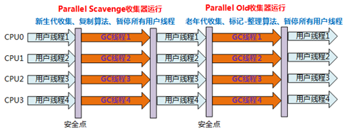

# 《一文就让你精通JVM》

网上有关JVM的知识贴多如牛毛，其中有纷杂的零碎知识贴，也有整理优秀的长贴。信息量非常充分。


但作为复习或整理JVM知识的而言，还可以有更好的学习用户体验和高效的方式。因此，就想尝试写一篇有关JVM知识点的“秘籍”，让初学者仅读此文就能快速精通JVM的知识脉络以及关键知识，也能让复习着快速反查知识和经验之谈。


<p align="right">黄老师</p>

<!-- more -->


# 1、背景知识铺垫

## 1.1、JRE、JVM、JDK
先讲讲JVM、JRE、JDK是什么

+ JVM (Java Virtual Machine)
    - JVM有自己的规范，所有的JVM版本都必须按此规范实现。
    - JVM是一个抽象、虚拟、不物理存在的"机器"。是通过在真实的计算机上仿真模拟各种计算机功能来实现的。JVM有自己完善的硬件架构，如处理器、堆栈、寄存器等，还具有相应的指令系统。
    - JVM负责执行Java代码
+ JRE (Java Runtime Environment)
    - JRE包含JVM
    - JRE是一个运行环境容器，提供诸多Java运行需要的libs。包括：标准、非标准的Java组件；Java规范要求、Java规范未要求的组件。
    - JRE为JVM服务
    - rt.jar(contains: lang, util, awt, swing, math, runtime libraries)
+ JDK (Java Development Kit)
    - 从Kit单词上可预知JDK会包含很多东西，的确，JDK包含：JVM、JRE，以及Java语言和工具包。
    - JDK比JRE多的部分：Development, debugging tools
+ Oracle 官方Java概念图    


## 1.2、HotSpot Client/Server模式

为什么要铺垫下 HotSpot Client/Server模式？因为后续GC章节默认收集器在不同模式下不同。


HotSpot JVM具有两种模式：Client模式和Server模式。可以理解为针对不同的硬件环境和软件场景做的JVM优化版本。

- Java HotSpot Client VM(-client)：轻量级。为在客户端环境中减少启动时间而优化，使用的策略和功能都是较简单版本。
- Java HotSpot Server VM(-server)：重量级。为在服务器环境中最大化程序执行速度而设计，使用的策略和功能是为了最大化的发挥硬件优势，提升吞吐量。《《《 作为服务端Java开发，大多数情况下默认Server模式。


HotSpot的安装的模式，32位的hotspot都是client模式；64位的都是server模式的。

可通过java -version查看


若想要修改模式，则需变更JVM的配置文件。32位的虚拟机在 “%JAVA_HOME%/jre/lib/i386/jvm.cfg”；64位的虚拟机在“%JAVA_HOME%/jre/lib/amd64/jvm.cfg”；


# 2、JVM体系结构


<center>JVM体系结构图</center>


<center>操作系统视角</center>

## 2.1、Class文件

- Class 文件是一种特定的**二进制文件**格式的文件。格式紧凑，包含了JVM指令集和符号表以及若干其他辅助信息，其编码结构风格被称为“字节码”。
- 在JVM体系里，不同的硬件(主要是CPU)和操作系统环境下的JVM是不同版本的实现，而**Java语言的平台无关性，主要体现在“Class文件”上**。Java代码一次编译成Class文件，可以在不同体系的JVM版本下运行。


- 其他语言只要其代码能被编译成符合Class文件规范的Class文件，就能在JVM上运行。


## 2.2、内存区 之 虚拟机栈区

> 见上图《JVM体系结构图》

在JVM里有一块专门为Java线程分配栈空间的内存区，叫"虚拟机栈区"。

每个Java线程创建时都会分配一个“虚拟机栈”，此虚拟机栈的生命周期与其所绑定的线程生命周期一致。


而当线程执行Java代码时，JVM会为每个Java方法创建一个固定结构的内存模型：栈帧。

- 此“栈帧”结构是线程虚拟机栈入栈/出栈操作的基本单位（入栈/出栈的时机对应Java方法的调用和返回）
- 栈帧是用于支持JVM进行方法调用和方法执行的数据结构


**2.2.1、栈帧(Stack Frame)结构**


1. **局部变量表**： 编译期确定局部变量表大小。一组变量存储空间， 容量以slot为最小单位，而slot的大小随硬件体系而定，以此来适应硬件体系的差异。

   - > 虚拟机规范中未明确指明一个Slot应占用的内存空间大小，只是导向性的说到每个Slot都应该存放一个boolean、byte、char、char、short、int、float、reference或returnAddress类型的数据，这8种数据类型都可以使用32位或更小的物理内存来存放，Slot的长度可以随着处理器、操作系统或虚拟机的不同而发生变化。

2. **操作栈**：编译期确定操作数栈最大深度。是一个后入先出栈（LIFO）。操作数栈可类比CPU的寄存器，协助JVM完成Java方法内的调用传值，计算操作。

   - > 例如：整数加法的字节码指令iadd再运行的时候操作数栈中最接近栈顶的两个元素已经存入了两个int类型的数值，当执行这个指令时，会将这两个int值出栈并相加，然后将相加的结果入栈。

3. **动态连接**： 指向运行时常量池中该栈帧所属Java方法的引用，这样才能找到真正&完整的代码片段。

   - > Class文件中关于方法调用，存的是符号引用。字节码在运行期，需要将符号引用转化为带具体内存地址的代码片段的直接引用。

4. **方法返回地址**：方法退出的过程实际上等同于把当前栈帧出栈，并恢复上层方法的局部变量表和操作数栈，把返回值（如果有）压入调用者栈帧的操作数栈中，调整PC计数器的值以指向方法调用指令后面的一条指令等。

   - 方法返回地址里一般存的是调用者当时的PC计数器的值。当方法正常返回时，就返回这个地址。而当方法异常退出时，返回地址要通过异常处理器表来确定。

5. **额外附加信息**：预留的扩展区域，由JVM实现方按需使用。


## 2.3、内存区 之 本地方法栈区

本地方法栈是JVM为Native方法提供的内存空间。

本地方法栈里的基本元素结构取决于本地方法接口的具体实现机制。若其使用C连接模型,那么本地方法栈就是C栈。

Java方法栈和本地方法栈之间可以灵活交叉切换。


有些虚拟机的实现直接把本地方法栈和虚拟机栈合二为一，比如典型的Sun HotSpot虚拟机。


## 2.4、内存区 之 堆内存区


Java堆，是JVM管理的最大的一块内存，也是GC的主战场。里面存放的是几乎所有的对象实例和数组数据。

> JIT编译器有栈上分配、标量替换等优化技术的实现导致部分对象实例数据不存在Java堆，而是栈内存。

- **从内存回收角度**：Java堆为分代回收机制，分为年轻代和老年代。这样划分的好处是为了更快的回收内存（每次回收的内存范围相对小）

- **从内存分配角度**：Java堆可以划分出线程私有的分配缓冲区(Thread Local Allocation Buffer,TLAB)；这样划分的好处是为了更快的分配内存；

  - > 关联知识点：
    >
    > 1、标量替换：允许将对象打散分配在栈上，比如若一个对象拥有两个字段，会将这两个 字段视作局部变量进行分配。


### **2.4.1、各内存区默认配比**

- 年轻代：老年代 默认 1：2（将堆空间分为3份）
- Eden ：from ：to  默认  8：1：1


相关JVM参数

  - -Xms：初始堆大小。默认物理内存的1/64。
  - -Xmx：最大堆大小。默认物理内存的1/4。
  - -Xmn：年轻代大小
  - -XX:NewRatio：年轻代与老年代的比值
  - -XX:SurvivorRatio：Eden区域Survivor区的大小比值。默认8:1:1。


### **2.4.2、TLAB** 

全称 Thread Local Allocation Buffer，线程本地分配缓冲区。

默认是开始的。JVM命令 -XX:+UseTLAB。


由于堆是全局共享的，因此存在同一时间会有多个线程在堆上申请空间的并发情况。为保证堆内存分配操作的原子性，JVM采用“CAS+失败重试”的方式，但这种方式在并发竞争激烈的情况下效率会进一步下降。

因此，JVM额外设计了TLAB 来避免多线程分配对象内存时的冲突处理。

大致原理：

- JVM在内存年轻代Eden Space中开辟了一小块线程私有的区域，称作TLAB。默认设定为占用Eden Space的1%。
- Java中每个线程都会有自己的缓冲区称作TLAB。
- 由于TLAB是线程私有的，所以内存分配没有锁开销，效率高。
- 在Java程序中很多对象都是小对象且用过即丢，它们不存在线程共享也适合被快速GC，所以对于小对象通常JVM会优先分配在TLAB上。

> 故，对象仍旧是在堆上被分配的，只不过分配的方式变了而已。


### **2.4.3、逃逸分析**

> 关联知识点：逃逸分析只在JVM运行在server模式时才能启用。

逃逸分析 是一种可以有效减少Java 中堆内存分配压力的分析算法。JVM默认开启。

通过逃逸分析，Java Hotspot编译器能够分析出一个即将新创建对象的引用的使用范围，从而决定通过哪种方式分配对象内存（栈上标量替换；TLAB分配；堆分配；）。


### **2.4.4、对象内存分配的两种方法**

为对象分配内存空间的任务等同于把一块确定大小的内存从Java堆中划分出来。

- **指针碰撞**    (Serial、ParNew等带Compact过程的收集器) 
  假设Java堆中内存是绝对规整的，所有用过的内存都放在一边，空闲的内存放在另一边，中间放着一个指针作为分界点的指示器，那所分配内存就仅仅是把那个指针向空闲空间那边挪动一段与对象大小相等的距离，这种分配方式称为“指针碰撞”（Bump the Pointer）。 
- **空闲列表**    (CMS这种基于Mark-Sweep算法的收集器) 
  如果Java堆中的内存并不是规整的，已使用的内存和空闲的内存相互交错，那就没有办法简单地进行指针碰撞了，虚拟机就必须维护一个列表，记录上哪些内存块是可用的，在分配的时候从列表中找到一块足够大的空间划分给对象实例，并更新列表上的记录，这种分配方式称为“空闲列表”（Free List）。 


### **2.4.5、对象实例的具体结构**


- 对于填充数据不是一定存在的，仅仅是为了字节对齐。


## 2.5、内存区 之 方法区

当JVM使用**类装载**器装载某个类时，它首先要定位对应的class文件，然后读入这个class文件，最后，JVM**提取该文件的内容**信息，并将这些信息**存储到方法区**，最后返回一个class实例。

- 注：方法区 是 JVM规范的一部分，并不是实际的实现。实际实现有JDK7以前的永久代，以及JDK8的元空间。


**方法区的特点：**

1、方法区是线程安全的。假如同时有两个线程都企图访问方法区中的同一个类，而这个类还没有被装入JVM，那么只允许一个线程去装载它，而其它线程必须等待。

2、方法区的大小不是固定的，JVM可根据应用运行期的需要动态调整。其内存也不一定是连续的。

3、方法区也可被垃圾收集（GC），当某个类不在被使用(不可触及)时，JVM将卸载这个类，进行垃圾收集。


方法区主要存放的是**已被虚拟机加载**的类信息、常量、静态变量、编译器编译后的代码等数据。


<center>常量池分解</center>

**2.5.1、静态常量池：**

即class文件中的常量池，是文件级、静态级的。class文件中的常量池不仅仅包含字符串(数字)字面量，还包含类、方法的信息，占用class文件绝大部分空间。


**2.5.2、运行时常量池：**

运行时常量池是方法区的一部分，可以理解为一块专门存放常量的内存。包括装载class文件而放入的常量，也包括代码运行时动态生成的常量（String类的intern()方法）。


静态常量池和运行时常量池的差别在于，一个是存在文件中，是“静”的，一个是存在内存中，是“动”的。

而我们常说的常量池，一般是指在方法区中的动态常量池。


## 2.6、内存区 之 堆外内存区

讲堆外内存前，首先带大家从操作系统视角看堆外内存所处的位置。相信看了直观的图示后能立马有清晰的记忆和理解。


助读说明：

1、先着眼操作系统进程视角，每个进程都拥有自己独占的进程级内存空间。每个进程看到的机器内存大小是一样的，且内存范围也是一样的。为什么？因为用户态进程看到的是逻辑内存地址，并不是真实的物理内存地址。

2、用户态进程的内存地址都是逻辑地址，用malloc分配，故物理上不连续。

3、堆内存在JVM内。受JVM管理，参与GC。

4、**堆外内存处于进程内存空间，但属于JVM堆内存之外**。

5、堆外内存不受JVM管理，不参与GC。编码时需要主动释放。


**2.6.1、直接内存**（Direct Buffer）

Direct Buffer是堆外内存的一种具体类型，常出现于NIO模型中。


NIO模型中为什么要用Direct Buffer？

答：NIO需要进行socket连接的收包和发包，这个操作最终要从操作系统用户态进入到内核态进行操作。而内核态调用要求内存地址必须可靠（即在一次完整调用周期内内存地址是不会变的）。但Java堆里的内存会受GC影响而移动整理，地址会变。故NIO不能用堆里的内存。

> 即使代码层面非要用Java堆内存区做NIO操作，JVM仍会自动将堆内存对象转换为直接内存对象，然后再进行内核态操作。


故Direct Buffer对于JVM来说有如下优点：

1、对于NIO操作,直接用Direct Buffer比用Java堆内存,免去一次内存拷贝，相比之下效率高了。

2、GC压力更小。因Direct Buffer是堆外内存，是代码者自行管理，不用JVM额外操心,GC的范围就缩小了。


其他须知：

1、Direct Buffer创建是比较耗时的，高性能或高频场景下，建议池化。


# 3、JVM垃圾收集器

JVM垃圾回收是继掌握内存模型后，必须进阶更进一步掌握的JVM内存知识。


全世界的程序员都知道：“Java的内存是会自动回收的”。这背后会有哪些知识点呢，请看下文。


## 3.1、垃圾回收原理

**3.1.1、垃圾分析策略**

- 引用计数 策略

> 比较古老的回收算法。原理是额外维护对象上的引用计数。当发生GC时，回收引用计数为0的对象的内存。
>
> 此算法的缺点：无法处理循环引用的问题。
>
> ​        那怎么破解呢？用Java里的弱引用（Weak Reference）破开强引用关系。


- 可达性分析 策略（主流JVM用的都是这种）

> 从GC ROOT开始，遍历引用关系节点，当所有的引用节点遍历完毕之后，剩余未遍历到的节点则被认为是没有被引用到的节点，即可被回收的对象节点。


<center>GC Root 示例</center>

需要知晓的是：

1、会有一些列的“GC Roots”且同时工作，在Java中可作为GC Root的对象包括：

​      a）虚拟机栈中引用的对象（栈帧中的本地变量表）

​	  b）方法区中类静态属性引用的对象

​      c）方法区中常量引用的对象

​      d）本地方法栈中JNI（Native）引用的对象

2、**基于GC Root做可达性分析时，需要STW（Stop The World），必须记住此知识点**，对于了解后续垃圾回收算法有帮助。


 **3.1.2、垃圾回收算法**

**一、引用计数 算法**

> 略


**二、标记-清除 算法（Mark-Sweep）**

最基础的垃圾回收算法，思想简单且容易实现。

工作上分为两个阶段：

一、标记阶段：从GC Roots开始标记被引用对象；

二、清除阶段：遍历整个堆，把未标记的对象清除；

缺点：会有内存碎片。导致下一次GC的提前到来。


**三、复制 算法（Copying）**

为了解决Mark-Sweep算法的缺陷，Copying算法就被提了出来。

它将可用内存按容量划分为大小相等的两块，每次只使用其中的一块。当这一块的内存用完了，就将还存活着的对象复制到另外一块上面，然后再把此内存区域空间一次清空，这样一来就不容易出现内存碎片的问题。

优点：不会出现内存碎片。

缺点：需要两倍的内存空间。

适合对象生命周期短的内存区域，一次能回收绝大部分内存。例如：年轻代


**四、标记-整理 算法（Mark-Compact）**

此算法结合了“标记**-**清除”和“复制”两个算法的优点。

分为三个阶段：（我更喜欢划分为三个阶段）

第一阶段：从GC Root开始标记所有被引用对象

第二阶段：遍历整个堆，将存活对象往集中的一片内存区域移动。

第三阶段：基于内存整理后的指针边界，清除整理区域以外的内存空间。

**再强调下特殊点：时序上是“标记->整理->清理”。**


**3.1.3、小结一下**

| 堆内存区 | 垃圾分析策略      | 常用垃圾回收算法                     |
| -------- | ----------------- | ------------------------------------ |
| 年轻代   | GC Root可达性分析 | 1、复制算法                          |
| 老年代   | GC Root可达性分析 | 1、标记-清除算法<br>2、标记-整理算法 |


**衍生的知识点：**

GC Roots的可达性分析，会衍生到图论的算法。有一个比较经典的有向图的问题：有向图检测是否存在环。

这也是调用引擎，规则引擎经常会遇到的算法问题（新加入一个节点时预检测是否构成环）

> 考虑简单环，所谓的简单环，即除了第一个和最后一个顶点，其余所有顶点在路径中只出现一次。

实现思路一：DFS    时间复杂度O(V+E)

做DFS（深度优先搜索）遍历时，每深入遍历一个的节点就把节点都压入**栈**，每退回一层遍历就把节点从栈中退出，且每次压入前都检测当前节点在栈中是否已存在。如果已存在，就表明曾经经过此节点，说明已构成环。

[参考之一](https://blog.csdn.net/login_sonata/article/details/78002042)


实现思路二：拓扑排序    时间复杂度O(n^2)    从有向图的末梢逐步往上砍叶子节点。

出度和入度的概念。一张有向图是有顶点和带有方向的边组成的。对于一个顶点，如果有n边从其他顶点指向此顶点，则这个顶点的入度就是n。相应的，如果有n条边从这个顶点指向其他顶点，则这个顶点的出度就是n。

**拓扑排序**的一般流程：

1.初始化各个顶点的出度。

2.移除出度为0的顶点和与此顶点相连的边。

3.更新出度。

4.重复步骤2和3，直到不存在出度为0的顶点或者顶点已经全部被移除了。

5.判断是否存在剩余顶点，若存在则存在环，若不存在则无环。

[参考](https://blog.csdn.net/weixin_48607921/article/details/107224420?utm_medium=distribute.pc_relevant.none-task-blog-BlogCommendFromMachineLearnPai2-1.channel_param&depth_1-utm_source=distribute.pc_relevant.none-task-blog-BlogCommendFromMachineLearnPai2-1.channel_param)


## 3.2、分代收集策略

分代收集策略的目的本质是为了更高效效率的进行内存回收。

核心思想是根据对象存活生命周期的特点，将JVM内存划分为若干个区域，不同内存区域按其对象生命周期的特点采用不同的回收频率和回收算法。常见的分代方式：年轻代、老年代、永久代。

> 反过来试想，假设JVM在一次垃圾回收窗口时，要对整个JVM内存区对垃圾回收分析和清除，Stop The World会持续很长时间。


**与垃圾回收策略的匹配**

| 堆内存区 | 内存区特点                   | 垃圾分析策略      | 常用垃圾回收算法                     |
| -------- | ---------------------------- | ----------------- | ------------------------------------ |
| 年轻代   | 对象生命周期短，每次回收量大 | GC Root可达性分析 | 1、复制算法                          |
| 老年代   | 对象生命周期长，每次回收量小 | GC Root可达性分析 | 1、标记-清除算法<br>2、标记-整理算法 |


## 3.3、JVM触发GC的时机

**3.2.1、JVM自动触发GC的时机**

- **触发YoungGC：**
  - 新建对象时，发现eden space满了（或者因内存碎片找不到足够连续的内存），JVM会触发一次YoungGC
- **触发FullGC：**
  - 升到老年代的对象空间大于老年代剩余空间，JVM会触发一次FullGC。或者被HandlePromotionFailure参数强制FullGC。

**3.2.2、手动触发GC**

- 代码System.gc()。但只是像JVM提交了一次GC请求，至于何时会真正执行GC，未知。

```java
/**
     * Indicates to the VM that it would be a good time to run the
     * garbage collector. Note that this is a hint only. There is no guarantee
     * that the garbage collector will actually be run.
     */    
public static void gc() {
  boolean shouldRunGC;
  synchronized(lock) {
    shouldRunGC = justRanFinalization;
    if (shouldRunGC) {
      justRanFinalization = false;
    } else {
      runGC = true;
    }
  }
  if (shouldRunGC) {
    Runtime.getRuntime().gc();
  }
}
```

只有在justRanFinalization=true的时候才会执行。

强制执行GC的方式

```java
System.gc();
runtime.runFinalizationSync();
System.gc();
```


## 3.4、“Stop The World”是怎么执行的（SafePoint）

我们知道JVM GC是需要"Stop The World"的，“Stop The World”代表着所有Java线程需要全部暂停。在JVM Java线程高频并发运行的状态下，怎么让所有Java线程全部都进入安全的暂停状态呢？答案：**SafePoint机制**。

<br>

3.4.1、【概念】

从线程角度看，safepoint可以理解成在代码执行过程中的一些特殊位置，当线程执行到这些位置的时候，说明虚拟机当前的状态是安全的，如果有需要，可以在这个位置暂停。比如：GC时需要暂停所以Java线程的需求。

safepoint的特性可以用在不同的地方：GC、Deoptimization。

常见的safepoint位置：

1. 循环的末尾 (防止大循环的时候一直不进入 safepoint，而其他线程在等待它进入 safepoint)

2. 方法返回前
3. 调用方法的call之后 
4. 抛出异常的位置


<br>

3.4.2、【Safepoint放在代码什么位置】

>  以Hotspot为例说明一下什么地方会放置safepoint

1、理论上，在解释器的每条字节码的边界都可以放一个Safepoint，但挂载Safepoint的调试符号信息（为GC生成的符号信息是OopMap）要占用内存空间，如果每条机器码后面都加safepoint的话，需要保存大量的运行时数据，所以在放置Safepoint方面会取折中适用的策略。

2、HotSpot JVM在通过JIT编译时，会在所有方法返回之前以及循环跳转、异常跳转之前放置Safepoint，为了防止发生GC需要STW时，该线程一直不能暂停。并且，在每个Safepoint都生成一些信息存储哪些地方是引用（**OopMap**），以便JVM能找到需要的引用。

<br>

3.4.3、【线程如何被挂起】

有两种方法：**抢占式中断**(Preemptive Suspension)和**主动式中断**(Voluntary Suspension)。


（线程被）**抢占式中断：**

抢占式中断不需要线程的执行代码去主动配合。当触发GC时，JVM会中断所有线程，然后依次检查每个线程中断的位置是否为Safepoint，如果不是则恢复线程，让它执行至Safepoint再进行终端。

<br>

（线程）**主动式中断：**《《《 **HotSpot JVM的实现方式**

即GC需要中断线程的时候，它仅仅简单地设个标志，每个Java线程会在进入Safepoint时主动轮询这个标志位，如果标志位就绪的话就自行中断。

> 如果触发GC动作，VM thread会在`VMThread::loop()`方法中调用`SafepointSynchronize::begin()`方法，最终使所有的线程都进入到safepoint。

```java
// Roll all threads forward to a safepoint and suspend them all
void SafepointSynchronize::begin() {
  Thread* myThread = Thread::current();
  assert(myThread->is_VM_thread(), "Only VM thread may execute a safepoint");

  if (PrintSafepointStatistics || PrintSafepointStatisticsTimeout > 0) {
    _safepoint_begin_time = os::javaTimeNanos();
    _ts_of_current_safepoint = tty->time_stamp().seconds();
  }
```


3.4.4、【线程如何恢复】

有了`begin`方法，自然有对应的`end`方法，在`SafepointSynchronize::end()`中，会最终唤醒所有挂起等待的线程。


思考题：

1、GC时最大的影响就是STW周期，本文讲的所有线程都进入safepoint的也是有个周期，且此周期受并发线程个数和safepoint距离影响。问：线程池配的越多，对GC的耗时有明显的影响吗？


## 3.5、垃圾收集器

### **3.5.1、垃圾收集器类型**

HotSpot JVM里有7种垃圾收集器，你是怎么记忆它们的呢？


上图解读：

（A）图中展示了**7种**收集器：Serial、ParNew、Parallel Scavenge、Serial Old、Parallel Old、CMS、G1；

（B）图中它们所处区域，表明其是属于年轻代收集器还是老年代收集器：

- 年轻代收集器**：Serial、ParNew、Parallel Scavenge；

- **老年代收集器**：Serial Old、Parallel Old、CMS；

- **整堆收集器**：G1；

（C）两个收集器间的连线，表明它们**可以搭配使用**：

    - Serial 配 ：Serial Old 或 CMS；
    - ParNew 配 ：Serial Old 或 CMS；
    - Parallel Scavenge 配 ：Serial Old 或 Parallel Old；

（D）CMS与Serial Old的连线表示Serial Old是作为CMS出现**"Concurrent Mode Failure"失败**的后备预案。


### **3.5.2、常见垃圾收集器对比**


**GC时STW的停顿时长的排行**：G1 < CMS < Parallel收集器 < Serial收集器


**JVM默认收集器**

怎么查看？


怎么切换？

例子：-XX:+UseConcMarkSweepGC

| 参数               | 描述                                                         |
| ------------------ | :------------------------------------------------------------ |
| UseSerialGC        | JVM运行下<u>**Client模式下的默认收集器**</u>，打开此开关后，使用**Serial+Serial Old**的收集器组合。 |
| UseParNewGC        | 使用ParNew+Serial Old的收集器组合。                          |
| UseConcMarkSweepGC | 使用ParNew+CMS的收集器组合。                                 |
| UseParallelGC      | 虚拟机运行在**Server模式下的默认收集器**，打开此开关后：<br>- <u>JDK 7u4版本前</u>：使用**Parallel Scavenge + Serial Old**的收集器组合。也是Java书上的说法。<br>- <u>JDK 7u4版本后</u>：使用**Parallel Scavenge + Parallel Old**的收集器组合，此时的Parallel已经很成熟了。<br>求证过程：[Link](https://blog.csdn.net/youanyyou/article/details/106464291?utm_medium=distribute.pc_relevant_t0.none-task-blog-BlogCommendFromMachineLearnPai2-1.channel_param&depth_1-utm_source=distribute.pc_relevant_t0.none-task-blog-BlogCommendFromMachineLearnPai2-1.channel_param) |
| UseParallelOldGC   | 使用Parallel Scavenge + Parallel Old的收集器组合             |


### **3.5.3、常见垃圾收集器及原理**

**1、（年轻代）Serial**

​        Serial（串行）垃圾收集器是最基本、发展历史最悠久的收集器；JDK1.3.1前是HotSpot年轻代收集的唯一选择；

​       **特点**：

​       1、针对年轻代；

​       2、采用**复制算法**；单线程收集；全程STW；

​       3、HotSpot Client模式下的默认年轻代收集器；


<Center>Serial/Serial Old组合收集器运行示意图</Center>

​       **适用场景**：小内存（小于200M），单CPU的环境。


2、 **（年轻代）ParNew**

​       ParNew垃圾收集器是**Serial收集器的多线程版本**。

​       **特点**：

​       1、除了多线程外，其余的行为、特点和Serial收集器一样（两者还共用了不少代码）。

​       2、也是针对年轻代，也是**复制算法**。

​       3、"-XX:+UseConcMarkSweepGC"**：**指定使用CMS后，会**默认使用**ParNew作为年轻代收集器；

​       4、"-XX:ParallelGCThreads"：指定垃圾收集的线程数量，ParNew**默认**开启的收集线程与**CPU的数量**相同；


<Center>ParNew/Serial Old组合收集器运行示意图</Center>


​       **适用场景**：

​       在HotSpot Server模式下，ParNew收集器是一个非常重要的收集器，**因为除了Serial外，只有它能与CMS收集器配合工作**。


3、 **（年轻代）Parallel Scavenge**

​       （Java8 默认的收集器）Parallel Scavenge又称为吞吐量优先收集器，特点是多线程回收，以吞吐量优先，高效率的利用CPU时间。


​       **特点**：

​       1、Java8 默认的收集器；

​       2、年轻代收集器；**复制算法**；多线程收集；

​       3、Parallel Scavenge收集器的目标是以高吞吐量为目标，达一个可控制的吞吐量。

> 吞吐量：
>
> 吞吐量 = 运行用户代码时间 /（运行用户代码时间+垃圾收集时间）
>
> 高吞吐量即减少垃圾收集时间，让用户代码获得更长的运行时间


​       **适用场景**：

​       Parallel Scavenge收集器的高吞吐量可以最高效率的利用CPU时间，尽快的完成程序的运算任务等，主要适合在后台运算而不是太多交互的任务（其*不适合需要与用户交互的程序*，良好的响应速度能提升用户的体验，此种场景CMS效果更好）。


4、 **（老年代）Serial Old**

​       Serial Old是 **Serial收集器的老年代版本**。是JDK 7u4版本前的老年代默认收集器。


​       **特点**：

​       1、采用标记整理法；

​       2、单线程；


<Center>Serial/Serial Old组合收集器运行示意图</Center>


​       **适用场景**：

​       1、主要用于HotSpot的Client模式。


5、 **（老年代）Parallel Old**

​       Parallel Old垃圾收集器是Parallel Scavenge收集器的老年代版本；**目前已经很成熟了，是JDK 7u4版本后的老年代默认收集器（JDK8的老年代默认收集器）**。


​       **特点**：

​       1、标记-整理 算法；

​       2、多线程收集；



<Center>Parallel Scavenge/Parallel Old收集器运行示意图</Center>


6、 **（老年代）CMS**

​       CMS收集器也称为并发低停顿收集器（或低延迟垃圾收集器），以获取最短回收停顿时间为目标。

​       CMS并不是等内存不足了才进行FullGC，而是基于设定的GC阈值，当超过阈值时主动进行CMS GC，因为CMS GC是与用户线程并发的，故用户线程对于CMS GC的停顿感知是很少的。

> CMS的GC阈值：
>
> 1、设定了CMSInitiatingOccupancyFraction时，以此为阈值，区间：0~100。
>
> 2、CMSInitiatingOccupancyFraction默认为-1，则按“((100 - MinHeapFreeRatio) + (double)( CMSTriggerRatio * MinHeapFreeRatio) / 100.0) / 100.0 ”的值决定，其中MinHeapFreeRatio默认值40，CMSTriggerRatio默认值80，那么阈值为92%。
>
>  
>
> 为什么要通过阈值留有一部分空闲内存时进行GC？因为CMS GC时可能会遇到“浮动垃圾”，见下文。


**^敲黑板：** 需要注意：CMS GC不是FullGC！！！

- HotSpot VM里对concurrent collection和full collection有明确的区分。所有带有“FullCollection”字样的VM参数都是跟真正的full GC相关，而跟CMS并发GC无关的，cms收集算法只是清理老年代。


**CMS收集器运作过程**

**第一步：初始标记（CMS initial mark）**： 仅标记一下GC Roots能直接关联到的对象。*需要STW*，但速度很快。

**第二步：并发标记（CMS concurrent mark）**：进行GC Roots Tracing的过程，标出存活对象。因与用户线程并发运行，不能保证标记出所有存活对象。

**第三步：重新标记（CMS remark）**：**多线程**。修正并发标记期的标记结果。*需要STW*，相对也不长。

**第四步：并发清除（CMS concurrent sweep）**：回收所有垃圾对象。


整个过程中**耗时最长的并发标记和并发清除都可以与用户线程一起工作**；所以总体上说，CMS收集器的内存回收过程与用户线程一起并发执行；


<Center>CMS收集器运行示意图</Center>

​     **特点**：

​       1、<u>并发收集</u>（与用户线程并发执行），**低停顿**。

​       2、标记-清除算法，会产生内存碎片。  

​     **缺点**：

​       1、对CPU资源非常敏感

> CMS的默认收集线程数量 = (ParallelGCThreads + 3) / 4
>
> ParallelGCThreads = （ncpus <= 8）? ncpus : (3 + （(ncpus * 5) / 8))。CPU数量小于8时，ParallelGCThreads为CPU数量。
>
> 并发收集线程占用一部分CPU资源，当CPU数量多于4个，收集线程占用的CPU资源多于25%，对用户程序影响可能较大；不足4个时，影响更大，可能无法接受。

​      

​       2、无法处理浮动垃圾，可能出现“Concurrent Mode Failure”

​           a）浮动垃圾（Floating Garbage）

>    在并发清除时，用户线程新产生的垃圾，称为浮动垃圾；
>
>    这使得并发清除时需要预留一定的内存空间，CMS所需要的空间比其他垃圾收集器大；
>
>    "-XX:CMSInitiatingOccupancyFraction"：用于设置CMS预留内存空间比例；

​          b）"Concurrent Mode Failure"失败

>    如果CMS预留内存空间无法满足程序需要，就会出现一次"Concurrent Mode Failure"失败；
>
>    这时JVM启用后备预案：临时启用Serail Old收集器，而导致另一次FullGC的产生；
>
>    这样的代价是很大的，所以CMSInitiatingOccupancyFraction不能设置得太大。


​      **3、产生内存碎片**

> 解决方法：        
>
> （1）"-XX:+UseCMSCompactAtFullCollection + -XX:+CMSFullGCsBeforeCompaction" 设置CMS执行N次FullGC后，进行一次带整理的FullGC。默认未开启。
>
> （2）降低-XX:CMSInitiatingOccupancyFraction参数，以提早执行CMS GC动作，虽然CMS GC不会进行内存碎片的压缩整理，但它会合并老年代中相邻的free空间。这样就可以容纳更多的年轻代晋升行为。


   **适用场景**：

​       1、与用户交互多的场景，注重服务的响应速度，常见于WEB、B/S系统的服务器上的应用。系统停顿时间最短，给用户带来较好的体验。

   

7、 **（整堆）G1**

**G1收集器运作过程：**

**第一步、初始标记（Initial Marking）**：仅标记一下GC Roots能直接关联到的对象；且修改TAMS（Next Top at Mark Start）,让下一阶段并发运行时，用户程序能在正确可用的Region中创建新对象；**需要"Stop The World"，但速度很快**；

**第二步、并发标记（Concurrent Marking）**：   进行GC Roots Tracing的过程； 刚才产生的集合中标记出存活对象；耗时较长，但应用程序也在运行；并不能保证可以标记出所有的存活对象；

**第三步、最终标记（Final Marking）**：   为了修正并发标记期间因用户程序继续运作而导致标记变动的那一部分对象的标记记录； 上一阶段对象的变化记录在线程的Remembered Set Log；这里把Remembered Set Log合并到Remembered Set中； **需要"Stop The World"，且停顿时间比初始标记稍长，但远比并发标记短**；**采用多线程并行执行来提升效率**。

**第四步、筛选回收（Live Data Counting and Evacuation）**：   首先**排序各个Region的回收价值和成本**； **然后根据用户期望的GC停顿时间来制定回收计划**； 最后按计划回收一些价值高的Region中垃圾对象；


回收时采用"复制"算法，从一个或多个Region复制存活对象到堆上的另一个空的Region，并且在此过程中压缩和释放内存；

 可以并发进行，降低停顿时间，并增加吞吐量；


​       **特点**：

​       1、充分利用多CPU的硬件优势，通过并行缩短STW时间，通过并发让用户线程同时进程。

​       2、能独立管理整个堆（年轻代和老年代）

​       3、结合多种垃圾收集算法，整体上基于标记-整理算法，局部Region间基于复制算法。不会产生内存碎片。

​       4、可预测的停顿，低停顿，高吞吐。

​      

​       **适用场景**：

​       针对具有大内存、多处理器机器的服务端应用。可提供低GC停顿的能力。


# 4、GC调优

## 4.1、GC调优的目标内存区


- 一般都针对年轻代、老年代调优，**尤其是老年代**。
- 方法区可以进行GC，但一般不操心方法区的GC，因为GC的性价比太低，主要回收“废弃常量和无用的类”。如果内存不够就扩大吧。JDK8方法区的实现为元空间，元空间使用的是本地内存（非堆内存），默认情况下元空间的大小是无限的。


## 4.2、GC调优的策略

> 常见的招数，一招招使
>
> 注：一定是先找1台机器进行试验，对比，然后再做出选择，发布生产环境。


**4.3.1、大多数的Java应用不需要GC调优**

- 大部分需要GC调优的，不是JVM参数问题，是代码问题。
- 在实际情况中，基于GC情况优化代码比优化GC参数要多得多。

**4.2.2、（选择合适的GC收集器）互联网Web应用考虑CMS收集器，提升交互响应性能**

- GC低停顿：CMS收集器是与用户线程并发的内存垃圾收集器；
- 大幅减少FullGC：CMS GC是concurrent GC，是周期性主动的回收内存。大幅减少FullGC的发生。

**4.2.3、（选择合适的堆大小） 去设置堆大小，别不设置用默认的**

- 拍脑袋定初始参数 -> 运行JVM -> 查监控 -> 调整JVM -> 查监控 -> 反复试验 -> 确认JVM参数

**4.2.4、（选择合适的年轻代比重）年轻代尽量大**

- 年轻代 尽量大，那么可以减少YoungGC。进而减少了对象进入老年代的频率,进而减少FullGC的频率。

**4.2.5、-XX:MaxTenuringThreshold 合理年轻代对象晋升进入老年代的年龄**

- -XX:MaxTenuringThreshold 设置年轻代对象进入老年代的年龄大小，减少老年代的内存占用，降低 FullGC 发生的频率

**4.3.6、（小心大对象）避免大对象直接进入老年代**

- 怎么应对/避免？

  - 一：-XX:+PretenureSizeThreshold 控制
    - 设置-XX:+PretenureSizeThreshold 参数：代表超过这个值的时候，对象直接在old区分配内存。默认值是0，代表不管新对象多大都是先在eden中分配内存。
    - 注意：PretenureSizeThreshold参数只对Serial和ParNew两款收集器有效，Parallel Scavenge收集器不认识这个参数。如果遇到必须使用此参数的场合，可以考虑ParNew加CMS的收集器组合。
  - 二：更大的年轻代，含：eden区、survivor区
    - eden区能申请的到，就不会去old区申请了。同时可适当调高-XX:MaxTenuringThreshold（Linux 64下，默认15），让大对象在年轻代生，在年轻代亡。
    - 同时，可考虑搭配最小堆大小和最大堆大小，并设置MinHeapFreeRatio或MaxHeapFreeRatio来掌控堆大小的按需扩大与收缩。


## 4.3、GC调优分析工具

发现JVM内存问题以及查看对应GC情况是简单的

- （原始一点的）登录到服务器上敲命令：jstat、jmap、jstack。
- （常见的）登录公司运维平台查看指标情况：Grafana、容器管理平台等
- （辅助工具型的）APM工具，如：pinpoint。


**pinpoint：**


**Grafana：**


一般我们能从统计图表里**快速的看到问题**现象，例如：

- FullGC频繁；
- 年轻代占用比例不高，但老年代会有规律性FullGC；
- ......


然后，进一步**定位GC现象发生的原因和具体代码位置**，是需要些技术分析能力和不断试验的。

这里我们需要用工具来帮我们高效的定位问题。


**常用工具**：

> 使用顺序：
>
> 1、dump JVM堆
>
> 2、用工具load dump后的文件，通过工具查看内存占用Top的对象，通过对象Class声明或Reference找到代码位置。


**1、JProfiler（推荐）（功能很强大；需付费）**


- 软件下载地址：https://www.ej-technologies.com/products/jprofiler/overview.html

- IntelliJ IDEA有插件版本


**例图**：


**2、JVisualVM**（免费）


- 软件下载地址：http://visualvm.github.io/index.html

- IntelliJ IDEA有插件版本
- 使用指导贴：https://www.cnblogs.com/happy-rabbit/p/6232581.html


**例图：**


## 4.4、GC调优的问题举例


# 5、监控指标怎么看


## 5.1、Heap & Non-Heap

> 以JDK8及以后为背景


<Center>例图来自Grafana</Center>


<Center>例图来自JProfiler</Center>


**5.1.1、Heap Memory  =  堆内存**

​    看完之前章节，应熟悉堆内存包含什么。这里不再赘述。


**5.1.2、Non-Heap Memory  =  非堆内存**

如果non-heap使用上升趋势，我们应该关注什么呢？


non-heap（非堆内存）指Java进程内存中，JVM 堆内存范围以外的内存。不清楚的同学，复习上文第2章节：《JVM体系结构》


那么，non-heap（非堆内存）主要包含哪些内容呢？

1、【栈区】：虚拟机栈；本地方法栈；<<<< 这块基本不用操心。也不会持续增大。

2、【方法区】； <<<< 存在持续增大的可能，见本文《怎么构造方法区OOM》

3、【Native Memory】； <<<< 一般是JNI用到的内存，可能是频繁NIO导致大量Direct Buffer；也可能是内存未管理好，持续泄露内存了。

4、【Code Cache】：<<<< 用于编译和保存本地代码的内存。JVM内部处理或优化。一般不操心。


# 6、JVM类加载器

## 6.1、类加载过程

类加载的7个步骤:

- 装载。根据查找路径找到相应的 class 文件，然后导入。
- 验证，检查待加载的 class 文件的正确性。《《《链接的 3 小步
- 准备，给类中的静态变量分配存储空间。《《《链接的 3 小步
- 解析，将符号引用转换为直接引用(这一步可选)。《《《链接的 3 小步
- 初始化。对静态变量和静态代码块执行初始化工作。
- 使用
- 卸载


类的加载方式分为隐式加载和显示加载。

- 隐式加载指的是程序在使 用 new 等方式创建对象时，会隐式地调用类的加载器把对应的类 加载到 JVM 中。
- 显示加载指的是通过直接调用 class.forName() 方法来把所需的类加载到 JVM 中。

> 1、Class.forName 和 ClassLoader.loadClass 都能加载类，这两者在加载类时的区别？
>
> Class.forName有重载方法可以指定是否需要初始化，而默认的方法初始化设置为true这会初始化类执行链接和初始化操作
>
> ClasaLoader是有类加载器的loadClass方法加载，传入的是false，只会执行连接操作，不会初始化操作


类只有被使用到的时候才会被加载，采用这种方法一方面可以加快加载速度，另一方面可以节约程序运行 时对内存的开销。


此外，在 Java 语言中，每个类或接口都对应一 个 .class 文件，这些文件可以被看成是一个个可以被动态加载的

单元，**因此当只有部分类被修改时，只需要重新编译变化的类即可， 而不需要重新编译所有文件**，因此加快了编译速度。


## 6.2、类加载器的种类

在Java中，类加载器主要有下面四种：

- BootstrapClassLoader：启动类加载器，使用C++实现；
- ExtClassLoader：扩展类加载器，使用Java实现；
- AppClassLoader：应用程序类加载器，加载当前应用的classpath的所有类；
- UserDefinedClassLoader：用户自定义类加载器；


## 6.3、双亲委派机制

类加载器的加载过程中使用到了双亲委派机制：当一个类收到了类加载请求，它首先不会尝试自己去加载这个类，而是把这个请求委派给父类去完成，每一个层次类加载器都是如此，因此所有的加载请求都应该传送到启动类加载器(BootstrapClassLoader)中，只有当父类加载器反馈自己无法完成这个请求的时候（在它的加载路径下没有找到所需加载的Class），子类加载器才会尝试自己去加载。

好处：

比如加载位于 rt.jar 包中的类 java.lang.Object，不管是哪个加载器加载这个类，最终都是委托给顶层的启动类加载器进行加载，这样就保证了使用不同的类加载器最终得到的都是同样一个 Object对象。


## 6.4、沙箱安全机制

沙箱安全机制是由基于双亲委派机制上采取的一种JVM的自我保护机制，假设我们自定了一个java.lang.String 的类，由于双亲委派机制，加载请求会先交给BootstrapClassLoader启动类加载器试图去进行加载，但是BootstrapClassLoader在加载类时首先通过包和类名查找rt.jar中有没有java.lang.String，有则优先加载rt.jar包中的类，由于rt.jar中已经包含了java.lang.String类，所以我们自定义的String类永远得不到加载(当然编译是不会报错的)，它保证了Java源代码的安全。


# 7、其他独立知识点

## 7.1、内存逃逸分析

- 见本文《2.4.3、堆内存区 - 逃逸分析》章节


## 7.2、直接内存

- 见本文《2.4.6、堆外内存区》章节


## 7.3、Java内存屏障

**7.3.1、什么是内存屏障（Memory Barrier）？**
     内存屏障（memory barrier）是一个CPU指令。

​     通过在代码中插入这样一条指令可达到几种目的效果：

作用一：干预编译器的指令重排行为，确保内存屏障前后的代码指令有严格的先后执行顺序。

作用二：内存屏障的另一个作用是强制更新一次不同CPU的缓存。以此来主动影响一些数据的可见性。

> 例如，一个写屏障会把这个屏障前写入的数据刷新到缓存，这样任何试图读取该数据的线程将得到最新值，而不用考虑到底是被哪个cpu核心或者哪颗CPU执行的。


**7.3.2、为什么需要内存屏障**
    在多CPU（核）场景下，为了充分利用CPU，会通过流水线将指令并行进行。为了能并行执行，又需要将指令进行重排序以便进行并行执行，那么问题来了，那些指令不是在所有场景下都能进行重排，除了本身的一些规则（如Happens Before 规则）之外，我们还需要确保多CPU的高速缓存中的数据与内存保持一致性, 不能确保内存与CPU缓存数据一致性的指令也不能重排，**内存屏障正是通过阻止屏障两边的指令重排序来避免编译器和硬件的不正确优化而提出的一种解决办法**。


**7.3.3、Java中内存屏障的主要类型**
Java内存屏障主要有Load和Store两类。 

对Load Barrier来说，在读指令前插入读屏障，**可以让高速缓存中的数据失效，重新从主内存加载数据** 。

对Store Barrier来说，在写指令之后插入写屏障，**能让写入缓存的最新数据写回到主内存**。


对于Load和Store，在实际使用中，又分为以下四种：

1、LoadLoad 屏障：序列：Load1，Loadload，Load2 。

> 确保Load1所要读入的数据能够在被Load2和后续的load指令访问前读入。通常能执行预加载指令或/和支持乱序处理的处理器中需要显式声明Loadload屏障。

2、StoreStore 屏障：序列：Store1，StoreStore，Store2 。

> 确保Store1的数据在Store2以及后续Store指令操作相关数据之前**对其它处理器可见**（例如向主存刷新数据）。

3、LoadStore 屏障：序列： Load1，LoadStore， Store2 。

> 确保Load1的数据在Store2和后续Store指令**被刷新之前读取**。在等待Store指令可以越过loads指令的乱序处理器上需要使用LoadStore屏障。

4、StoreLoad 屏障：序列: Store1，StoreLoad， Load2 。

> 确保Store1的数据在被Load2和后续的Load指令读取之前**对其他处理器可见**。


**7.3.4、Java中内存屏障的使用**

**1、Synchronized**

通过 Synchronized关键字包住的代码区域，当线程进入到该区域读取变量信息时，JVM保证读到的是最新的值。这是因为在同步区内对变量的写入操作，在离开同步区时就将当前线程内的数据刷新到内存中，而对数据的读取也不能从缓存读取，只能从内存中读取，保证了数据的读有效性。这就是插入了StoreStore屏障


**2、volatile**

知识点：如果一个字段被声明成volatile，java线程内存模型确保所有线程看到这个变量的值是一致的。

使用了volatile修饰变量，则对变量的写操作，会插入StoreLoad屏障。

> 大致过程：
>
> 1、在volatile变量的作用域插入内存屏障，防止指令重排序
>
> 2、通过内存屏障，强制将本CPU的修改操作立即写入主存。此时会利用缓存一致性机制，组织多个CPU同时刷主存的此数据区域。
>
> 3、本CPU回写volatile字段数据到主存后，其他CPU的嗅探技术会发现此字段已被回写过主存了，其他CPU的嗅探技术会将它的字段缓存设置为无效，其他CPU下次访问此字段时没，会强制从主存读最新值。


**3、Unsafe类**

UNSAFE.putOrderedObject类似这样的方法,会插入StoreStore内存屏障 

Unsafe.putVolatiObject 则是插入了StoreLoad屏障


## 7.4、Java的平台无关性

- Java的平台无关性(一次编译、到处运行)得益于：
  - 1、统一的Class字节码文件格式；
  - 2、统一的JVM 规范 (指令集，内存模型，操作数栈架构)；
- JVM将平台相关性的活给干了，屏蔽了差异。
- JVM不止有"平台无关性"，还有"语言无关性"，只要最终能编译成符合Class字节码文件格式规范要求的，都能在JVM上运行。如：Coljure, Groovy, JRuby, Scala等


## 7.5、Java对象引用类型

对象引用类型分为强引用、软引用、弱引用、虚引用。

- **强引用**：就是我们一般声明对象时是虚拟机生成的引用，强引用环境下，垃圾回收时需要严格判断当前对象是否被强引用，如果被强引用，则不会被垃圾回收。**对应到我们日常写的代码**。
- **软引用**：软引用一般被**作为缓存来使用**。与强引用的区别是，软引用在垃圾回收时，**虚拟机会根据当前系统的剩余内存来决定是否对软引用进行回收**。如果剩余内存紧张，则虚拟机会回收软引用所引用的空间。 
- **弱引用**：弱引用与软引用类似，都是**作为缓存来使用**。但与软引用不同，弱引用在进行**垃圾回收时，是一定会被回收掉**的，因此其生命周期只存在于一个垃圾回收周期内。 
  - “软引用”和“弱引用”比较少见。 他们一般被作为缓存使用，而且一般是在内存大小比较受限的情况下做为缓存。因为如果内存足够大的话，可以直接使用强引用作为缓存即可，同时可控性更高。
- **虚引用**：使用虚引用的目的就是为了得知对象被GC的时机，可以利用虚引用来进行销毁前的一些操作，比如说资源释放等。虚引用一个很重要的用途就是用来做堆外内存的释放，**DirectByteBuffer就是通过虚引用来实现堆外内存的释放的**。


## 7.6 、容器化环境中的JVM内存设置须知

在JDK10前，JVM是无法感知容器环境存在的，JVM获取到的有关系统硬件的指标都是实际物理机的CPU和内存指标。这其实对于JVM运行环境来说是不合理的。

Java在JDK10以后，开始了对容器资源限制的支持（支持向linux cgroup获取容器内的硬件资源指标），可以使用**-XX:+UseContainerSupport**参数来指定JVM使用容器的内存指标，注：此参数是JVM内默认开启的。（其他类似的JVM还有：-XX:InitialRAMPercentage； -XX:MaxRAMPercentage等）


值得庆幸的是，其中一些功能已被移植到JDK-8u131及以后的版本。在JDK-8u131+及java9，需要加上"-XX:+UnlockExperimentalVMOptions -XX:+UseCGroupMemoryLimitForHeap"才能使得Xmx感知docker的memory limit。


我们知道JVM对于CPU和内存都有默认取值逻辑，且这个对于JVM的运行性能影响非常大。这个值设置的不对会严重影响线上应用的可用性和性能。


<u>推荐</u>：

建议大家部署Java应用时，必须设置明确的"Xms,Xmx"。减少外部依赖或假设，以减少未知风险的发生概率。


## 7.7、怎么构造方法区OOM？

先牢记知识点方法区存的是哪些东西：“**已被虚拟机加载**的类信息、常量、静态变量、编译器编译后的代码等数据”


**观察这些存放的信息里，哪几个在JVM运行期是动态的？**

- 运行期产生大量的动态类。
- 持续高频使用String.intern()方法，产生大量常量。


**怎么优化？**

- 通过工具查看方法区大量的动态类的来源代码。
- 一般方法区的溢出是由于大量的动态类，而动态类往往来自于框架或三发SDK。基本没的干预，所以一般是调大方法区大小。


## 7.8、怎么构造Java内存泄露

Java 中的内存泄露的情况:**长生命周期的对象持有短生命周期对象的引用**就很可能发生内存泄露，尽管短生命周期对象已经不再需要，但是**因为长生命周期对象持有它的引用而导致不能被回收**，这 就是 Java 中内存泄露的发生场景

例如

- 缓存系统，我们加载了一个对 象放在缓存中 (例如放在一个全局 map 对象中)，然后一直不再 使用它，这个对象一直被缓存引用，但却不再被使用。
- 如果一个外部类的实例对象的方法返回了一个内部类的实例对象， 这个内部类对象被长期引用了，即使那个外部类实例对象不再被使 用，但由于内部类持久外部类的实例对象，这个外部类对象将不会 被垃圾回收，这也会造成内存泄露。
- 内存泄露的另外一种情况:当一个对象被存储进 HashSet 集合中 以后，就不能修改这个对象中的那些参与计算哈希值的字段了，否 则，对象修改后的哈希值与最初存储进 HashSet 集合中时的哈希 值就不同了，在这种情况下，即使在 contains 方法使用该对象的 当前引用作为的参数去 HashSet 集合中检索对象，也将返回找不 到对象的结果，这也会导致无法从 HashSet 集合中单独删除当前 对象，造成内存泄露。


<center><font size=8 face="微软雅黑"> >>>> 更多内容，很快到来 <<<< </font></center>