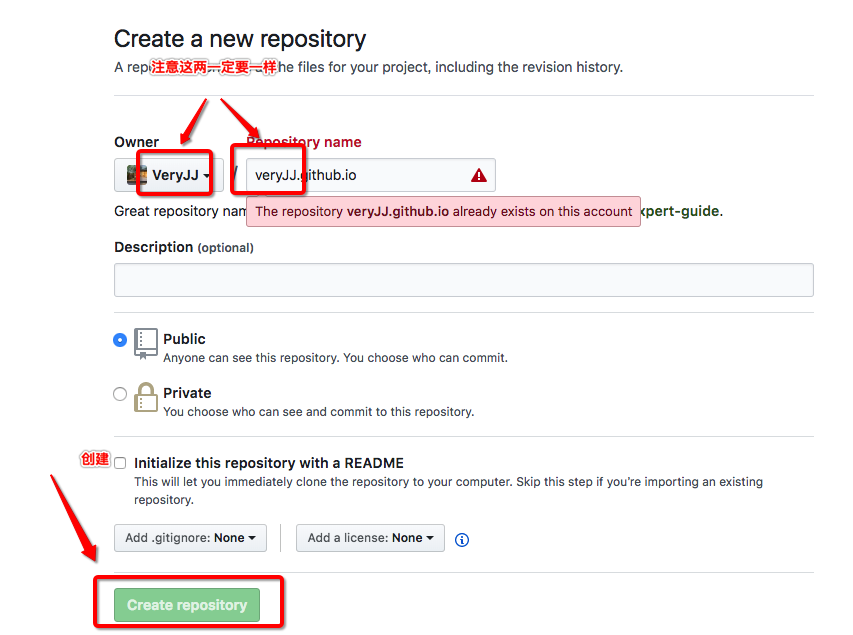
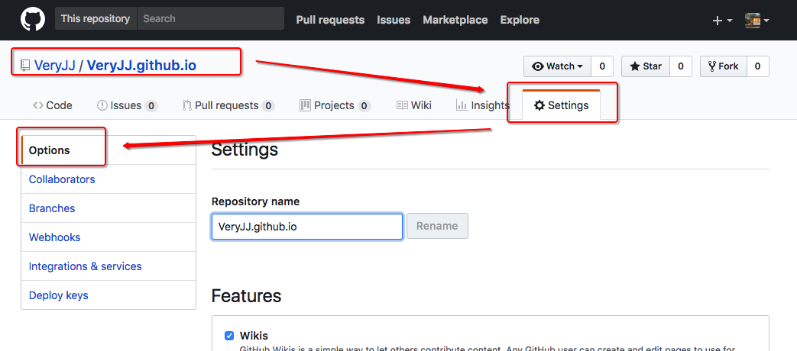
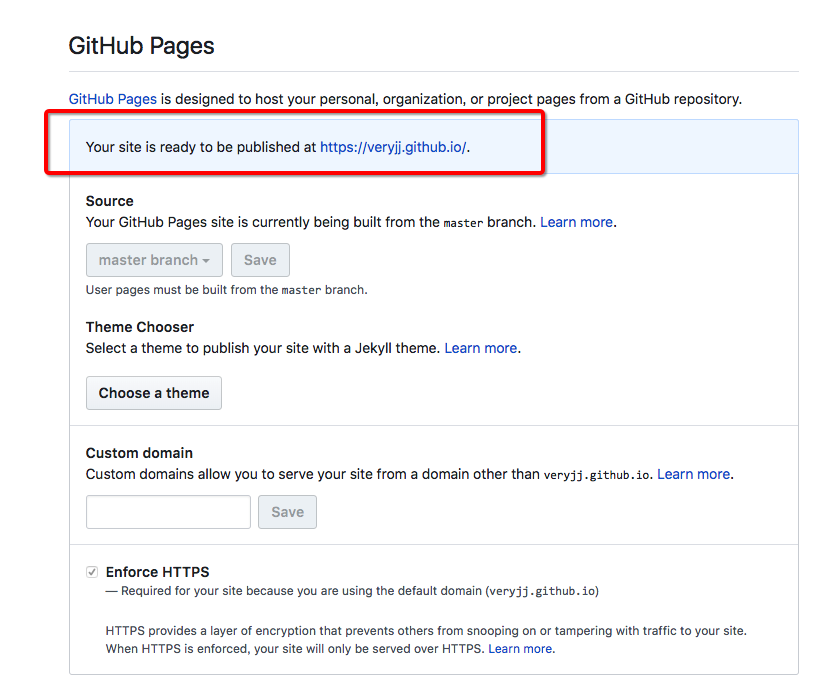

## Github Pages + Hexo 搭建个人博客

偶然的机会，看到"***.github.io"域名的个人博客，瞬间就来了兴趣，莫非Github能方便的创建个人博客？
  
咨询了下度娘，知道了用GitHub Pages + Hexo 搭建个人博客的方式，于是说干就干！

<!-- more -->
  
> PS: 我用的是Macbook + Shell，某些操作Windows的朋友可能要转化翻译成Windows上的命令。
 
### 1. 创建Github仓库

首先，个人Github账号应该有吧？如果没有，先去注册一个。
  
然后，在Github上新建一个仓库，如下图：

  
  
确保新建的仓库以Github Pages方式发布



OK，此步骤完成了！

---

### 2. 安装Hexo

        正式使用Hexo前，请先安装Node.js 和Git

+ 安装Node.js
去官网下载并安装：[Link](https://nodejs.org/en/download/)
  
+ 安装Git
    - 作为玩Github的程序员，默认你已经安装了Git  
  
#### 安装Hexo
1. 新建一个目录作为Hexo的根目录（PS: 后续Hexo相关的功能以及写博客都基于此目录）
1. 进入新建的目录  

```shell
npm install hexo-cli -g
hexo init  #初始化网站
npm install
hexo g     #hexo generate的简写，意思生成博客站点
hexo s     #hexo server的简写，即启动运行hexo的站点，这一步之后就可以通过http://localhost:4000  查看了
```

+ 常用Hexo命令

```
hexo c : hexo clean 清除hexo已生成的public
hexo g : hexo generate 重新生成hexo站点
hexo s : hexo server 运行hexo站点。注：本地运行时，在hexo上做的修改保存后即生效的，不用重新hexo g
hexo d : hexo deploy 将hexo发布到github上去。
```

---

### 3. Hexo deploy 到Github

+ 编辑根目录下_config.yml文件

```shell
deploy:
    type: git
    repo: https://github.com/VeryJJ/VeryJJ.github.io.git  #这里的网址填你自己的
    branch: master   
```

+ 安装hexo deploy插件：
    - npm install hexo-deployer-git --save   

+ 在Hexo目录下执行hexo d 

---

hexo d 成功后，就大工告成拉！你可以在浏览器输入***.github.io(你新建的github.io仓库)，就能看到你的个人博客拉！
  
以后写博客的步骤为：

1. 在电脑本地hexo new '文章名'
1. 丰富你的文章
1. hexo g
1. hexo d 发布

**博客搭建好了，但相信你会觉得它好丑，没关系，请继续阅读下一篇Hexo的装修总结**


##### 参考链接
+ [我是如何利用Github Pages搭建起我的博客，细数一路的坑](https://www.cnblogs.com/jackyroc/p/7681938.html) 
