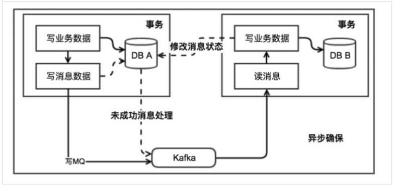

# 分布式系统 之 分布式事务问题

<br>

# 1、你怎么分享分布式事务？

<br>

分布式事务问题是分布式系统绕不开的技术话题。

“谈谈你对分布式事务的理解”、“分享下你团队在分布式事务上的解决方案”、“你用过哪几种分布式事务的中间件”？在技术交流/面试中很容易讨论到这些个话题，得到的反馈大概率是这样的：

- “额~~ ~~ ~~ ~~”，一时语噻 《《《 平时没有梳理和认知分布式事物的问题，一时不知如何组织语言。
- “我们没有使用分布式事务”《《《 分布式事务裸奔状态。
- “我知道有CAP和BASE理论，分别是XXX意思” 《《《 “学院派”选手，不够接地气。
- “我们没用分布式事务，但有做补偿方案，XXX” 《《《 有意识和思考，可以。
- “我们在个别特殊业务上，用了XXX中间件方案” 《《《 有数据、有实践心得，可以。
- etc......

<!--more-->

<br>

**的确，分布式事务问题比中间件技术问题难回答的多，因为：**

**1、它是一个解决方案。而不仅仅是某个功能的技术实现解答。**

**2、分布式事务是一项“有损解决方案”，是一项取舍决策，背后是业务适用性。**

**3、解决方案要基于业务场景，以及业务场景分析。不存在一招鲜吃遍天的最佳方案。**

**3、分布式事务是个综合的技术问题，涉及：业务代码、RPC、幂等性、DB、并发处理、局部高可用、网络分区、一致性视图等问题。**

<br>

据笔者交流反馈的经验，在多数团队中并未落地“像样”的分布式方案。分布式事务在线上系统的应用比例是很小的。相比分布式事务的学习复杂度和实际应用概率，真有点“面试造火箭，实际拧螺丝”的感觉。

但，不论线上应用比例怎样。作为对技术深度的好奇和掌握（尤其是一堆技术的协同的原理掌握），我们仍要扎实的掌握分布式事务。做到知一返三、游刃有余。

<br>

# 2、分布式事务的本质


<Center>分布式事务问题</Center>

如上图：

- 分布式事务的问题/需求是随着系统分布式化后必然产生的。

<br>

- 分布式事务的目的或**本质是追求分布式的多个DB数据的一致性**。

  - 和本地数据库事务的本质原理是一样的。只不过是放大到一套技术栈中去实现，更多考虑因素和复杂度。

  - （以Mysql为例）**本地数据库事务原理**：undo log（原子性） + redo log（持久性） + 数据库锁（原子性&隔离性） + MVCC（隔离性）

  - **分布式事务原理**：全局事务协调器（原子性） + 全局锁（隔离性） + DB本地事务（原子性、持久性）

  - > 注，“一致性” 靠 “原子性 + 持久性 + 隔离性” 三者共同完成

<br>

- 分布式多个DB数据变更的一致性不是瞬间一致，而是会经历一个过程。
  - 需要考虑期间DB数据可见性和隔离性问题。

<br>

问题：

1、分布式系统中，日常研发线上发版，需要考虑分布式事务问题吗？如果要考虑，怎么应对？

2、分布式事务相关的技术问题：RPC、幂等性、DB、并发处理、局部高可用、网络分区、一致性视图等，胸有成竹吗？

<br>

# 3、CAP原则和BASE理论

> 下文并不会基于这两理论分解，毕竟是理论，不能解决实际的问题
>
> 但理论知识还是需要了解一些的。故，快速浏览下。

<br>

## 3.1、CAP原则

**CAP原则：**

一个分布式系统最多只能同时满足一致性（Consistency）、可用性（Availability）和分区容错性（Partition tolerance）中的两项。

<br>

- **一致性（Consistency）**：一致性指“all nodes see the same data at the same time”，即**更新操作**成功并返回客户端**完成后**，所有节点在同一时间的数据完全一致。

- **可用性（Availability）**：可用性指“Reads and writes always succeed”，即服务一直可用，而且是正常响应时间。

- **分区容错性（Partition tolerance）**：分区容错性指“the system continues to operate despite arbitrary message loss or failure of part of the system”，即分布式系统在遇到某节点或网络分区故障的时候，仍然能够对外提供满足一致性和可用性的服务。

<br>

**CAP的取舍策略：**

|    策略    | 解释                                                         |
| :--------: | ------------------------------------------------------------ |
|     CA     | 单点集群，满足一致性，可用性的系统，通常可扩展性较差。例如传统的单机数据库。<br>特点：故障时完全不可用。 |
| 【常选】AP | 满足可用性，分区容错的系统，对一致性要求低一些，是很多分布式系统设计时的选择。<br>       例如：Redis，HBase，Eureka。<br>       例如：各云厂商的SLA几个9，也是牺牲了强一致性。 |
|     CP     | 满足一致性，分区容错的系统，通常性能不是特别高<br />        例如：Zookeeper（通过ZAB协议达到强一致性） |

<br>

## 3.2、BASE理论

BASE理论是对CAP理论的延伸，**对AP的细化**。

核心思想是“即使无法做到强一致性，但应可以采用适合的方式达到最终一致性”。

**BASE**是指：基本可用（Basically Available）、软状态（ Soft State）、最终一致性（ Eventual Consistency）。

 <br>

- **基本可用（Basically Available）**
  - 基本可用是指分布式系统在出现故障时，为保证核心可用，允许损失部分可用性。
  - 例如：电商大促时，为了应对访问量激增，部分用户可能会被引导到降级页面，服务层也可能只提供降级服务。

- **软状态（ Soft State）**
  - 软状态是指允许系统存在中间状态，而该中间状态不会影响系统整体可用性。
  - 例如：分布式存储中一般一份数据至少会有三个副本，允许不同节点间副本同步的延时就是软状态的体现。mysql replication的异步复制也是一种体现。

- **最终一致性（ Eventual Consistency）**
  - 最终一致性是指系统中的所有数据副本经过一定时间后，最终能够达到一致的状态。
  - 最终一致性是弱一致性的一种特殊情况。

<br>

## **3.3、为什么分布式系统倾向BASE理论的架构**

实际性问题：

- 工程师可以做到逻辑严密的代码，但无法确保硬件长期100%可用。
- 在大型分布式系统中，通信异常、网络分区、节点故障、磁盘损坏、机房掉电等等硬件问题随时都可能发生。

<br>

在商业中，越是大型的公司越是需要在线服务能力强的大型分布式系统，在线可用性和响应能力是大型公司的生命支柱（很多线上一次大故障毁掉一个公司的案例）【基本已排除CA和CP】。

且，数据最终一致的特点留给架构很多发挥的余地。即使是关键异常，也可以通过补偿的方式或人工的方式处理。

<br>

# 4、技术方案汇总

## 4.1、按方案本质分类


> - 阿里Seata：http://seata.io/zh-cn/
> - Hmily：https://github.com/dromara/hmily

<br>

## 4.2、怎么选

>仅提供数据参考

**一、一般业务都倾向选最终一致性**

- 绝大部分使用“自研补偿/MQ方案 + 人工介入”。

  - 选型取向：

    - 方案最“轻”，可掌控性好。
    - 方案简单易懂，团队易接受、易维护。
    - 性能损失最少。

  - > 笔者也赞同一般团队选型此方式。毕竟分布式事务问题是小概率事件，留有补救余地就行，性能的损失可是实打实的反应在线上每一个请求上。

<br>

**二、阿里Seata AT模式，平均性能会降低35%以上**

- 笔者团队的业务实测
- 大家可以根据Seata AT模式下额外做的事情来感受

<br>

**三、RocketMQ事务消息**

- 听起来挺好挺简单的方案，但它比较挑业务场景，同步性强的处理链路不适合。
- 【重要】要求下游MQ消费方一定能成功消费消息。否则转人工介入处理。
- 【重要】千万记得实现幂等性。
- RocketMQ 3.0.8版本前，或RocketMQ 4.3.0后 支持事务消息，中间版本事务消息被干掉过。

<br>

# 5、技术方案介绍

## 5.1、【原理】2PC  （理论基石）

两阶段提交（Two-phase Commit，2PC）

<br>

**5.1.1、运行原理**

2PC通过引入协调者（Coordinator）来协调分布式事务参与者的行为，并最终决定这些参与者是否要真正执行事务。

2PC 把事务的执行分为两个阶段：

- 第一阶段 prepare 阶段：这个阶段实际上就是参与者对事务的投票阶段，协调者向所有参与者确认是否可以共同提交？
- 第二阶段 commit阶段：只有第一阶段所有参与者都回答yes，协调者才会向所有参与者发起commit指令共同提交事务。否则向所有参与者发送abort指令共同中止事务。用以保证事务达到一致性。

<br>
【特别强调】2PC是方案原理，不是落地型方案。2PC几乎是所有分布式事务方案的基础，各分布式事务方案几乎都由此改进而来。

<br>

**一阶段：准备阶段**


<Center>一阶段：准备阶段</Center>

- 协调者询问参与者事务是否执行成功，参与者发回事务执行结果。

<br>

**二阶段：提交阶段**


<Center>二阶段：提交阶段</Center>

- 如果事务在每个参与者上都执行成功，事务协调者发送通知让参与者提交事务；否则，协调者发送通知让参与者回滚事务。

- *【注意】*需要注意的是，在准备阶段，参与者在DB层**只执行了事务，未提交事务**。只有在提交阶段接收到协调者发来的通知后，才进行提交或者回滚。

<br>

**5.1.2、方案背后的隐性要求**

1、需要实现一个全局协调器。引发考虑全局协调器自身的可用性问题。

2、应用需配合协调者要求，实现多个接口。

3、需要将DB层面的事务commit分离（需要DB支持）。拖长的一致性过程，对并发情况采取的应对策略（一般往往是同步阻塞）。

4、假设阶段二的commit/rollback肯定执行成功，故二阶段的实现不能复杂。且，一旦出错就人工介入。

<br>

**5.1.3、存在的问题**

1、同步阻塞：所有事务参与者在等待其它参与者响应的时候都处于同步阻塞状态，阻塞级别（应用级、表级、数据行级）视实现方案。

2、单点问题：协调者发生故障将会造成很大影响。特别是在阶段二发生故障，所有参与者会一直等待状态，无法完成其它操作。

3、*数据不一致*：在阶段二，如果协调者只发送了部分 Commit 消息，**此时网络发生异常**，那么只有部分参与者接收到 Commit 消息，也就是说只有部分参与者提交了事务，使得系统数据不一致。抑或协调者发送的commit消息到达参会与者的速度不一样，抑或参与者处理commit消息的调度及时性不一样，都会出现全局数据不一致的一个时间窗口。

4、太过保守： 任意一个节点失败就会导致整个事务失败，没有完善的容错机制。

<br>

## 5.2、【原理】TCC  （补偿型）

TCC 本质上也是一个2PC型原理，但其属于“补偿型” “柔性事务”方案。是最常用的分布式事务的思路。

<br>

理解TCC，重要的是去理解“补偿型”方案的思路。基于“补偿型”思路在实际业务场景中灵活应变。

<br>

故，要往补偿型方案上去理解，勿死记硬背！


<br>

**【敲黑板】TCC特点：**

- TCC是属于BASE理论的柔性事务。是最终一致性的做法。
- （相较于资源层DB）TCC工作于业务逻辑层，属业务逻辑层的2PC。实现：Try、Confirm、Cancel三个方法（Cancel是取消Try）。
- TCC每一个接口在返回时都是直接提交本地事务的。故，TCC是牺牲了一定的隔离性和全局一致性。
- TCC也有事务管理器（Coordinator 事务协调者）。事务管理器要记录分布式事务活动日志，用于事务管理器重启后的恢复。
- 标准的TCC，数据设计上需要支持中间态（配合try + confirm）。变种的TCC，也可以一步到位。

<br>

**TCC的状态推进逻辑：**

1、Try阶段：如果有1个Try失败。则发起全局Cancel。

2、Confirm阶段：假设必须成功。若有个别应用Confirm失败，则由事务管理器进行重试。若重试无效，则人工介入。

3、Cancel阶段：也是假设必须成功。Cancel失败的基本都转人工。

<br>

**TCC实现注意点：**

1、**实现幂等**：因为网络调用无法保证请求一定能到达，所以都会有重调机制，因此对于 Try、Confirm、Cancel 三个方法都需要幂等实现，避免重复执行产生错误。

2、**空回滚问题**：指由于网络问题，Try 方法没收到，超时了。此时事务管理器就会发出 Cancel 命令，那么需要支持 Cancel 在未执行 Try 的情况下能正常的 Cancel。

3、**考虑单应用多实例架构**：在单应用多实例的架构下，TCC的协调者需要保证一个事务的Try、Confirm、Cancel操作在同一个实例上。

- **应对方案一**、单应用多实例间，针对业务数据做分布式锁。
- **应对方案二**、**放任其并发**。前提是单应用级多实例架构自身能保证业务的负载均衡后的并发原子性，例如：请求负载均衡到多台机器实例进行库存操作，常见方案有：分布式锁、DB乐观锁等。因为TCC的Try会检查并锁定资源，如果遇到冲突，那么检测到冲突，Try失败的分布式事务者进行Cancel回滚。

4、**防悬挂**：（尤其是异步方式的TCC）是指 Try 方法由于网络阻塞，超时触发了事务管理器发出了 Cancel 命令， 但是执行了 Cancel 命令之后 Try 请求到了。

<br>

**TCC应用的难度不在于实现三个方法**，<u>在于结合具体TCC工具选型和技术架构下的逻辑严密性</u>，常思考几个问题：

- 这个请求失败了怎么办？
- 方案执行TimeOut了怎么办？
- 任何时候，网络抖动了怎么办？
- 网络异常分区了，会造成什么问题？
- TCC的事务管理器异常了怎么办？
- 执行TCC的应用程序异常了怎么办？
- 如何优雅的事务平滑的更新线上版本？
- ......等等

<br>

> 国内开源的**ByteTCC、hmily、tcc-transaction**

<br>

***TCC的缺点：***

- 在业务层面，完全手写回滚逻辑或者是补偿逻辑，实在太恶心了。且，这块业务代码很难维护，很容易纰漏。


<br>

**因地制宜，这些也是TCC思路：**

- **一、没有Try的TCC**

例如，购买联程机票，换乘的又是不同的航空公司。比如从 A 飞到 B，再从 B 飞到 C，只有 A - B 和 B - C 都买到票了才有意义。

但有可能受限于各航空公司未必都实现TCC的接口，故为了方案的通用性，会做方案降级应对。这时候的选择就不 Try 了，直接调用航空公司的买票操作，当两个航空公司都买成功了那就直接成功了，如果某个公司买失败了，那就需要调用取消订票接口。

也就是在第一阶段直接就执行完整个业务操作了，所以要重点关注回滚操作，如果回滚失败得有提醒，需要人工介入等。

> 类SAGA的方案哦

<br>

- **二、异步方式的TCC**

 TCC 异步其实也是一种折衷。

比如某些服务很难改造，但又**不会影响主业务决策**，也就是它不那么需要即时执行。这时候可以引入可靠消息服务，通过消息服务来替代个别服务来进行 Try、Confirm、Cancel 。

Try 的时候只是写入消息，消息还不能被消费，Confirm 就是真正发消息的操作，Cancel 就是取消消息的发送。

是不是有点耳熟？对！就是RocketMQ。

> 事务消息的方案哦

<br>

## 5.3、【原理】 XA （取决于数据库）

XA规范 是 X/Open 组织定义的分布式事务处理（DTP，Distributed Transaction Processing）标准。

XA 规范 描述了全局的事务管理器与局部的资源管理器之间的接口。 XA规范 的目的是允许的多个资源（如数据库，应用服务器，消息队列等）在同一事务中访问，这样可以使 ACID 属性跨越应用程序而保持有效。

<br>

XA中大致分为两部分：事务管理器和本地资源管理器。

- 本地资源管理器：往往由数据库实现，比如Oracle、DB2这些商业数据库都实现了XA接口。
- 事务管理器：作为全局的调度者，负责各个本地资源的提交和回滚。

XA 规范 使用两阶段提交（2PC，Two-Phase Commit）来保证所有资源同时提交或回滚任何特定的事务


<br>

XA实现分布式事务的原理如下：


<br>

> 看，背后还是2PC的原理。

<br>

总的来说，XA协议比较简单，而且一旦商业数据库实现了XA协议，使用分布式事务的成本也比较低。

但是，*XA也有致命的缺点，那就是性能不理想*，特别是在交易下单链路，并发量高，*XA无法满足高并发场景*。

<br>

XA目前在商业数据库支持的比较理想，在mysql数据库中支持的不太理想，mysql的XA实现，没有记录prepare阶段日志，主备切换回导致主库与备库数据不一致。

<br>

至于实战经验/代码demo，笔者也没使用过。此章节略带“键盘侠”的感觉。

带XA能力的框架：Seata。

<br>

## 5.4、【框架】Seata  （多种模式可选）

http://seata.io/zh-cn/index.html

<br>

### 5.4.1、XA模式   （阻塞大，性能低）

**前提：**

- <u>支持XA 事务的数据库</u>。（Mysql就不行罗）
- Java 应用，通过 JDBC 访问数据库。

<br>

**整体机制：**

在 Seata 定义的分布式事务框架内，利用事务资源（数据库、消息服务等）对 XA 协议的支持，以 XA 协议的机制来管理分支事务的一种 事务模式。


- 一、执行阶段：
  - 可回滚：业务 SQL 操作放在 XA 分支中进行，由数据库对 XA 协议的支持来保证 *可回滚*
  - 持久化：XA 分支完成后，执行 XA prepare，同样，由数据库对 XA 协议的支持来保证 *持久化*（即，之后任何意外都不会造成无法回滚的情况）
- 二、完成阶段：
  - 分支提交：执行 XA 分支的 commit
  - 分支回滚：执行 XA 分支的 rollback

<br>

**工作机制：**

1. 整体运行机制

XA 模式 运行在 Seata 定义的事务框架内：


- 执行阶段（E xecute）：XA start/XA end/XA prepare + SQL + 注册分支
- 完成阶段（F inish）：XA commit/XA rollback

<br>

2. 数据源代理

XA 模式需要 XA Connection。

获取 XA Connection 两种方式：

- 方式一：要求开发者配置 XADataSource
- 方式二：根据开发者的普通 DataSource 来创建

第一种方式，给开发者增加了认知负担，需要为 XA 模式专门去学习和使用 XA 数据源，与 透明化 XA 编程模型的设计目标相违背。

第二种方式，对开发者比较友好，和 AT 模式使用一样，开发者完全不必关心 XA 层面的任何问题，保持本地编程模型即可。

<br>

虽然第二种方式对使用者更友好，但仍优先推荐第一种自实现的方式：

为什么？

关于第二种方式，其实是Seata来开发XA Connection，这种方法是在做数据库驱动程序要做的事情。不同的厂商、不同版本的数据库驱动实现机制是厂商私有的，Seata只保证在充分测试过的驱动程序上是正确的（无法针对使用者各色各样的驱动版本给出通用版本），开发者使用的**驱动程序版本差异**很可能造成机制的失效。这点在 Oracle 上体现非常明显。参见 Druid issue：https://github.com/alibaba/druid/issues/3707  。

<br>

3. 分支注册

XA start 需要 Xid 参数。

这个 Xid 需要和 Seata 全局事务的 XID 和 BranchId 关联起来，以便由 TC 驱动 XA 分支的提交或回滚。

目前 Seata 的 BranchId 是在分支注册过程，由 TC 统一生成的，所以 **XA 模式分支注册的时机需要在 XA start 之前**。

<br>

**XA 模式的使用**

可以参考 Seata 官网的样例：https://github.com/seata/seata-samples/tree/master/seata-xa

样例场景是 Seata 经典的，涉及库存、订单、账户 3 个微服务的商品订购业务。

<br>

### 5.4.2、AT模式 （折中的优选）

复习下Seata XA模式下的不足：

1. 需要数据库支持XA协议。Mysql没戏。
2. 阻塞大，性能低。

<br>

然后，Seata AT模式就是Seata XA模式的演化版本，优化了Seata XA模式下的2个不足。更灵活、性能有所提升（不绝对，建议实测比较）。

<br>

**前提：**

- 基于支持本地 ACID 事务的关系型数据库。
- Java 应用，通过 JDBC 访问数据库。

<br>

**整体改进原理：**

1、【自动代理，插入逻辑】【低入侵】自动代理应用层的数据源，拦截并插入Seata的操作和逻辑。

2、【应用层XA Prepare】【灵活】在应用层实现 XA Prepare部分，大大提升适用面和灵活性。实际实现上，通过对数据源做代理，以此拦截应用的事务SQL，进而反向解析出undo sql log（供于rollback）。

3、【行级-全局锁】【隔离性&性能】在全局TC上实现行级全局锁。全局事务在执行期间，需要先拿到全局锁，才能处理临界区逻辑。以此达到全局的读写隔离。

> 代码层面参照Seata-Sample，最大特点是在事务入口打上@GlobalTransactional的代理注解，让Seata能干预SQL的执行。


<br>

基本概念：

- **TC（Transaction Coordinator） -  事务协调者**：维护全局事务和分支事务的状态，驱动全局事务提交或回滚。
- **TM（Transaction Manager）      - 事务管理器**：定义全局事务的范围
- **RM（Resource Manager）         - 资源管理器** ：管理分支事务处理的资源，与TC通信注册/报告分支事务状态，并驱动分支事务的提交或回滚。

两阶段提交：

- 一阶段：业务数据和<u>回滚日志记录</u>在同一个本地**事务中提交**，释放本地锁和连接资源。
- 二阶段：提交异步化，非常快速地完成   或   回滚通过一阶段的回滚日志进行反向补偿。


<br>

**写隔离：**

- 一阶段本地事务提交前，需要确保先拿到 **全局锁（数据行级）** 。而全局锁的实现，在TC端。带来的优点：全局解锁就在一瞬间。
- 拿不到 **全局锁** ，不能提交本地事务。
- 拿 **全局锁** 的尝试被限制在一定范围内，超出范围将放弃，并回滚本地事务，释放本地锁。

<br>

示例：

两个全局事务 tx1 和 tx2，分别对 a 表的 m 字段进行更新操作，m 的初始值 1000。

- tx1 先开始，开启本地事务，拿到本地锁，更新操作 m = 1000 - 100 = 900。本地事务提交前，<u>先拿到该记录的 **全局锁**</u> ，本地提交释放本地锁。 

- tx2 后开始，开启本地事务，拿到本地锁，更新操作 m = 900 - 100 = 800。本地事务提交前，*尝试拿该记录的 **全局锁*** ，tx1 全局提交前，该记录的全局锁被 tx1 持有，tx2 需要*重试等待* **全局锁** 。


- tx1 二阶段全局提交，释放 **全局锁** 。tx2 拿到 **全局锁** 提交本地事务。


如果回滚：

如果 tx1 的二阶段全局回滚，则 tx1 需要重新获取该数据的本地锁，进行反向补偿的更新操作，实现分支的回滚。

此时，如果 tx2 仍在等待该数据的 **全局锁**，同时持有本地锁，则 tx1 的分支回滚会失败。分支的回滚会一直重试，直到 tx2 的 **全局锁** 等锁超时，放弃 **全局锁** 并回滚本地事务释放本地锁，tx1 的分支回滚最终成功。

<br>

因为整个过程 **全局锁** 在 tx1 结束前一直是被 tx1 持有的，所以不会发生 **脏写** 的问题。

<br>

**读隔离：**

在数据库本地事务隔离级别 **读已提交（Read Committed）** 或以上的基础上，Seata（AT 模式）的默认全局隔离级别是 **读未提交（Read Uncommitted）** 。

如果应用在特定场景下，必需要求全局的 **读已提交** ，目前 Seata 的方式是通过 SELECT FOR UPDATE 语句的代理。


*SELECT FOR UPDATE 语句的执行会申请 **全局锁**（并发阻塞的代价点）* ，如果 **全局锁** 被其他事务持有，则释放本地锁（回滚 SELECT FOR UPDATE 语句的本地执行）并重试。这个过程中，查询是被 block 住的，直到 **全局锁** 拿到，即读取的相关数据是 **已提交** 的，才返回。

<br>

出于总体性能上的考虑，Seata 目前的方案并<u>没有对所有 SELECT 语句都进行代理</u>，仅针对 FOR UPDATE 的 SELECT 语句。

<br>

**回滚日志表：**

AT模式的特点是通过代理数据源，从而能拦截SQL，并生成undo sql。这个特点在实际实战中要引起注意，要实测真实业务sql的undo sql生成正确性（担心Seata AT模式对于复杂更新sql 的解析能力）。

<br>

注，UNDO_LOG Table 一定要创建哦。

 MySQL 为例：

| Field         | Type         |
| ------------- | ------------ |
| branch_id     | bigint PK    |
| xid           | varchar(100) |
| context       | varchar(128) |
| rollback_info | longblob     |
| log_status    | tinyint      |
| log_created   | datetime     |
| log_modified  | datetime     |

```sql
-- 注意此处0.7.0+ 增加字段 context
CREATE TABLE `undo_log` (
  `id` bigint(20) NOT NULL AUTO_INCREMENT,
  `branch_id` bigint(20) NOT NULL,
  `xid` varchar(100) NOT NULL,
  `context` varchar(128) NOT NULL,
  `rollback_info` longblob NOT NULL,
  `log_status` int(11) NOT NULL,
  `log_created` datetime NOT NULL,
  `log_modified` datetime NOT NULL,
  PRIMARY KEY (`id`),
  UNIQUE KEY `ux_undo_log` (`xid`,`branch_id`)
) ENGINE=InnoDB AUTO_INCREMENT=1 DEFAULT CHARSET=utf8;
```

<br>

**AT模式的缺点：**

**1、性能损耗：**

- 还是业务上明显感知的。
- 一条Update SQL，需要获取全局事务XID（与TC通信）、before image（解析SQL，查询一次数据库）、after image（查询一次数据库）、insert undo log（写一次数据库）、before commit（与TC通信，判断锁冲突/获取锁），这些操作都需要一次次的远程通信RPC，而且是同步的。
- 另外，undo log写入时blob字段的插入信息也是不高的。
- 每条写SQL都会增加这么多开销，粗略估计会增加5倍的响应时间。
- 笔者平台线上业务实测，Seata AT模式后，所及业务功能点整体性能下降35%。

**2、特别注意应对：补偿型方式的通病：**

- Seata已经支持的AT、TCC、SAGA都是补偿型的。

- 补偿型事务处理机制构建在事务资源之上，事务资源本身对分布式事务是无感知的。无法做到真正的全局一致性。

  - > 比如，一条库存记录处在补偿型事务处理过程中由100扣减为50。此时，仓库管理员链接数据库查询统计库存，查到了50。然后因事务回滚，库存由50补偿变回100。显然，仓库管理员查询统计到的50就是脏数据。

- AT的锁能解决部分这类问题，故，实际应用时一定要仔细分析并发读写场景特点，做最小代价的应对方案。


<br>

### 5.4.3、TCC模式  （提供框架）

关于原理，《5.2、TCC》章节后，此处不再详述。

但，在实际应用中务必记得考虑TCC模式下各种情况的应对。见《5.2、TCC》章节。


<Center>Seata TCC模式的执行流程原理图</Center>

根据两阶段行为模式的不同，将分支事务划分为 **Automatic (Branch) Transaction Mode** 和 **TCC (Branch) Transaction Mode**.

- Automatic模式 基于支持本地 ACID 事务的关系型数据库（<u>即Seata AT模式</u>）：
  - 一阶段 prepare 行为：在本地事务中，一并提交业务数据更新和相应回滚日志记录。
  - 二阶段 commit 行为：马上成功结束，自动异步批量清理回滚日志。
  - 二阶段 rollback 行为：通过回滚日志，自动生成补偿操作，完成数据回滚。

- **TCC 模式，不依赖于底层数据资源的事务支持：**
  - 一阶段 prepare 行为：调用 **自定义** 的 prepare 逻辑。
  - 二阶段 commit 行为：调用 **自定义** 的 commit 逻辑。
  - 二阶段 rollback 行为：调用 **自定义** 的 rollback 逻辑。

所谓 TCC 模式，是指支持把 **自定义** 的分支事务纳入到全局事务的管理中。

<br>

### 5.4.4、Saga模式  （多系统集成）

**概述：**

Saga模式是Seata提供的长事务解决方案。

事务长不长不知道，但Saga有它存在的意义和只有它能解决的场景。

<br>

在Saga模式中，业务流程中每个参与者都提交本地事务，当出现某一个参与者失败则补偿前面已经成功的参与者，一阶段正向服务和二阶段补偿服务都由业务开发实现。


<br>

**适用场景：**

- 参与者包含其它公司或遗留系统服务，无法提供 TCC 模式要求的三个接口
- 业务流程长、业务流程多

**优势：**

- 一阶段提交本地事务，无锁，高性能
- 事件驱动架构，参与者可异步执行，高吞吐
- 补偿服务易于实现

**缺点：**

- 不保证隔离性

<br>

**需要注意的是：**

- 虽然没体现，但Seata Saga模式的背后，仍旧是对Seata框架和Saga事务管理器的依赖。

更多了解详见：

- Seata 官网：http://seata.io/zh-cn/docs/user/saga.html
- Seata 样例：https://github.com/seata/seata-samples/

<br>

**缺乏隔离性的应对**：

- 由于 Saga 事务不保证隔离性, 在极端情况下可能由于脏写无法完成回滚操作。

  - > 比如举一个极端的例子, 分布式事务内先给用户A充值, 然后给用户B扣减余额, 如果在给A用户充值成功, 在事务提交以前, A用户把余额消费掉了, 如果事务发生回滚, 这时则没有办法进行补偿了。这就是缺乏隔离性造成的典型的问题, 实践中一般的应对方法是：

- 业务流程设计时遵循“<u>宁可长款, 不可短款</u>”的原则, 长款意思是客户少了钱机构多了钱, 以机构信誉可以给客户退款, 反之则是短款, 少的钱可能追不回来了。所以在<u>业务流程设计上一定是先扣款</u>。

- 有些业务场景可以允许让业务最终成功, 在回滚不了的情况下可以继续重试完成后面的流程, 所以状态机引擎除了提供“回滚”能力还需要提供“向前”恢复上下文继续执行的能力, 让业务最终执行成功, 达到最终一致性的目的。

<br>

## 5.5、【方案】事务消息 （补偿型）

属TCC的方案变种。

**适用于场景有限：** 限于可异步处理的分布式事务场景（即分支事务不影响主业务的决策）。

<br>

市面上支持事务消息的仅：RocketMQ。见《4.2、怎么选》。

<br>

RocketMQ 中间件思路大致为：

- 第一阶段 Prepared消息，会拿到消息的地址
- 第二阶段 执行本地事务
- 第三阶段 通过第一阶段拿到的地址去访问消息，并修改状态（投递/撤销）。

也就是说在业务方法内要向消息队列提交两次请求，一次发送消息和一次确认消息。如果确认消息发送失败了RocketMQ会定期扫描消息集群中的事务消息，这时候发现了Prepared消息，它会向消息发送者确认，所以生产方需要实现一个check接口，RocketMQ会根据发送端设置的策略来决定是回滚还是继续发送确认消息。这样就保证了消息发送与本地事务同时成功或同时失败。


优点： 实现了最终一致性，不需要依赖本地数据库事务。一部分可用性保障转移给/借力MQ的能力。

缺点： 实现难度大，主流MQ不支持。

<br>

## 5.6、【方案】本地消息表 （最大努力通知）

本地消息表与业务数据表处于同一个数据库中，这样就能利用本地事务来保证在对这两个表的操作满足事务特性，并且使用了消息队列来保证最终一致性。

1. 在分布式事务操作的一方完成写业务数据的操作之后向本地消息表发送一个消息，本地事务能保证这个消息一定会被写入本地消息表中。
2. 之后将本地消息表中的消息转发到 Kafka 等消息队列中，如果转发成功则将消息从本地消息表中删除，否则继续重新转发。
3. 在分布式事务操作的另一方从消息队列中读取一个消息，并执行消息中的操作。



优点： 一种非常经典/简单的实现，避免了分布式事务，实现了最终一致性。

缺点： 消息表会耦合到业务系统中，如果没有封装好的解决方案，*（重点）会有很多杂活需要处理*。同样要考虑TCC方案下的多种技术因素，见《5.2、TCC》。在运行环境中，怀疑一切才能一切放心。

<br>

# 3、再谈方案选型

看完上文后，大家应该有几个感觉：

- 日常在聊的分布式事务的一些概念或名字中，部分是原理，部分是方案，彼此之间还存在演进关系。目前应能清晰的区分。
- 在实现方案上，选择的余地很少。实战场景下，大多仍是根据业务场景自研一套代码为主，但自研方案的背后仍然是TCC/XA/Saga的原理。
- 选择开源框架的很大目的是借力开源方案的事务管理器和其框架，本质原理都是一样的。
- 懂分布式事务原理的基础上，更要掌握各方案背后要应对的问题
  - 网络不可靠的问题
  - 数据全局隔离性的问题
  - 幂等的问题
  - 空回滚的问题
  - 事务管理器、应用节点不可靠的问题
  - 监控的问题
  - ......等等

<br>

关于分布式事务实现方案的选型/设计，笔者的心得和倾向：

1、【价值取向】分布式事务方案在“性能”和“数据一致性”两方面是相悖的，在价值取向上，我更倾向于保障“性能”。

> 原因：从影响面和可恢复性角度，分布式事务问题是小概率事件，留有补救余地就行，性能的损失是实打实的反应在线上每一个请求上。

2、【编码风格】落实“宁可长款, 不可短款”的原则。优先做扣除行为。

3、【做好监控】既然允许线上分布式事务问题的发生，那么就要有兜底应对的手段。笔者会要求团队在分布式事务的流程中认真打日志。并将此类日志作为线上业务监控范围，并与公司内部邮件系统、钉钉打通。做到一个有问题，秒级感知。

4、【双重兜底】开发统计对账服务，对线上分布式事务数据做周期性巡检。对线上数据不一致情况做通知：工单、钉钉、邮件。


