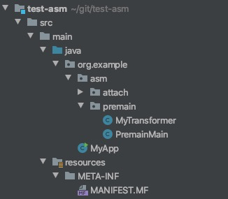
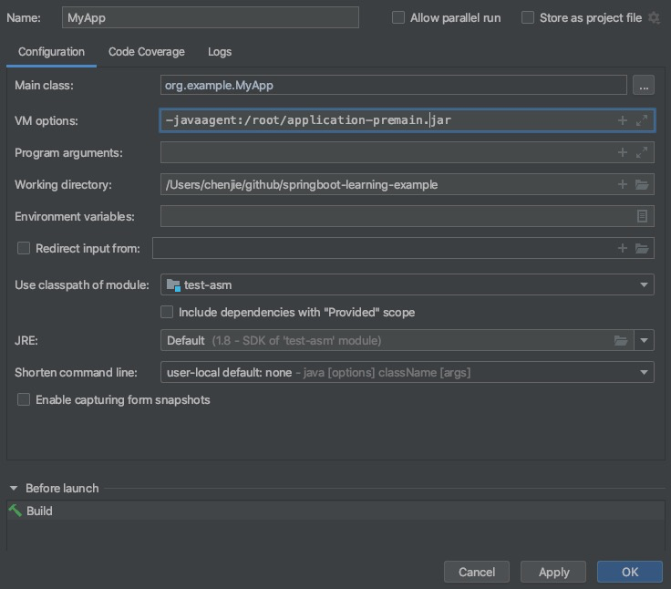
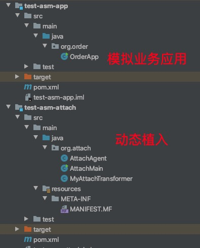
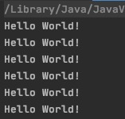
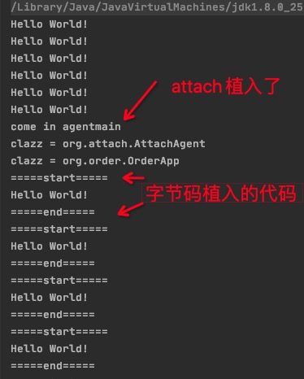

## 手把手教你Java字节码Demo

接触中间件的开发来说，了解像Pinpoint（https://github.com/naver/pinpoint）、BTrace（https://github.com/btraceio/btrace）、阿里的JVM-SANDBOX（https://github.com/alibaba/jvm-sandbox）、Java在线问题诊断工具**Greys**（https://github.com/oldmanpushcart/greys-anatomy）等，都是通过字节码技术，无侵入的干预到Java应用程序。很清爽又很实用。

<br>

今天就记录字节码的两种实现demo，作为入门了解。

<br>

Java Agent的最常用方式:

- 一种是premain方式：它属于静态注入。即在Java应用程序启动时，在类加载器对类的字节码进行加载之前对类字节码进行“再改造”来做功能增强（例如实现AOP）
- 一种是：HotSpot独有的attach方式（JDK1.6才出现），它能实现动态注入，对已经运行的Java应用的类进行字节码增强。

<!--more-->

<br>

## 方式一：premain静态方式

（大多中间件/工具的方式）

```java
java -javaagent:/root/application-premain.jar MyApp
```

如上面这句java启动命令，假定/root目录下已经有一个符合Java Agent规范的Jar了（这里指application-premain.jar），而MyApp是指我们Java应用的启动类（main方法的类），如此我们就能成功的对这个Java应用进行了静态注入。

接下来，分解一下具体实现步骤。

<br>

**1、建个独立Maven工程**

pom的必要依赖和设置

```xml
<dependencies>
    <dependency>
      <groupId>org.javassist</groupId>
      <artifactId>javassist</artifactId>
      <version>3.21.0-GA</version>
    </dependency>

    <!--      注意：如果需要进行attach，那么需要引入tools.jar-->
    <dependency>
      <groupId>com.sun</groupId>
      <artifactId>tools</artifactId>
      <version>1.8</version>
      <scope>system</scope>
      <systemPath>${java.home}/../lib/tools.jar</systemPath>
    </dependency>

  </dependencies>

  <build>
    <finalName>application-premain</finalName>

    <plugins>
      <plugin>
        <groupId>org.apache.maven.plugins</groupId>
        <artifactId>maven-compiler-plugin</artifactId>
        <version>3.8.0</version>
        <configuration>
          <source>1.7</source>
          <target>1.7</target>
          <encoding>UTF-8</encoding>
        </configuration>
      </plugin>

      <plugin>
        <artifactId>maven-assembly-plugin</artifactId>
        <version>3.1.1</version>
        <configuration>
          <archive>
            <!--避免MANIFEST.MF被覆盖-->
            <manifestFile>src/main/resources/META-INF/MANIFEST.MF</manifestFile>
          </archive>
          <descriptorRefs>
            <!--打包时加入依赖-->
            <descriptorRef>jar-with-dependencies</descriptorRef>
          </descriptorRefs>
        </configuration>
        <executions>
          <execution>
            <id>make-assembly</id>
            <phase>package</phase>
            <goals>
              <goal>single</goal>
            </goals>
          </execution>
        </executions>
      </plugin>

    </plugins>
  </build>
```

<br>

**2、准备MyApp**

Java应用相当简单，里面就一个打印语句：

```java
public class MyApp
{
    public static void main( String[] args ) {

        while(true){
            printSth();
        }
    }

    private static void printSth(){
        System.out.println( "Hello World!" );

        try {
            TimeUnit.SECONDS.sleep(5);
        } catch (InterruptedException e) {
            e.printStackTrace();
        }
    }
}
```

此例中，我们目标对`printSth()`方法进行字节码级改造，植入额外逻辑。（最终会打包成例子中的application-premain.jar）

<br>

Maven工程结构大致如下：



<br>

**3、编写MyTransformer**

MyTransformer类是具体实现字节码植入的实现类。

此例中，字节码植入的逻辑是两个打印语句。

具体代码如下：

```java
package org.example.asm.premain;

import java.lang.instrument.ClassFileTransformer;
import java.lang.instrument.IllegalClassFormatException;
import java.security.ProtectionDomain;
import java.util.Objects;

import javassist.ClassPool;
import javassist.CtClass;
import javassist.CtMethod;

public class MyTransformer implements ClassFileTransformer {
    @Override
    public byte[] transform(ClassLoader loader,
                            String className,
                            Class<?> classBeingRedefined,
                            ProtectionDomain protectionDomain,
                            byte[] classfileBuffer) throws IllegalClassFormatException {

        //跳过java自带方法
        if (className.startsWith("java") || className.startsWith("sun")){
            return classfileBuffer;
        }

        //好像使用premain这个className是没问题的，但使用attach时className的.变成了/，所以如果是attach，那么这里需要替换
        className = className.replace("/", ".");

        //只处理MyApp类
        if (!className.endsWith("MyApp")){
            return classfileBuffer;
        }

        try {
            ClassPool classPool = ClassPool.getDefault();
            CtClass ctClass = classPool.get(className);
            CtMethod[] declaredMethods = ctClass.getDeclaredMethods();

            for (CtMethod declaredMethod : declaredMethods){
                //只处理printSth方法
                if (Objects.equals("printSth", declaredMethod.getName())){
                    //在方法执行前插入打印语句
                    declaredMethod.insertBefore("System.out.println(\"=====start=====\");");
                    //在方法执行后插入打印语句
                    declaredMethod.insertAfter("System.out.println(\"=====end=====\");");

                    break;
                }
            }

            return ctClass.toBytecode();

        } catch (Exception e) {
            e.printStackTrace();
        }

        return classfileBuffer;
    }
}
```

可以看到MyTransformer实现了ClassFileTransformer接口，ClassFileTransformer是专门为Java Agent提供类转换功能的接口。

在transform方法中，我们可以大显身手了，从上面代码片段可以看出，我们只是对MyApp#printSth方法的之前和末尾各加入了一条打印语句，你可能会奇怪，不是字节码吗？为啥可以直接像表达式引擎一样直接输入Java表达式？是因为这里使用了**javassist**这一轻量级的字节码工具，它帮我们屏蔽了字节码的细节，使我们可以只关注Java代码。

<br>

**4、编写Premain类**

有了MyTransformer，在哪用？答案就在PremainMain类中，PremainMain要做的事情很简单，就是把我们自定义的类转换器MyTransformer加到前面提到的Instrumentation实例中：

```java
package org.example.asm.premain;

import java.lang.instrument.Instrumentation;

public class PremainMain {
    /**
     * 注意，这个premain方法签名是Java Agent约定的，不要随意修改
     * @param agentArgs
     * @param instrumentation
     */
    public static void premain(String agentArgs, Instrumentation instrumentation) {
        instrumentation.addTransformer(new MyTransformer());
    }
}
```

`注意`：PremainMain#premain的方法签名是Java Agent内部约定的，不能随意修改。

<br>

**5、编写MANIFEST.MF**

Java Agent是怎么知道premain方法在哪个类中呢？答案就application-premain.jar的resources/META-INF/MANIFEST.MF文件中**，**MANIFEST.MF文件内容如下：

```xml
Manifest-Version: 1.0
Created-By: veryJJ
Premain-Class: org.example.asm.premain.PremainMain

```

注意：最后一行需要留一个空行

<br>

**6、打包&运行**

几步操作下来，必要的文件已就绪，我们把它打成一个jar包（需要包含javassist），需用到maven-assembly-plugin插件（再check下pom），项目的pom.xml文件内容如下：

```xml
<build>
    <finalName>asm-premain</finalName>

    <plugins>
      <plugin>
        <groupId>org.apache.maven.plugins</groupId>
        <artifactId>maven-compiler-plugin</artifactId>
        <version>3.8.0</version>
        <configuration>
          <source>1.7</source>
          <target>1.7</target>
          <encoding>UTF-8</encoding>
        </configuration>
      </plugin>

      <plugin>
        <artifactId>maven-assembly-plugin</artifactId>
        <version>3.1.1</version>
        <configuration>
          <archive>
            <!--避免MANIFEST.MF被覆盖-->
            <manifestFile>src/main/resources/META-INF/MANIFEST.MF</manifestFile>
          </archive>
          <descriptorRefs>
            <!--打包时加入依赖-->
            <descriptorRef>jar-with-dependencies</descriptorRef>
          </descriptorRefs>
        </configuration>
        <executions>
          <execution>
            <id>make-assembly</id>
            <phase>package</phase>
            <goals>
              <goal>single</goal>
            </goals>
          </execution>
        </executions>
      </plugin>

    </plugins>
  </build>

```

我们直接执行Maven的打包命令：

```
mvn clean package
```

打包完成后，我们会在target目录下得到：application-premain.jar 和 application-premain-jar-with-dependences.jar。注，用`application-premain-jar-with-dependences.jar`哦。为了方便，可以在cp命令拷贝到/root目录时顺便重命名的短一些。（拷贝其他任何目录都可以的哦）

<br>

一切就绪了，idea上运行



运行结果如下：

```shell
=====start=====
Hello World!
=====end=====
=====start=====
Hello World!
=====end=====
=====start=====
Hello World!
=====end=====
=====start=====
Hello World!
=====end=====
=====start=====
Hello World!
=====end=====
=====start=====
Hello World!
```

可以看到，原本只有一个打印"Hello World"语句的MyApp类，在前后加了两条打印语句，目标达成！！！！！

<br>

## 方式二、AttachAgent动态方式

（混动工程的实现方式）

如何动态注入字节码呢？为了更清晰的展示，我们创建两个独立的maven工程，一个模拟业务应用：循环执行printSth方法。一个模拟动态attach植入。



OrderApp代码如下

```java
public class OrderApp
{
    public static void main( String[] args ) {

        while(true){
            printSth();
        }
    }

    private static void printSth(){
        System.out.println( "Hello World!" );

        try {
            TimeUnit.SECONDS.sleep(5);
        } catch (InterruptedException e) {
            e.printStackTrace();
        }
    }
}
```

<br>

> 准备动态植入的代码

**1、编写Transformer类**

```java
package org.attach;

import javassist.ClassPool;
import javassist.CtClass;
import javassist.CtMethod;

import java.lang.instrument.ClassFileTransformer;
import java.lang.instrument.IllegalClassFormatException;
import java.security.ProtectionDomain;
import java.util.Objects;

public class MyAttachTransformer implements ClassFileTransformer {
    @Override
    public byte[] transform(ClassLoader loader,
                            String className,
                            Class<?> classBeingRedefined,
                            ProtectionDomain protectionDomain,
                            byte[] classfileBuffer) throws IllegalClassFormatException {

        //跳过java自带方法
        if (className.startsWith("java") || className.startsWith("sun")){
            return classfileBuffer;
        }

        //好像使用premain这个className是没问题的，但使用attach时className的.变成了/，所以如果是attach，那么这里需要替换
        className = className.replace("/", ".");

        //只处理MyApp类
        if (!className.endsWith("OrderApp")){
            return classfileBuffer;
        }

        try {
            ClassPool classPool = ClassPool.getDefault();
            CtClass ctClass = classPool.get(className);
            CtMethod[] declaredMethods = ctClass.getDeclaredMethods();

            for (CtMethod declaredMethod : declaredMethods){
                //只处理printSth方法
                if (Objects.equals("printSth", declaredMethod.getName())){
                    //在方法执行前插入打印语句
                    declaredMethod.insertBefore("System.out.println(\"=====start=====\");");
                    //在方法执行后插入打印语句
                    declaredMethod.insertAfter("System.out.println(\"=====end=====\");");

                    break;
                }
            }

            return ctClass.toBytecode();

        } catch (Exception e) {
            e.printStackTrace();
        }

        return classfileBuffer;
    }
}
```


<br>

**2、新增AttachAgent类**

```java
package org.example.asm.attach;

import org.example.asm.premain.MyTransformer;
import java.lang.instrument.Instrumentation;
import java.lang.instrument.UnmodifiableClassException;


public class AttachAgent {
    /**
     * 注意：agentmain的方法签名也是约定好的，不能随意修改
     *
     * 其实如果要支持premain和attach两种方式的话，可以把premain和agentmain两个方法写在一个类里，这里为了方便演示，写成了两个
     *
     * @param agentArgs
     * @param instrumentation
     */
    public static void agentmain(String agentArgs, Instrumentation instrumentation) {
        String targetClassPath = "org.example.MyApp";

        System.out.println("come in agentmain");

        for (Class<?> clazz : instrumentation.getAllLoadedClasses()) {

            // 过滤掉不能修改的类
            if(!instrumentation.isModifiableClass(clazz)) {
                continue;
            }

            System.out.println("clazz = " + clazz.getName());

            // 只修改我们关心的类
            if (clazz.getName().equals(targetClassPath)) {
                // 最根本的目的还是把MyTransformer添加到instrumentation中
                instrumentation.addTransformer(new MyTransformer(), true);
                try {
                    instrumentation.retransformClasses(clazz);
                } catch (UnmodifiableClassException e) {
                    e.printStackTrace();
                }

                return;
            }
        }
    }
}
```

这里约定好的方法是agentmain，但agentmain方法的本质也是把MyTransformer添加到instrumentation中，进而动态刷新目标class的transformer。

<br>

**3、配置MANIFEST.MF**

```xml
Manifest-Version: 1.0
Created-By: veryJJ
Agent-Class: org.attach.AttachAgent
Can-Redefine-Classes: true
Can-Retransform-Classes: true

```

<br>

**4、test-asm-attach工程打包**

得到attach-premain-jar-with-dependencies.jar和attach-premain.jar

记得使用：attach-premain-jar-with-dependencies.jar（对应下面attchMain中的jar，按需重命名）

<br>


**5、此时，先运行OrderApp**

会看到，此时OrderApp循环打印“Hello World！”



<br>

**6、编写并运行动态AttachMain代码**

编写attachMain，并attach到OrderApp上去。

```java
package org.attach;

import com.sun.tools.attach.VirtualMachine;

import java.io.File;
import java.util.concurrent.TimeUnit;


public class AttachMain {
    public static void main(String[] args){
        //OrderApp的jvm进程ID
        String jvmPID = "6279";

        File agentFile = new File("/你的目录路径/attach-premain-all.jar");

        if (!agentFile.isFile()){
            System.out.println("jar 不存在");
            return;
        }

        try {
            VirtualMachine jvm = VirtualMachine.attach(jvmPID);
            jvm.loadAgent(agentFile.getAbsolutePath());
            jvm.detach();

            System.out.println("attach 成功");
        }catch (Exception e){
            e.printStackTrace();
        }
        //attach植入后就可以退出了哦。因为代码已经进入目标JVM的内存空间了。
    }
}

```

运行上述AttachMain，此时查看OrderApp的控制台界面，会得到：



至此，就完成了。

