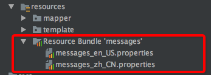
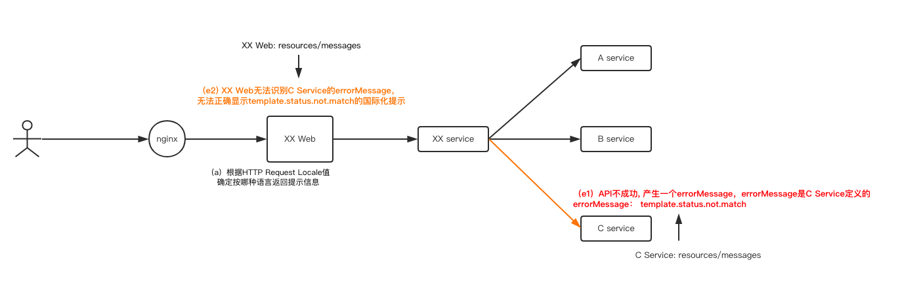

# API错误返回规范

## 禁止通过抛异常形式返回API业务错误

API禁止抛Checked异常，即业务处理上的参数错误、逻辑错误、业务错误等禁止通过抛异常形式返回，应用Response#code, message表达业务错误。

注：不要逼调用方到处写try{}catch()。

- 正例：

```
Response<T> saveDesposit(...);

```

- 反例：

```
T saveDesposit(...) throws ServiceException, IllegalArgumentException, ValidationException;

```


<!--more-->


## 禁止通过抛异常形式返回API业务错误

API禁止抛Checked异常，即业务处理上的参数错误、逻辑错误、业务错误等禁止通过抛异常形式返回，应用Response#code, message表达业务错误。

注：不要逼调用方到处写try{}catch()。

- 正例：

```
Response<T> saveDesposit(...);

```

- 反例：

```
T saveDesposit(...) throws ServiceException, IllegalArgumentException, ValidationException;

```


## 需要调用方做错误细分处理的，API提供方务必一并提供判断工具类

- 正例：

```
public void saveXXX(){
    Response<T> result = xxxWriteService(...)
    if (!result.isSuccess()){
        if (xxxUtils.isBankUnSupport(result.getCode)){   <<<API提供方提供工具类解析code含义，且code含义可持续迭代更新，调用方无感知。
            //银行渠道未开通，需要特殊提示
            ...
        }else{
            ...
        }
    }
}

```

- 反例：

```
public void saveXXX(){
    Response<T> result = xxxWriteService(...)
    if (!result.isSuccess()){
        if ("10101".equals(result.getCode)){   <<<调用方按API提供方的错误码值做硬编码，代码耦合。
            //银行渠道未开通，需要特殊提示
            ...
        }else{
            ...
        }
    }
}

```


## 【推荐】API返回可直接显示给用户的中文提示信息

API失败时，只有API实现方最清楚是什么原因，该怎么提示。那么，请提供对应的提示信息。


我们系统中存在一些用国际化风格的error message，而当前的国际化实现方式真如你想的那么好用吗？


#### **error message国际化原理：**

- 代码中的提示信息国际化配置文件




- 国际化提示原理



1) 提示信息国际化的行为发生在Web层，Web层启动时会加载Web层的resources/messages提示信息文件

2)当REST API需要返回提示信息时，Web会根据HTTP 请求中的Locale值（例如：zh_CN、zh_TW、en_US、es_ES_Traditional_WIN等）来决定返回哪一种语言的提示信息。将errorMessage以此种语言方式返回给浏览器进行提示。


问题：

1）在分布式系统中，各个应用按领域自治，其resources/messages只维护了自身业务需要的errorMessage。

2）当图中C Service 将errorMessage = template.status.not.match 返回给 XX Service，XX Service直接透传给XX Web的情况下，XX Web的resources/messages是不包括template.status.not.match的，所以此errorMessage将无法正确的展示其本应该提示的信息。


所以，推荐API返回可直接显示给用户的中文提示信息。


- 正例：

```
public Response<Boolean> saveTemplate(...) {

    try{
        ...
    }catch(StateMachineException e){
        log.warn("...");
        ...
        return Response.fail("模板配置正在审核中，请在审核完成后再更新");
    }catch(Exception e){
        ...
    }
}

```

- 反例： 

```
public Response<Boolean> saveTemplate(...) {

    try{
        ...
    }catch(StateMachineException e){
        log.warn("...");
        ...
        return Response.fail("模板管理状态机异常");
    }catch(Exception e){
        ...
    }
}
```


## 【推荐】返回具备可读性，引导性的错误提示信息

- 正例：

```
public Response<Boolean> saveTemplate(...) {

    try{
        ...
    }catch(StateMachineException e){
        log.warn("...");
        ...
        return Response.fail("模板配置正在审核中，请在审核完成后再更新");
    }catch(Exception e){
        ...
    }
}

```

- 反例：

例1 

```
public Response<Boolean> saveTemplate(...) {

    try{
        ...
    }catch(StateMachineException e){
        log.warn("...");
        ...
        return Response.fail("模板管理状态机异常");  <<<< 你作为用户，是不是吓一跳？
    }catch(Exception e){
        ...
    }
}
```

例2

```
public Response<Boolean> saveTemplate(...) {

    try{
        ...
    }catch(StateMachineException e){
        log.warn("...");
        ...
        return Response.fail(e.getMessage());    <<<< message谁都看不懂，没有任何意义
    }catch(Exception e){
        ...
    }
}
```

