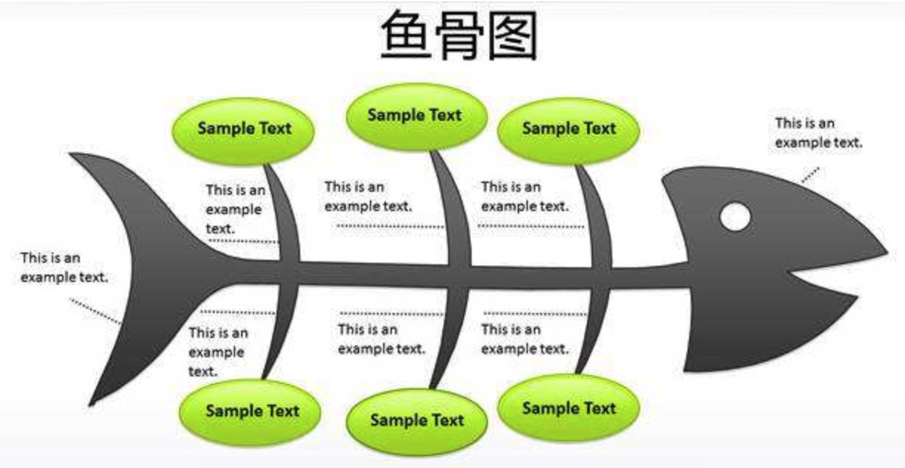
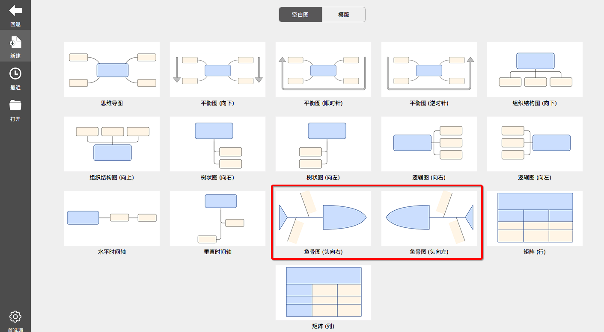

<!-- more -->

今天，偶然的机会在同事电脑上漂见“鱼骨图”。晚上吃完饭就在思考这个问题：“为什么我从来没用过鱼骨图分析问题？鱼骨图适用于什么类型的分析？”
  
查了些资料追求普及，介绍的内容大同小异

### 概念摘要
鱼骨分析法，又名 因果分析法，是一种发现问题"根本原因"的分析方法。
   
鱼骨图可以进一步被划分为：

1. 整理问题型鱼骨图（各要素与特性值间不存在原因关系，而是结构构成关系）
  
1. 原因型鱼骨图（鱼头在右，特性值通常以“为什么……”来写）
  
1. 对策型鱼骨图（鱼头在左，特性值通常以“如何提高/改善……”来写）

### 怎么作图
#### 分析结构
+ A、针对问题点，选择层别方法（如人机料法环等）；  

+ B、按头脑风暴分别对各层别类别找出所有可能原因（因素）；
  
+ C、将找出的各要素进行归类、整理，明确其从属关系；
  
+ D、分析选取重要因素；
  
+ E、检查各要素的描述方法，确保语法简明、意思明确;
  
#### 分析要点
+ A、确定大要因（大骨）时，现场作业一般从“人机料法环”着手,管理类问题一般从“人事时地物”层别，应视具体情况决定；  

+ B、大要因必须用中性词描述（不说明好坏），中、小要因必须使用价值判断（如…不良）；
  
+ C、头脑风暴时，应尽可能多而全地找出所有可能原因，而不仅限于自己能完全掌控或正在执行的内容。对人的原因，宜从行动而非思想态度面着手分析；
  
+ D、中要因跟特性值、小要因跟中要因间有直接的原因-问题关系，小要因应分析至可以直接下对策；
  
+ E、如果某种原因可同时归属于两种或两种以上因素，请以关联性最强者为准（必要时考虑三现主义：即现时到现场看现物，通过相对条件的比较，找出相关性最强的要因归类。）；
  
+ F、选取重要原因时，不要超过7项，且应标识在最未端原因。

#### 绘图过程
+ A、填写鱼头（按为什么不好的方式描述），画出主骨；  

+ B、画出大骨，填写大要因；
  
+ C、画出中骨、小骨，填写中小要因；
  
+ D、用特殊符号标识重要因素；

### 使用步骤
(1) 查找要解决的问题；  

(2) 把问题写在鱼骨的头上；  

(3) 召集同事共同讨论问题出现的可能原因，尽可能多地找出问题；  

(4) 把相同的问题分组，在鱼骨上标出；  

(5) 根据不同问题征求大家的意见，总结出正确的原因；  

(6) 拿出任何一个问题，研究为什么会产生这样的问题；  

(7) 针对问题的答案再问为什么？这样至少深入五个层次（连续问五个问题）；  

(8) 当深入到第五个层次后，认为无法继续进行时，列出这些问题的原因，而后列出至少20个解决方法。   

---

> 看了鱼骨图的概念介绍后，在脑海中立马出现了新的问题："鱼骨图和思维导图有什么区别？"

### 鱼骨图和思维导图有什么区别？
#### 类同点
1. 都是基于主题逐步分解、细化的过程
1. 都是类树形结构

#### 我的理解
##### 理解-1
首先、思维导图和鱼骨图都是图形思维，而图形思维最大的特点就是`将我们的思维结构化，并由此实现图形化`。  

而所谓的结构化一般就是构建逻辑思维，任何的逻辑思维都是基于这两个出发点而来的：1、分类；2、顺序；所以只要你的分类与顺序是一样的，那么你的逻辑思维是一样的，由此产生的图形思维也是一样的。而图形、分列、表格......只是图形思维具体的呈现方式。换句话说，在图形思维一样的前提下，不同的人选择了自己认为好的呈现方式让图形思维更可视化、更清晰化、更感性化。  

另外，还有不同之处在于思维导图不仅仅能用于构建逻辑思维，还能`扩展发散思维`，以及还能强化思维记忆。这是和鱼骨图的区别之一！
  
##### 理解-2
+ 【思维导图】在实际应用中，思维导图`常用于个人`，`侧重于个人思维的发散，以求思维的全面性`，思维导图的层次感是逻辑思维自然的产出。`应用场景广泛`。
  
+ 【鱼骨图】常用在多人同时参与的`头脑风暴场景`，侧重于发挥团队智力`逐层解剖问题，找到问题原因`。往往会以"问题原因分析 + 跟进Action"作为结果产出。
  
  
  
### 鱼骨图作图工具

+ Xmind
  

  
